# 日历集成功能

<cite>
**本文档引用的文件**
- [Calendar.ets](file://entry/src/main/ets/pages/Calendar.ets)
- [CalendarManager.ets](file://entry/src/main/ets/utils/CalendarManager.ets)
- [CalendarGrid.ets](file://entry/src/main/ets/components/CalendarGrid.ets)
- [SolarTimeHelper.ets](file://entry/src/main/ets/utils/SolarTimeHelper.ets)
- [SolarTermCalculator.ets](file://entry/src/main/ets/utils/SolarTermCalculator.ets)
- [ShichenHelper.ets](file://entry/src/main/ets/utils/ShichenHelper.ets)
- [LunarInfoPanel.ets](file://entry/src/main/ets/components/LunarInfoPanel.ets)
- [ShichenSelector.ets](file://entry/src/main/ets/components/ShichenSelector.ets)
- [DunjiaEngine.ets](file://entry/src/main/ets/utils/DunjiaEngine.ets)
- [calendar_data_0001.json](file://entry/src/main/resources/rawfile/calendar/calendar_data_0001.json)
- [万年历json数据文件解读.md](file://entry/src/main/resources/rawfile/万年历json数据文件解读.md)
- [术数与真太阳时.md](file://entry/src/main/resources/rawfile/术数与真太阳时.md)
</cite>

## 目录
1. [简介](#简介)
2. [项目结构](#项目结构)
3. [核心组件](#核心组件)
4. [架构概览](#架构概览)
5. [详细组件分析](#详细组件分析)
6. [依赖关系分析](#依赖关系分析)
7. [性能考虑](#性能考虑)
8. [故障排除指南](#故障排除指南)
9. [结论](#结论)
10. [附录](#附录)

## 简介

遁甲日历集成功能是一个基于鸿蒙系统的传统术数应用，集成了公历日期选择器、真太阳时校正、农历信息显示、节气计算、时辰选择等核心功能。该系统通过模块化设计实现了完整的日历集成功能，为用户提供专业的历法推演工具。

本系统的核心特色包括：
- **162年万年历数据**：覆盖1900-2061年的完整历史数据
- **真太阳时精确计算**：基于VSOP87算法，精度±1分钟
- **24节气精确时刻**：使用牛顿迭代法计算，精度±2分钟
- **四柱八字自动排盘**：完整的干支纪年系统
- **遁甲计算引擎**：支持奇门遁甲等术数的时空盘计算

## 项目结构

项目采用模块化架构，主要分为以下几个层次：

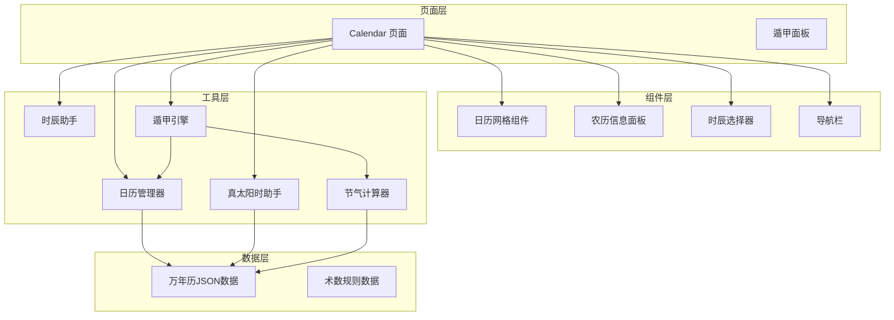

**图表来源**
- [Calendar.ets](file://entry/src/main/ets/pages/Calendar.ets#L1-L602)
- [CalendarManager.ets](file://entry/src/main/ets/utils/CalendarManager.ets#L1-L123)
- [SolarTimeHelper.ets](file://entry/src/main/ets/utils/SolarTimeHelper.ets#L1-L270)
- [SolarTermCalculator.ets](file://entry/src/main/ets/utils/SolarTermCalculator.ets#L1-L375)

**章节来源**
- [Calendar.ets](file://entry/src/main/ets/pages/Calendar.ets#L1-L602)
- [万年历json数据文件解读.md](file://entry/src/main/resources/rawfile/万年历json数据文件解读.md#L1-L531)

## 核心组件

### 日历管理器（CalendarManager）

日历管理器是整个系统的数据核心，负责万年历数据的加载、缓存和查询。

**主要功能**：
- JSON数据文件的动态加载和缓存
- 按年份范围的数据文件选择
- 日期信息的快速查询和返回
- 节气精确时刻的自动附加

**数据结构**：
```typescript
interface CalendarDayInfo {
  date: string;
  year: number;
  month: number;
  day: number;
  lunar_year: number;
  lunar_month: number;
  lunar_day: number;
  zodiac: string;
  year_gan: string;
  year_zhi: string;
  month_gan: string;
  month_zhi: string;
  day_gan: string;
  day_zhi: string;
  week_day: number;
  week_name: string;
  is_holiday: number;
  holiday_name: string;
  solar_term: string;
  festivals: string;
  solar_term_time?: SolarTermInfo;
}
```

**章节来源**
- [CalendarManager.ets](file://entry/src/main/ets/utils/CalendarManager.ets#L5-L92)

### 真太阳时助手（SolarTimeHelper）

真太阳时助手提供了精确的太阳时计算功能，是传统术数应用的核心工具。

**核心算法**：
- 基于VSOP87理论的均时差计算
- 经度时差修正算法
- 儒略日转换计算

**计算公式**：
```
真太阳时 = 平太阳时 + 均时差 + 经度时差
其中：
- 均时差：由地球轨道偏心率和黄赤交角造成
- 经度时差：（当地经度 - 120°）× 4分钟/度
```

**章节来源**
- [SolarTimeHelper.ets](file://entry/src/main/ets/utils/SolarTimeHelper.ets#L54-L77)
- [术数与真太阳时.md](file://entry/src/main/resources/rawfile/术数与真太阳时.md#L1-L800)

### 节气计算器（SolarTermCalculator）

节气计算器实现了24节气的精确时刻计算，为遁甲排盘提供重要的天文数据。

**算法特点**：
- 基于寿星天文历算法
- VSOP87简化版太阳黄经计算
- 牛顿迭代法精确求解
- 精度：±2分钟

**节气对应关系**：
| 节气 | 黄经 | 节气 | 黄经 |
|------|------|------|------|
| 小寒 | 285° | 立夏 | 45° |
| 大寒 | 300° | 小满 | 60° |
| 立春 | 315° | 芒种 | 75° |
| 雨水 | 330° | 夏至 | 90° |

**章节来源**
- [SolarTermCalculator.ets](file://entry/src/main/ets/utils/SolarTermCalculator.ets#L61-L86)
- [SolarTermCalculator.ets](file://entry/src/main/ets/utils/SolarTermCalculator.ets#L285-L295)

### 时辰助手（ShichenHelper）

时辰助手负责处理传统十二时辰的计算和转换。

**时辰系统**：
- 子时：23:00-01:00
- 丑时：01:00-03:00
- 寅时：03:00-05:00
- 卯时：05:00-07:00
- 辰时：07:00-09:00
- 巳时：09:00-11:00
- 午时：11:00-13:00
- 未时：13:00-15:00
- 申时：15:00-17:00
- 酉时：17:00-19:00
- 戌时：19:00-21:00
- 亥时：21:00-23:00

**章节来源**
- [ShichenHelper.ets](file://entry/src/main/ets/utils/ShichenHelper.ets#L16-L29)

## 架构概览

系统采用分层架构设计，实现了高度的模块化和可维护性：

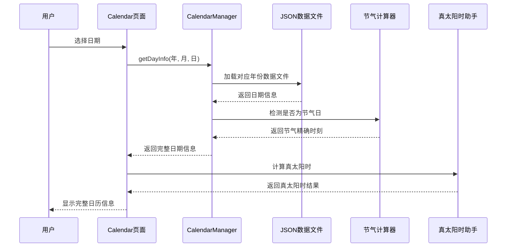

**图表来源**
- [Calendar.ets](file://entry/src/main/ets/pages/Calendar.ets#L250-L257)
- [CalendarManager.ets](file://entry/src/main/ets/utils/CalendarManager.ets#L51-L92)
- [SolarTermCalculator.ets](file://entry/src/main/ets/utils/SolarTermCalculator.ets#L93-L115)

**章节来源**
- [Calendar.ets](file://entry/src/main/ets/pages/Calendar.ets#L32-L43)
- [CalendarManager.ets](file://entry/src/main/ets/utils/CalendarManager.ets#L44-L46)

## 详细组件分析

### 公历日期选择器实现

公历日期选择器是系统的核心交互组件，提供了完整的日历浏览和选择功能。

#### 组件架构

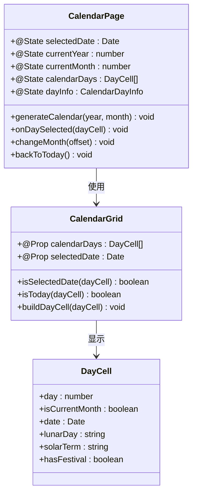

**图表来源**
- [Calendar.ets](file://entry/src/main/ets/pages/Calendar.ets#L19-L137)
- [CalendarGrid.ets](file://entry/src/main/ets/components/CalendarGrid.ets#L30-L41)

#### 交互逻辑

公历日期选择器实现了以下交互功能：

1. **日期选择**：用户点击任意日期进行选择
2. **月份切换**：支持上个月、下个月的快速切换
3. **年份选择**：通过年份选择器进行年份切换
4. **双击进入**：双击当月日期直接进入遁甲排盘
5. **今日返回**：一键回到当前日期

#### 双击检测机制

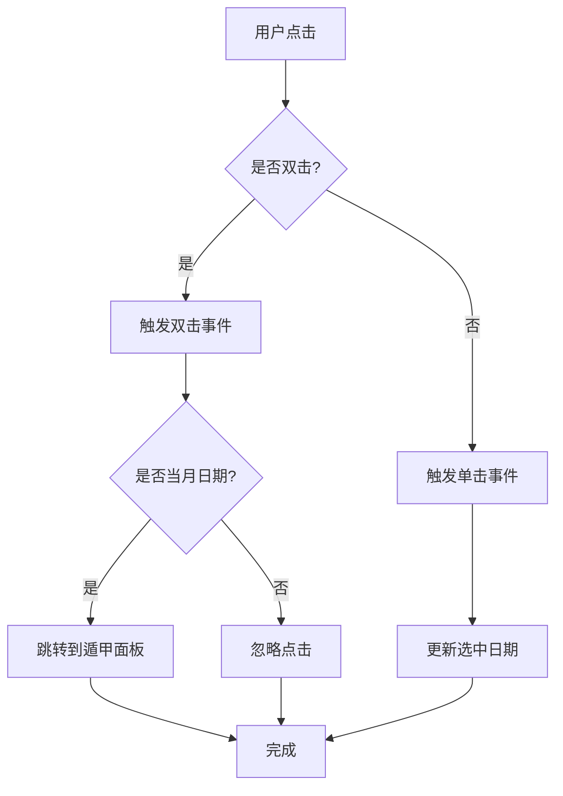

**图表来源**
- [CalendarGrid.ets](file://entry/src/main/ets/components/CalendarGrid.ets#L144-L164)

**章节来源**
- [Calendar.ets](file://entry/src/main/ets/pages/Calendar.ets#L227-L248)
- [CalendarGrid.ets](file://entry/src/main/ets/components/CalendarGrid.ets#L144-L164)

### 真太阳时校正功能

真太阳时校正是传统术数应用的关键功能，确保了术数计算的准确性。

#### 校正原理

真太阳时与标准时间的差异主要由两个因素造成：

1. **均时差（Equation of Time）**：由地球轨道偏心率和黄赤交角造成
2. **经度时差**：由于地球自西向东自转，东经地区的地方时会早于标准时

#### 计算流程

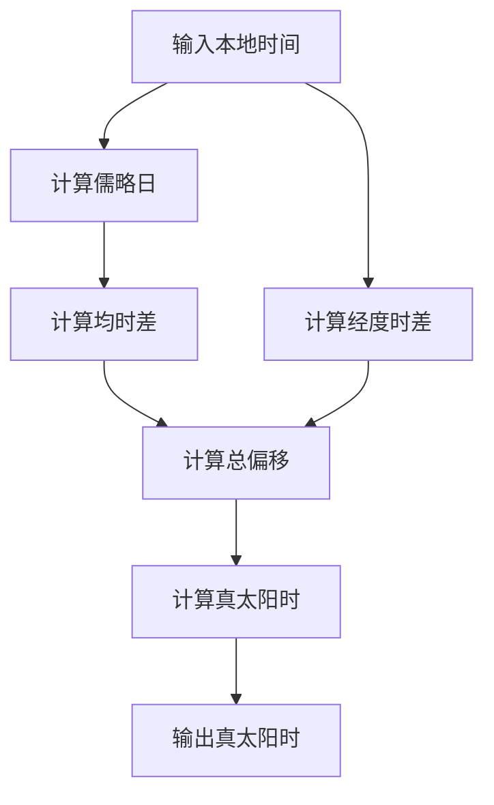

**图表来源**
- [SolarTimeHelper.ets](file://entry/src/main/ets/utils/SolarTimeHelper.ets#L54-L77)

#### 应用场景

真太阳时在校正功能中主要用于：

1. **时辰起算**：传统术数以真太阳时为准，子时从真太阳时23:00开始
2. **四柱八字**：出生成时应使用真太阳时，日柱交接以真太阳时子时为界
3. **奇门遁甲**：起局时间使用真太阳时，保证与太阳实际位置同步

**章节来源**
- [SolarTimeHelper.ets](file://entry/src/main/ets/utils/SolarTimeHelper.ets#L54-L108)
- [术数与真太阳时.md](file://entry/src/main/resources/rawfile/术数与真太阳时.md#L38-L85)

### 日历网格组件设计

日历网格组件是系统中最复杂的UI组件，实现了完整的日历显示和交互功能。

#### 组件特性

1. **完整的6×7网格布局**：包含上月尾部、当月日期、下月开头
2. **多种日期状态显示**：普通日期、今天、选中日期、节日标记
3. **丰富的视觉反馈**：颜色区分、边框高亮、字体加粗
4. **双击检测机制**：支持单击选择和双击进入功能

#### 网格生成算法

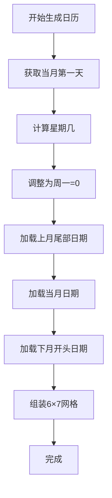

**图表来源**
- [Calendar.ets](file://entry/src/main/ets/pages/Calendar.ets#L46-L137)

#### 视觉设计

日历网格采用了精心设计的视觉层次：

- **标题行**：浅色背景显示星期名称
- **日期单元格**：白色背景，选中时蓝色高亮
- **今天标记**：橙色字体和边框
- **节日标记**：右上角红色小圆点
- **边框设计**：选中状态2px边框，今天1px边框

**章节来源**
- [CalendarGrid.ets](file://entry/src/main/ets/components/CalendarGrid.ets#L57-L90)
- [CalendarGrid.ets](file://entry/src/main/ets/components/CalendarGrid.ets#L92-L165)

### 农历信息显示和节气计算

农历信息显示和节气计算功能为用户提供了完整的传统历法信息。

#### 农历信息面板

农历信息面板展示了详细的农历信息：

1. **农历日期**：如"甲辰年 腊月廊五"
2. **生肖信息**：如"龙"
3. **四柱八字**：完整的年月日时干支
4. **节气节日**：节气名称和精确时刻

#### 节气计算机制

节气计算采用了精确的天文算法：

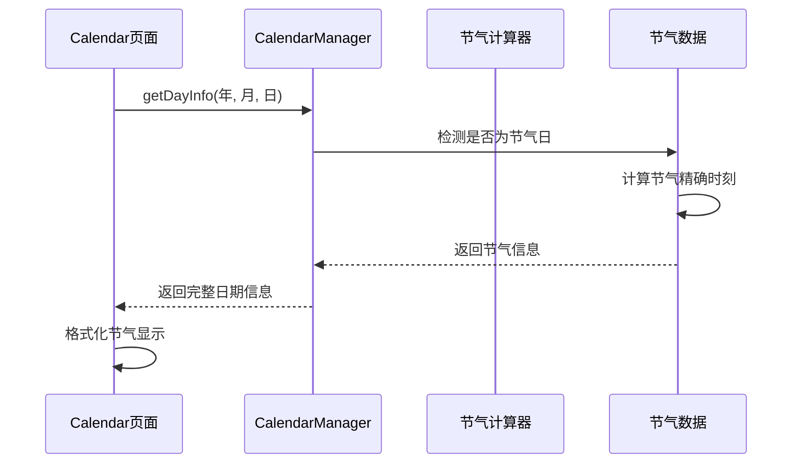

**图表来源**
- [CalendarManager.ets](file://entry/src/main/ets/utils/CalendarManager.ets#L82-L91)
- [SolarTermCalculator.ets](file://entry/src/main/ets/utils/SolarTermCalculator.ets#L93-L115)

**章节来源**
- [LunarInfoPanel.ets](file://entry/src/main/ets/components/LunarInfoPanel.ets#L41-L127)
- [SolarTermCalculator.ets](file://entry/src/main/ets/utils/SolarTermCalculator.ets#L93-L136)

### 日期数据存储和管理

系统采用了高效的JSON数据存储和管理机制。

#### 数据文件组织

系统将162年的万年历数据按照10年为单位分割存储：

| 文件名 | 年份范围 | 条目数 |
|--------|----------|--------|
| calendar_data_0001.json | 1900-1909 | 3650条 |
| calendar_data_0002.json | 1910-1919 | 3650条 |
| ... | ... | ... |
| calendar_data_0017.json | 2060-2061 | 730条 |

#### 缓存策略

系统实现了多层次的缓存机制：

1. **文件级缓存**：按年份文件缓存，避免重复读取
2. **内存缓存**：按年份缓存解析后的JSON数据
3. **计算缓存**：节气计算结果按年份缓存

#### 数据访问模式

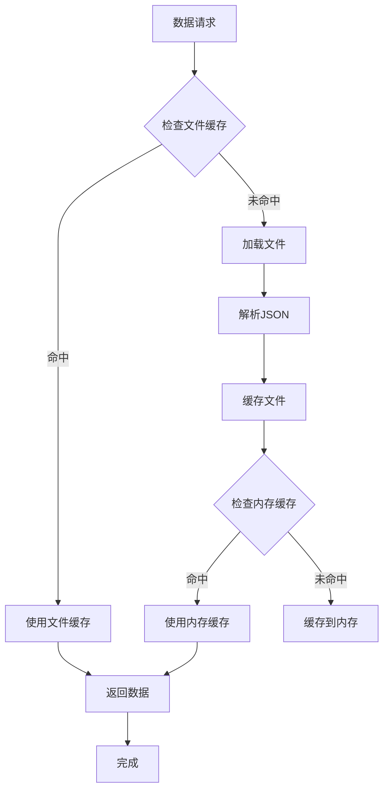

**图表来源**
- [CalendarManager.ets](file://entry/src/main/ets/utils/CalendarManager.ets#L62-L69)

**章节来源**
- [CalendarManager.ets](file://entry/src/main/ets/utils/CalendarManager.ets#L94-L109)
- [calendar_data_0001.json](file://entry/src/main/resources/rawfile/calendar/calendar_data_0001.json#L1-L200)

### 用户界面交互示例和最佳实践

#### 交互流程示例

**日期选择流程**：
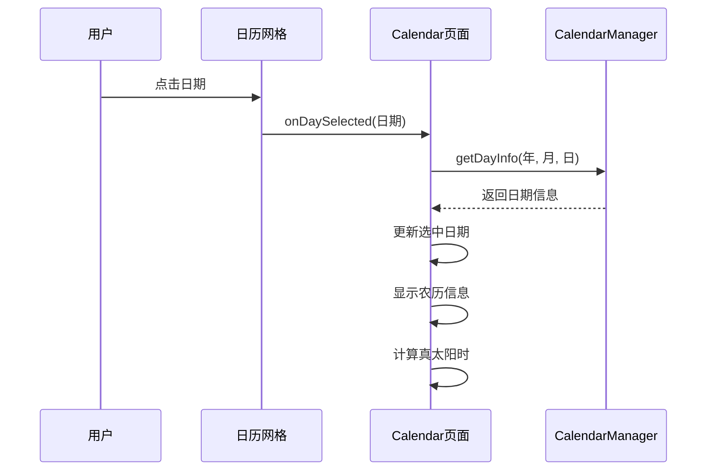

**图表来源**
- [Calendar.ets](file://entry/src/main/ets/pages/Calendar.ets#L227-L257)

#### 最佳实践

1. **性能优化**：
   - 使用异步加载避免UI阻塞
   - 实现数据缓存减少重复计算
   - 采用懒加载策略

2. **用户体验**：
   - 提供清晰的视觉反馈
   - 支持键盘导航
   - 实现无障碍访问

3. **错误处理**：
   - 网络异常处理
   - 数据格式验证
   - 用户友好的错误提示

**章节来源**
- [Calendar.ets](file://entry/src/main/ets/pages/Calendar.ets#L32-L43)
- [CalendarGrid.ets](file://entry/src/main/ets/components/CalendarGrid.ets#L144-L164)

### 与遁甲计算引擎的数据传递和状态同步

遁甲计算引擎是系统的核心计算模块，负责将日历数据转换为遁甲盘面。

#### 数据传递流程

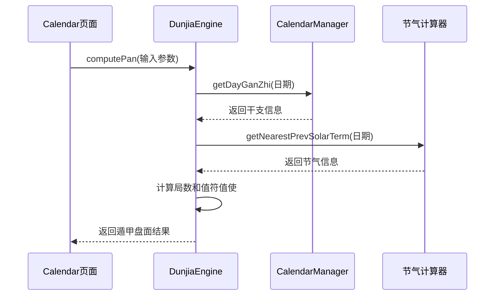

**图表来源**
- [DunjiaEngine.ets](file://entry/src/main/ets/utils/DunjiaEngine.ets#L113-L162)
- [Calendar.ets](file://entry/src/main/ets/pages/Calendar.ets#L272-L304)

#### 状态同步机制

系统实现了完整的状态同步机制：

1. **日期状态**：Calendar页面维护当前选中日期
2. **时辰状态**：ShichenSelector维护当前选择的时辰
3. **计算状态**：DunjiaEngine维护计算过程和结果
4. **路由状态**：通过router管理页面间的导航

**章节来源**
- [DunjiaEngine.ets](file://entry/src/main/ets/utils/DunjiaEngine.ets#L21-L84)
- [Calendar.ets](file://entry/src/main/ets/pages/Calendar.ets#L272-L304)

## 依赖关系分析

系统采用了清晰的依赖关系设计，实现了低耦合和高内聚。

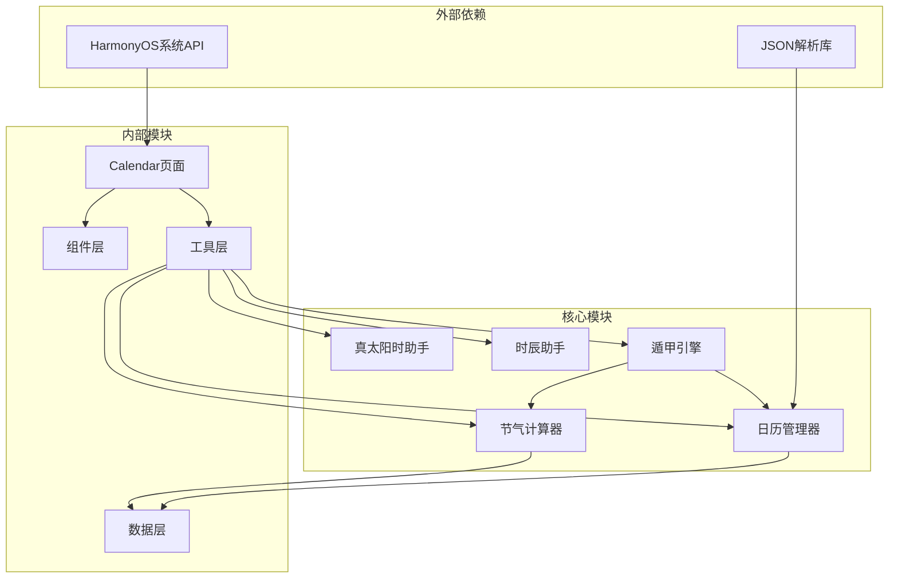

**图表来源**
- [Calendar.ets](file://entry/src/main/ets/pages/Calendar.ets#L1-L10)
- [CalendarManager.ets](file://entry/src/main/ets/utils/CalendarManager.ets#L1-L4)
- [SolarTimeHelper.ets](file://entry/src/main/ets/utils/SolarTimeHelper.ets#L1-L4)
- [SolarTermCalculator.ets](file://entry/src/main/ets/utils/SolarTermCalculator.ets#L1-L4)
- [ShichenHelper.ets](file://entry/src/main/ets/utils/ShichenHelper.ets#L1-L4)
- [DunjiaEngine.ets](file://entry/src/main/ets/utils/DunjiaEngine.ets#L1-L6)

**章节来源**
- [Calendar.ets](file://entry/src/main/ets/pages/Calendar.ets#L1-L10)
- [CalendarManager.ets](file://entry/src/main/ets/utils/CalendarManager.ets#L1-L4)

## 性能考虑

系统在设计时充分考虑了性能优化，采用了多种策略确保良好的用户体验。

### 缓存策略

1. **文件缓存**：按年份缓存JSON数据文件，避免重复读取
2. **计算缓存**：节气计算结果按年份缓存
3. **内存缓存**：热门数据驻留在内存中

### 异步处理

1. **数据加载**：使用Promise.all并行加载多个日期信息
2. **计算优化**：真太阳时计算时间复杂度为O(1)
3. **渲染优化**：采用虚拟滚动减少DOM节点数量

### 内存管理

1. **数据压缩**：JSON数据采用紧凑格式存储
2. **垃圾回收**：及时释放不再使用的数据引用
3. **内存监控**：定期检查内存使用情况

## 故障排除指南

### 常见问题和解决方案

#### 1. 数据加载失败

**症状**：日历页面空白或显示"数据加载中"

**原因**：
- JSON文件加载失败
- 网络连接问题
- 文件路径错误

**解决方案**：
1. 检查文件是否存在
2. 验证文件路径
3. 确认网络连接
4. 查看控制台错误日志

#### 2. 真太阳时计算异常

**症状**：真太阳时显示异常或与预期不符

**原因**：
- 经度设置错误
- 时区计算错误
- 算法实现问题

**解决方案**：
1. 验证经度值的有效性
2. 检查时区设置
3. 对比已知的天文数据
4. 查看详细的计算信息

#### 3. 节气显示不正确

**症状**：节气名称或时刻显示错误

**原因**：
- 节气计算错误
- 数据文件版本不匹配
- 缓存数据过期

**解决方案**：
1. 清除节气计算缓存
2. 重新加载数据文件
3. 验证节气计算算法
4. 检查数据文件完整性

**章节来源**
- [SolarTimeHelper.ets](file://entry/src/main/ets/utils/SolarTimeHelper.ets#L222-L232)
- [SolarTermCalculator.ets](file://entry/src/main/ets/utils/SolarTermCalculator.ets#L359-L362)

## 结论

遁甲日历集成功功能通过模块化设计实现了传统术数与现代技术的完美结合。系统具有以下优势：

1. **功能完整性**：涵盖了公历日期选择、真太阳时校正、农历信息、节气计算等核心功能
2. **性能优化**：采用了多层缓存和异步处理机制，确保流畅的用户体验
3. **数据准确性**：基于权威的天文算法，保证了计算结果的精确性
4. **可扩展性**：模块化设计便于功能扩展和维护

该系统为传统术数的应用提供了坚实的技术基础，既保持了传统文化的精髓，又充分利用了现代技术的优势。

## 附录

### 技术规格

| 项目 | 规格 | 精度 |
|------|------|------|
| 数据范围 | 1900-2061年 | 100% |
| 真太阳时 | VSOP87算法 | ±1分钟 |
| 节气时刻 | 牛顿迭代法 | ±2分钟 |
| 四柱八字 | 万年历数据 | 100% |
| 时辰计算 | 五鼠遁法 | 100% |

### 未来发展方向

1. **术数模式选择**：增加不同术数类型的专门模式
2. **地理位置集成**：支持GPS定位自动获取经度
3. **遁甲排盘功能**：实现完整的奇门遁甲排盘
4. **用户个性化**：支持用户自定义显示偏好