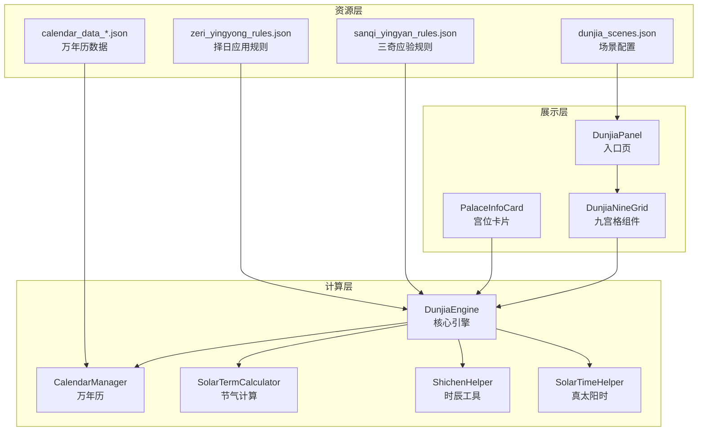
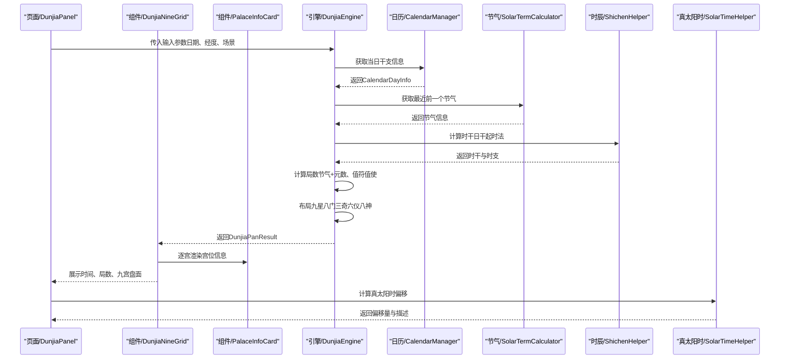
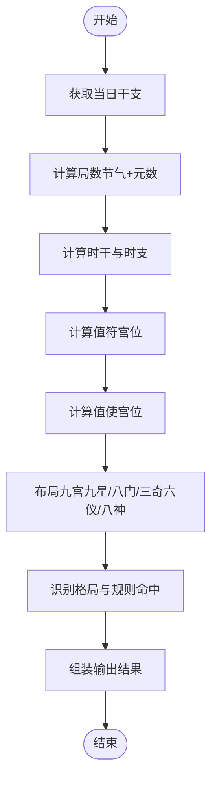
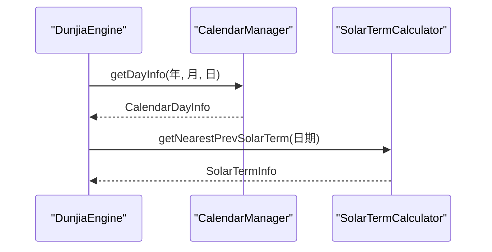
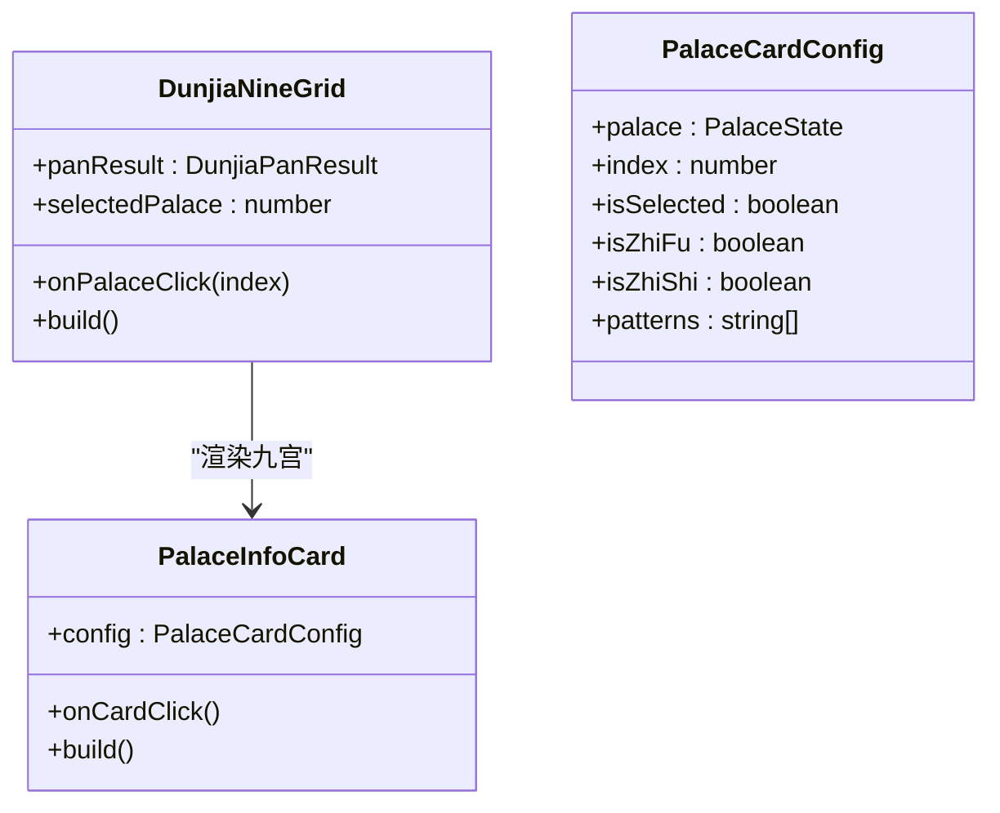
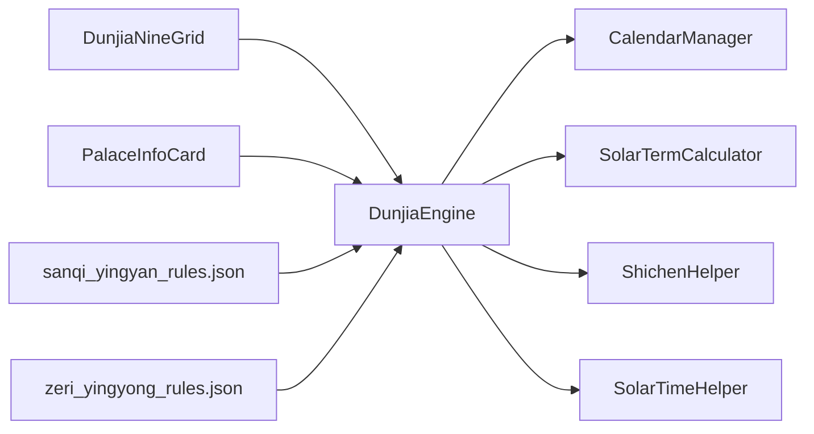

# 时空盘计算引擎

<cite>
**本文引用的文件**
- [DunjiaEngine.ets](file://entry/src/main/ets/utils/DunjiaEngine.ets)
- [SolarTimeHelper.ets](file://entry/src/main/ets/utils/SolarTimeHelper.ets)
- [ShichenHelper.ets](file://entry/src/main/ets/utils/ShichenHelper.ets)
- [CalendarManager.ets](file://entry/src/main/ets/utils/CalendarManager.ets)
- [SolarTermCalculator.ets](file://entry/src/main/ets/utils/SolarTermCalculator.ets)
- [DunjiaNineGrid.ets](file://entry/src/main/ets/components/DunjiaNineGrid.ets)
- [PalaceInfoCard.ets](file://entry/src/main/ets/components/PalaceInfoCard.ets)
- [DunjiaPanel.ets](file://entry/src/main/ets/pages/DunjiaPanel.ets)
- [dunjia_scenes.json](file://entry/src/main/resources/rawfile/dunjia_scenes.json)
- [calendar_data_0001.json](file://entry/src/main/resources/rawfile/calendar/calendar_data_0001.json)
- [sanqi_yingyan_rules.json](file://entry/src/main/resources/rawfile/rules/sanqi_yingyan_rules.json)
- [zeri_yingyong_rules.json](file://entry/src/main/resources/rawfile/rules/zeri_yingyong_rules.json)
</cite>

## 目录
1. [简介](#简介)
2. [项目结构](#项目结构)
3. [核心组件](#核心组件)
4. [架构总览](#架构总览)
5. [详细组件分析](#详细组件分析)
6. [依赖关系分析](#依赖关系分析)
7. [性能考虑](#性能考虑)
8. [故障排查指南](#故障排查指南)
9. [结论](#结论)
10. [附录](#附录)

## 简介
本文件面向“遁甲时空盘计算引擎”的功能与实现，系统阐述遁甲排盘的核心算法与数据流，包括九宫格布局、八门配置、九星排列、三奇六仪、八神定位等关键元素；详述输入参数处理机制（公历日期、真太阳时转换、地理坐标）；描述计算流程与算法步骤（遁甲起局、宫位推演、神煞配置）；解释输出结果的数据结构与可视化展示方式；提供具体计算示例与参数配置说明；说明与其他组件的集成关系与调用模式；并给出性能优化策略与错误处理机制。

## 项目结构
该工程采用ArkTS生态的模块化组织，核心计算逻辑集中在utils目录下的引擎与工具类，UI组件位于components目录，页面入口位于pages目录，规则与数据资源位于resources/rawfile目录。

图示来源
- [DunjiaEngine.ets](file://entry/src/main/ets/utils/DunjiaEngine.ets#L98-L162)
- [CalendarManager.ets](file://entry/src/main/ets/utils/CalendarManager.ets#L30-L92)
- [SolarTermCalculator.ets](file://entry/src/main/ets/utils/SolarTermCalculator.ets#L30-L159)
- [ShichenHelper.ets](file://entry/src/main/ets/utils/ShichenHelper.ets#L14-L113)
- [SolarTimeHelper.ets](file://entry/src/main/ets/utils/SolarTimeHelper.ets#L29-L77)
- [DunjiaNineGrid.ets](file://entry/src/main/ets/components/DunjiaNineGrid.ets#L23-L178)
- [PalaceInfoCard.ets](file://entry/src/main/ets/components/PalaceInfoCard.ets#L22-L178)
- [DunjiaPanel.ets](file://entry/src/main/ets/pages/DunjiaPanel.ets#L20-L186)
- [dunjia_scenes.json](file://entry/src/main/resources/rawfile/dunjia_scenes.json#L1-L50)
- [calendar_data_0001.json](file://entry/src/main/resources/rawfile/calendar/calendar_data_0001.json#L1-L200)
- [sanqi_yingyan_rules.json](file://entry/src/main/resources/rawfile/rules/sanqi_yingyan_rules.json#L1-L525)
- [zeri_yingyong_rules.json](file://entry/src/main/resources/rawfile/rules/zeri_yingyong_rules.json#L1-L145)

章节来源
- [DunjiaEngine.ets](file://entry/src/main/ets/utils/DunjiaEngine.ets#L98-L162)
- [DunjiaNineGrid.ets](file://entry/src/main/ets/components/DunjiaNineGrid.ets#L23-L178)
- [PalaceInfoCard.ets](file://entry/src/main/ets/components/PalaceInfoCard.ets#L22-L178)
- [DunjiaPanel.ets](file://entry/src/main/ets/pages/DunjiaPanel.ets#L20-L186)
- [dunjia_scenes.json](file://entry/src/main/resources/rawfile/dunjia_scenes.json#L1-L50)

## 核心组件
- 引擎核心（DunjiaEngine）
  - 输入参数：公历时间、地理经度、研习场景类型
  - 输出结果：遁甲盘面、值符值使、九宫状态、规则命中、结构评估、格局识别
  - 关键算法：局数计算（节气+元数）、值符值使推演、九星八门三奇六仪八神布局
- 万年历与节气（CalendarManager、SolarTermCalculator）
  - 提供干支信息、节气精确时刻，支撑遁局与局数判定
- 时辰与时干（ShichenHelper）
  - 提供十二时支、时干推算，支持日干起时法
- 真太阳时（SolarTimeHelper）
  - 提供均时差、经度时差、真太阳时计算，支持偏移量展示
- 可视化组件（DunjiaNineGrid、PalaceInfoCard）
  - 展示九宫格、时间信息、局数、格局徽章、值符值使标识
- 页面入口（DunjiaPanel）
  - 提供研习模块导航，承载参数传递与路由跳转

章节来源
- [DunjiaEngine.ets](file://entry/src/main/ets/utils/DunjiaEngine.ets#L21-L84)
- [CalendarManager.ets](file://entry/src/main/ets/utils/CalendarManager.ets#L5-L28)
- [SolarTermCalculator.ets](file://entry/src/main/ets/utils/SolarTermCalculator.ets#L23-L28)
- [ShichenHelper.ets](file://entry/src/main/ets/utils/ShichenHelper.ets#L5-L12)
- [SolarTimeHelper.ets](file://entry/src/main/ets/utils/SolarTimeHelper.ets#L21-L27)
- [DunjiaNineGrid.ets](file://entry/src/main/ets/components/DunjiaNineGrid.ets#L24-L70)
- [PalaceInfoCard.ets](file://entry/src/main/ets/components/PalaceInfoCard.ets#L13-L20)
- [DunjiaPanel.ets](file://entry/src/main/ets/pages/DunjiaPanel.ets#L8-L17)

## 架构总览
引擎采用“计算-存储-展示”三层架构：
- 计算层：DunjiaEngine为核心，协调CalendarManager、SolarTermCalculator、ShichenHelper、SolarTimeHelper完成排盘与分析
- 存储层：CalendarManager缓存年份级万年历数据，SolarTermCalculator缓节气数据
- 展示层：DunjiaNineGrid与PalaceInfoCard渲染九宫盘面，DunjiaPanel提供入口与导航

图示来源
- [DunjiaEngine.ets](file://entry/src/main/ets/utils/DunjiaEngine.ets#L113-L162)
- [CalendarManager.ets](file://entry/src/main/ets/utils/CalendarManager.ets#L51-L92)
- [SolarTermCalculator.ets](file://entry/src/main/ets/utils/SolarTermCalculator.ets#L143-L159)
- [ShichenHelper.ets](file://entry/src/main/ets/utils/ShichenHelper.ets#L59-L91)
- [SolarTimeHelper.ets](file://entry/src/main/ets/utils/SolarTimeHelper.ets#L54-L77)
- [DunjiaNineGrid.ets](file://entry/src/main/ets/components/DunjiaNineGrid.ets#L72-L177)
- [PalaceInfoCard.ets](file://entry/src/main/ets/components/PalaceInfoCard.ets#L50-L178)

## 详细组件分析

### 引擎核心（DunjiaEngine）
- 输入参数处理
  - 公历时间：用于获取干支、节气、时干
  - 地理经度：用于真太阳时偏移计算
  - 研习场景类型：用于UI与规则侧的差异化展示
- 计算流程
  - 获取干支信息：通过CalendarManager按年份文件加载
  - 计算局数：依据最近前一个节气与日干支确定阴阳遁与上中下元，再查局数表
  - 计算值符值使：值符随“时干”飞布（阳遁顺飞、阴遁逆飞，跳过中宫）；值使随“时支”飞布
  - 布局九宫：九星固定对应九宫、八门固定对应九宫；三奇六仪按遁局与阴阳遁规则飞布；八神围绕值符按规则定位
  - 规则命中与结构评估：识别三奇得使、三遁、三奇合、伏吟、反吹等格局，生成结构标签与概览
  - 输出结果：包含盘面、值符值使、规则命中、结构评估、格局识别、时间与真太阳时信息
- 数据结构
  - DunjiaInput、PalaceState、DunjiaPanResult、RuleHit、GejuPattern等

图示来源
- [DunjiaEngine.ets](file://entry/src/main/ets/utils/DunjiaEngine.ets#L113-L162)
- [DunjiaEngine.ets](file://entry/src/main/ets/utils/DunjiaEngine.ets#L256-L281)
- [DunjiaEngine.ets](file://entry/src/main/ets/utils/DunjiaEngine.ets#L206-L246)
- [DunjiaEngine.ets](file://entry/src/main/ets/utils/DunjiaEngine.ets#L358-L389)
- [DunjiaEngine.ets](file://entry/src/main/ets/utils/DunjiaEngine.ets#L678-L800)

章节来源
- [DunjiaEngine.ets](file://entry/src/main/ets/utils/DunjiaEngine.ets#L21-L84)
- [DunjiaEngine.ets](file://entry/src/main/ets/utils/DunjiaEngine.ets#L113-L162)
- [DunjiaEngine.ets](file://entry/src/main/ets/utils/DunjiaEngine.ets#L206-L246)
- [DunjiaEngine.ets](file://entry/src/main/ets/utils/DunjiaEngine.ets#L256-L281)
- [DunjiaEngine.ets](file://entry/src/main/ets/utils/DunjiaEngine.ets#L358-L389)
- [DunjiaEngine.ets](file://entry/src/main/ets/utils/DunjiaEngine.ets#L678-L800)

### 万年历与节气（CalendarManager、SolarTermCalculator）
- 万年历
  - 年份分档加载calendar_data_0001.json等文件，缓存到内存
  - 提供按日期查询干支、节气、节日等信息
- 节气
  - 计算24节气精确时刻（北京时间），支持最近前一个节气查询
  - 用于局数判定与“符头三元”判断

图示来源
- [CalendarManager.ets](file://entry/src/main/ets/utils/CalendarManager.ets#L51-L92)
- [SolarTermCalculator.ets](file://entry/src/main/ets/utils/SolarTermCalculator.ets#L143-L159)

章节来源
- [CalendarManager.ets](file://entry/src/main/ets/utils/CalendarManager.ets#L5-L28)
- [CalendarManager.ets](file://entry/src/main/ets/utils/CalendarManager.ets#L94-L122)
- [SolarTermCalculator.ets](file://entry/src/main/ets/utils/SolarTermCalculator.ets#L30-L159)
- [calendar_data_0001.json](file://entry/src/main/resources/rawfile/calendar/calendar_data_0001.json#L1-L200)

### 时辰与时干（ShichenHelper）
- 提供十二时支、时干推算（五鼠遁法），支持按日干起时
- 用于计算值使宫位与“五阳五阴时”等应用

章节来源
- [ShichenHelper.ets](file://entry/src/main/ets/utils/ShichenHelper.ets#L14-L113)

### 真太阳时（SolarTimeHelper）
- 计算均时差、经度时差、真太阳时与本地时间的总偏移
- 提供格式化显示与描述文本，支持按经度设置

章节来源
- [SolarTimeHelper.ets](file://entry/src/main/ets/utils/SolarTimeHelper.ets#L29-L108)
- [SolarTimeHelper.ets](file://entry/src/main/ets/utils/SolarTimeHelper.ets#L115-L202)

### 可视化组件（DunjiaNineGrid、PalaceInfoCard）
- DunjiaNineGrid
  - 展示阳历/农历日期、时辰、真太阳时偏移、局数、整体概览
  - 按传统方位布局九宫格（上南下北）
- PalaceInfoCard
  - 展示宫位名称、九星、八门、天盘地盘干支、八神
  - 标识值符/值使宫位，显示格局徽章

图示来源
- [DunjiaNineGrid.ets](file://entry/src/main/ets/components/DunjiaNineGrid.ets#L24-L70)
- [PalaceInfoCard.ets](file://entry/src/main/ets/components/PalaceInfoCard.ets#L22-L50)
- [PalaceInfoCard.ets](file://entry/src/main/ets/components/PalaceInfoCard.ets#L13-L20)

章节来源
- [DunjiaNineGrid.ets](file://entry/src/main/ets/components/DunjiaNineGrid.ets#L23-L178)
- [PalaceInfoCard.ets](file://entry/src/main/ets/components/PalaceInfoCard.ets#L22-L178)

### 页面入口（DunjiaPanel）
- 提供遁甲研习模块导航，支持从外部页面传参（时间戳、干支等）
- 路由跳转至九宫排盘、三奇应验、攻守方位等模块

章节来源
- [DunjiaPanel.ets](file://entry/src/main/ets/pages/DunjiaPanel.ets#L20-L186)
- [dunjia_scenes.json](file://entry/src/main/resources/rawfile/dunjia_scenes.json#L1-L50)

## 依赖关系分析
- 引擎对工具类的依赖
  - CalendarManager：获取干支与节气信息
  - SolarTermCalculator：节气精确时刻与最近前一个节气
  - ShichenHelper：时干与时支推算
  - SolarTimeHelper：真太阳时偏移
- 组件对引擎的依赖
  - DunjiaNineGrid与PalaceInfoCard消费DunjiaPanResult进行渲染
- 资源对引擎的依赖
  - 规则文件（sanqi_yingyan_rules.json、zeri_yingyong_rules.json）为引擎识别格局与应用提供数据基础

图示来源
- [DunjiaEngine.ets](file://entry/src/main/ets/utils/DunjiaEngine.ets#L4-L5)
- [DunjiaEngine.ets](file://entry/src/main/ets/utils/DunjiaEngine.ets#L113-L162)
- [DunjiaNineGrid.ets](file://entry/src/main/ets/components/DunjiaNineGrid.ets#L24-L27)
- [PalaceInfoCard.ets](file://entry/src/main/ets/components/PalaceInfoCard.ets#L24-L25)
- [sanqi_yingyan_rules.json](file://entry/src/main/resources/rawfile/rules/sanqi_yingyan_rules.json#L1-L525)
- [zeri_yingyong_rules.json](file://entry/src/main/resources/rawfile/rules/zeri_yingyong_rules.json#L1-L145)

章节来源
- [DunjiaEngine.ets](file://entry/src/main/ets/utils/DunjiaEngine.ets#L4-L5)
- [DunjiaEngine.ets](file://entry/src/main/ets/utils/DunjiaEngine.ets#L113-L162)
- [DunjiaNineGrid.ets](file://entry/src/main/ets/components/DunjiaNineGrid.ets#L24-L27)
- [PalaceInfoCard.ets](file://entry/src/main/ets/components/PalaceInfoCard.ets#L24-L25)

## 性能考虑
- 缓存策略
  - CalendarManager按年份缓存calendar_data_*.json，避免重复IO
  - SolarTermCalculator按年份缓存节气计算结果
- 计算复杂度
  - 布局九宫为O(1)固定映射，整体计算以布局为主
  - 节气计算采用牛顿迭代法，迭代次数固定，时间复杂度稳定
- I/O与资源
  - 规则文件与日历数据均为静态资源，建议在应用启动阶段预加载
- UI渲染
  - 九宫格组件按需渲染，减少不必要的重绘

[本节为通用性能指导，无需特定文件引用]

## 故障排查指南
- 无法获取干支信息
  - 现象：返回空盘或概览为空
  - 排查：确认CalendarManager已初始化、年份文件存在、日期合法
  - 参考：createEmptyPan与getDayInfo
- 节气查询异常
  - 现象：局数计算错误或值符值使异常
  - 排查：确认SolarTermCalculator.getNearestPrevSolarTerm返回有效节气
- 真太阳时偏移异常
  - 现象：偏移量与预期不符
  - 排查：确认经度设置正确、SolarTimeHelper.getTrueSolarTime返回合理结果
- 格局识别不准确
  - 现象：三奇得使、三遁等未命中
  - 排查：检查layoutTianGan与layoutDeities布局是否符合规则

章节来源
- [DunjiaEngine.ets](file://entry/src/main/ets/utils/DunjiaEngine.ets#L613-L639)
- [CalendarManager.ets](file://entry/src/main/ets/utils/CalendarManager.ets#L51-L92)
- [SolarTermCalculator.ets](file://entry/src/main/ets/utils/SolarTermCalculator.ets#L143-L159)
- [SolarTimeHelper.ets](file://entry/src/main/ets/utils/SolarTimeHelper.ets#L54-L77)
- [DunjiaEngine.ets](file://entry/src/main/ets/utils/DunjiaEngine.ets#L678-L800)

## 结论
该引擎以《遁甲符应经》规则体系为基础，实现了从公历日期到遁甲时空盘的自动化计算与结构化展示。通过清晰的模块划分与缓存策略，保证了性能与可维护性；通过组件化的UI设计，提升了研习体验。未来可在规则扩展、算法优化与交互增强方面持续演进。

[本节为总结性内容，无需特定文件引用]

## 附录

### 计算示例与参数配置
- 示例场景
  - 输入：公历日期、地理经度（如北京116.4074°E）、研习场景（普通研习）
  - 输出：阳遁/阴遁、局数、值符值使、九宫状态、规则命中、结构评估、格局识别、真太阳时偏移
- 参数说明
  - dateTime：建议使用真太阳时校正后的本地时间
  - longitude：东经为正，用于真太阳时偏移计算
  - sceneType：用于UI与规则侧的差异化展示

章节来源
- [DunjiaEngine.ets](file://entry/src/main/ets/utils/DunjiaEngine.ets#L21-L28)
- [DunjiaEngine.ets](file://entry/src/main/ets/utils/DunjiaEngine.ets#L645-L651)
- [SolarTimeHelper.ets](file://entry/src/main/ets/utils/SolarTimeHelper.ets#L37-L47)
- [SolarTimeHelper.ets](file://entry/src/main/ets/utils/SolarTimeHelper.ets#L658-L661)

### 规则与数据来源
- 三奇应验规则：sanqi_yingyan_rules.json
- 择日与应用规则：zeri_yingyong_rules.json
- 万年历数据：calendar_data_*.json
- 场景配置：dunjia_scenes.json

章节来源
- [sanqi_yingyan_rules.json](file://entry/src/main/resources/rawfile/rules/sanqi_yingyan_rules.json#L1-L525)
- [zeri_yingyong_rules.json](file://entry/src/main/resources/rawfile/rules/zeri_yingyong_rules.json#L1-L145)
- [calendar_data_0001.json](file://entry/src/main/resources/rawfile/calendar/calendar_data_0001.json#L1-L200)
- [dunjia_scenes.json](file://entry/src/main/resources/rawfile/dunjia_scenes.json#L1-L50)