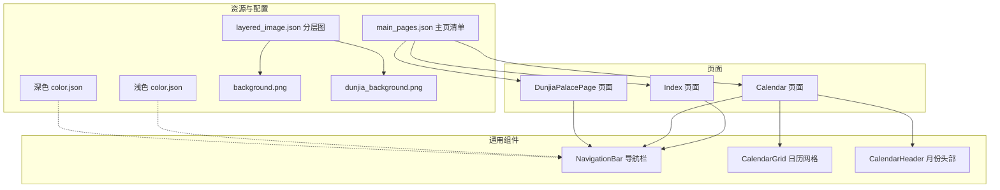
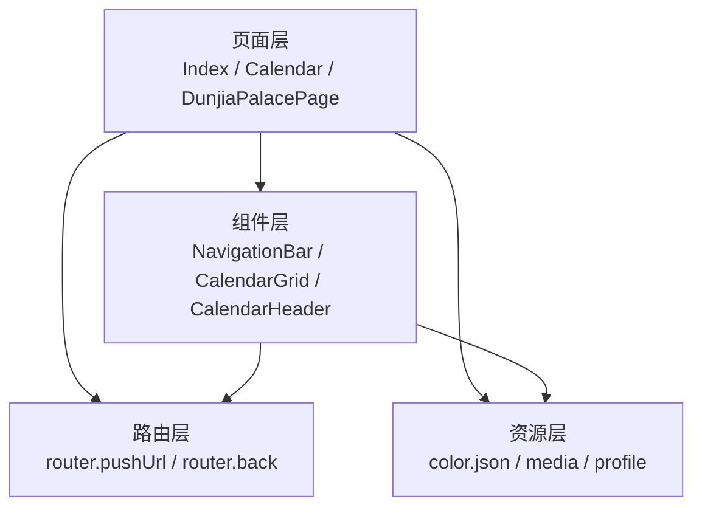
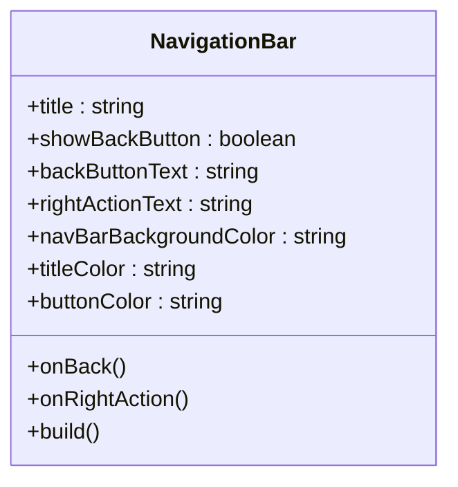
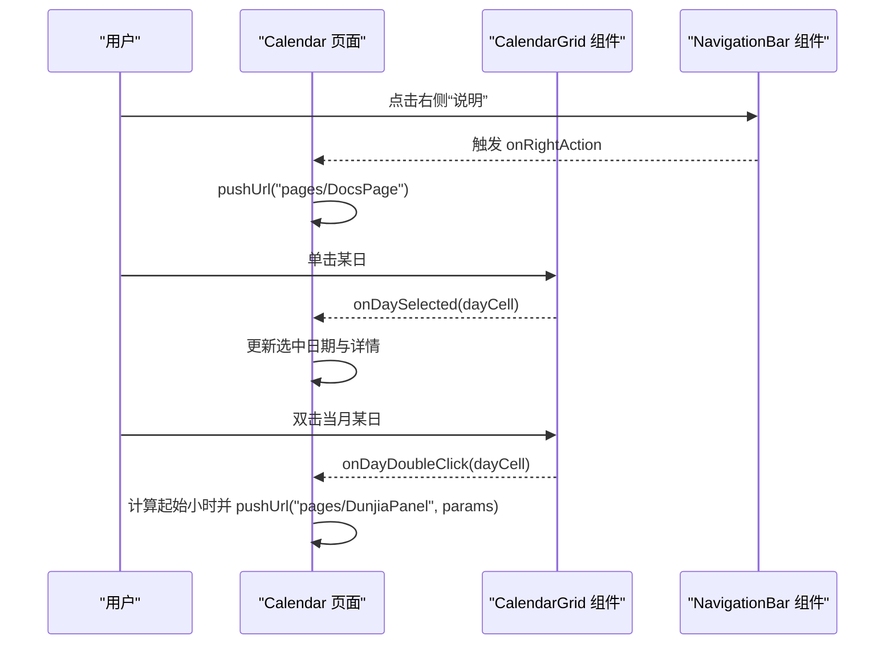
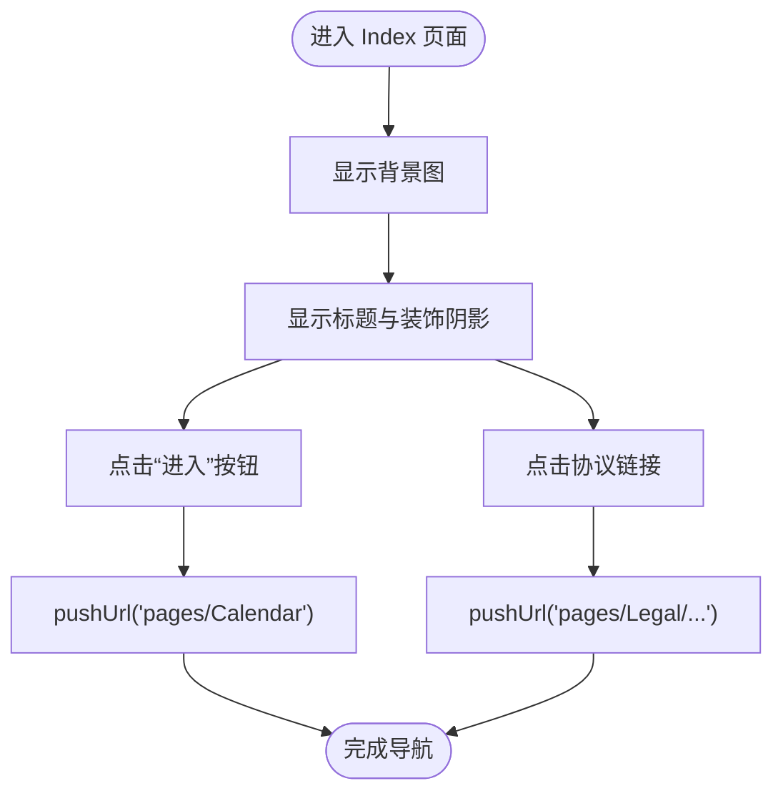
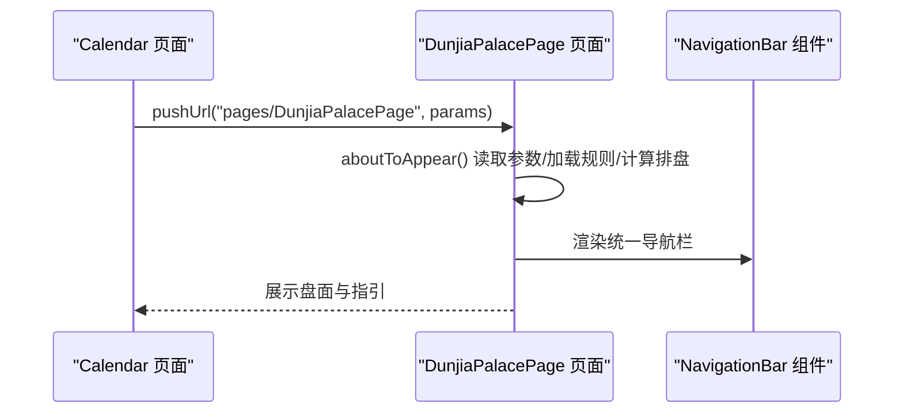
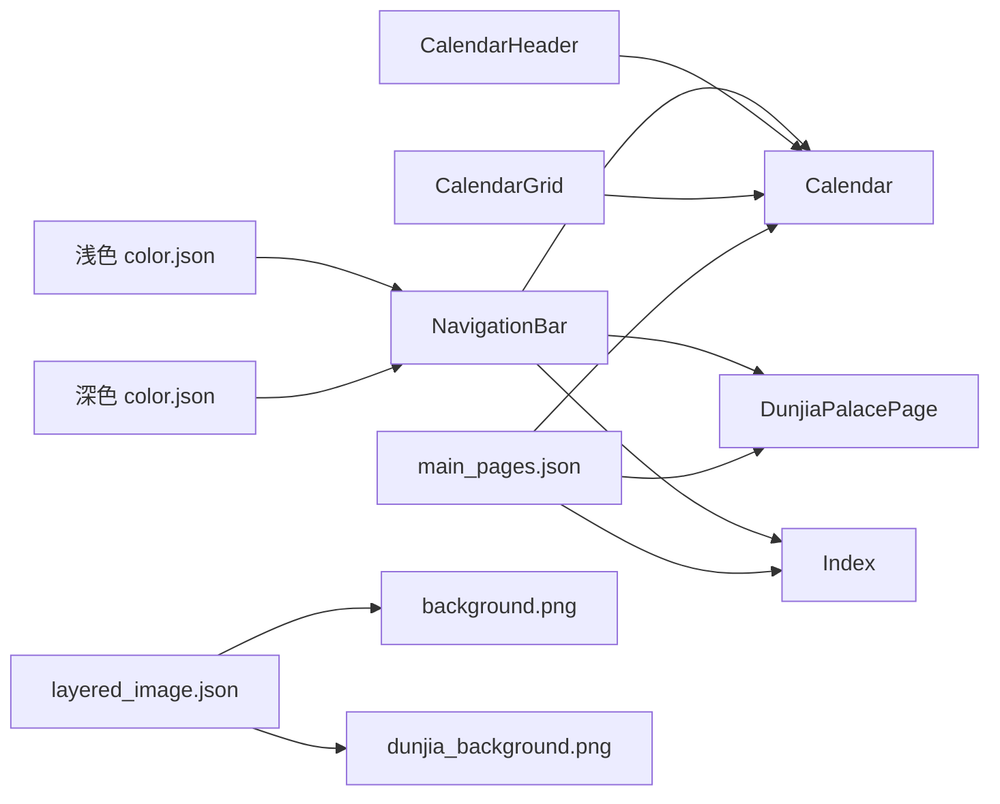

# 界面导航体验

<cite>
**本文引用的文件**
- [NavigationBar.ets](file://entry/src/main/ets/components/NavigationBar.ets)
- [Calendar.ets](file://entry/src/main/ets/pages/Calendar.ets)
- [DunjiaPalacePage.ets](file://entry/src/main/ets/pages/DunjiaPalacePage.ets)
- [Index.ets](file://entry/src/main/ets/pages/Index.ets)
- [CalendarGrid.ets](file://entry/src/main/ets/components/CalendarGrid.ets)
- [CalendarHeader.ets](file://entry/src/main/ets/components/CalendarHeader.ets)
- [color.json（浅色）](file://entry/src/main/resources/base/element/color.json)
- [color.json（深色）](file://entry/src/main/resources/dark/element/color.json)
- [main_pages.json](file://entry/src/main/resources/base/profile/main_pages.json)
- [layered_image.json](file://entry/src/main/resources/base/media/layered_image.json)
- [background.png](file://entry/src/main/resources/base/media/background.png)
- [dunjia_background.png](file://entry/src/main/resources/base/media/dunjia_background.png)
</cite>

## 目录
1. [简介](#简介)
2. [项目结构](#项目结构)
3. [核心组件](#核心组件)
4. [架构总览](#架构总览)
5. [详细组件分析](#详细组件分析)
6. [依赖分析](#依赖分析)
7. [性能考虑](#性能考虑)
8. [故障排查指南](#故障排查指南)
9. [结论](#结论)
10. [附录](#附录)

## 简介
本设计文档聚焦“遁甲应用”的界面导航体验，围绕整体视觉风格、主题色彩系统、导航栏组件设计理念与交互模式、主界面布局与用户旅程、响应式与多设备适配策略、动画与过渡效果、可访问性与国际化支持、界面定制与主题切换、以及用户反馈与帮助系统集成等方面进行系统化阐述。目标是帮助开发者与产品人员统一认知，指导后续迭代优化与扩展。

## 项目结构
应用采用 ArkTS + 自绘组件的前端架构，页面与组件分离清晰，导航栏作为跨页面通用组件被广泛复用。资源按主题与模式（浅色/深色）分层组织，主页面清单集中管理，媒体资源采用分层图像配置。

**图表来源**
- [Index.ets](file://entry/src/main/ets/pages/Index.ets#L1-L88)
- [Calendar.ets](file://entry/src/main/ets/pages/Calendar.ets#L1-L602)
- [DunjiaPalacePage.ets](file://entry/src/main/ets/pages/DunjiaPalacePage.ets#L1-L1017)
- [NavigationBar.ets](file://entry/src/main/ets/components/NavigationBar.ets#L1-L86)
- [CalendarGrid.ets](file://entry/src/main/ets/components/CalendarGrid.ets#L1-L167)
- [CalendarHeader.ets](file://entry/src/main/ets/components/CalendarHeader.ets#L1-L108)
- [main_pages.json](file://entry/src/main/resources/base/profile/main_pages.json#L1-L20)
- [layered_image.json](file://entry/src/main/resources/base/media/layered_image.json#L1-L7)
- [color.json（浅色）](file://entry/src/main/resources/base/element/color.json#L1-L8)
- [color.json（深色）](file://entry/src/main/resources/dark/element/color.json#L1-L8)

**章节来源**
- [Index.ets](file://entry/src/main/ets/pages/Index.ets#L1-L88)
- [Calendar.ets](file://entry/src/main/ets/pages/Calendar.ets#L1-L602)
- [DunjiaPalacePage.ets](file://entry/src/main/ets/pages/DunjiaPalacePage.ets#L1-L1017)
- [NavigationBar.ets](file://entry/src/main/ets/components/NavigationBar.ets#L1-L86)
- [CalendarGrid.ets](file://entry/src/main/ets/components/CalendarGrid.ets#L1-L167)
- [CalendarHeader.ets](file://entry/src/main/ets/components/CalendarHeader.ets#L1-L108)
- [main_pages.json](file://entry/src/main/resources/base/profile/main_pages.json#L1-L20)
- [layered_image.json](file://entry/src/main/resources/base/media/layered_image.json#L1-L7)
- [color.json（浅色）](file://entry/src/main/resources/base/element/color.json#L1-L8)
- [color.json（深色）](file://entry/src/main/resources/dark/element/color.json#L1-L8)

## 核心组件
- 通用导航栏（NavigationBar）：提供统一的标题、返回行为与右侧动作按钮，支持主题色与文字色自定义，贯穿首页、日历、遁甲盘等多个页面。
- 日历网格（CalendarGrid）：渲染标准 6×7 网格，支持选中态、今日高亮、节日标记、双击快速进入等功能。
- 月份头部（CalendarHeader）：提供上一月/下一月、回到今天、点击年/月弹层等交互入口。
- 主页面清单（main_pages.json）：集中声明应用主页面，确保路由与打包正确。

**章节来源**
- [NavigationBar.ets](file://entry/src/main/ets/components/NavigationBar.ets#L1-L86)
- [CalendarGrid.ets](file://entry/src/main/ets/components/CalendarGrid.ets#L1-L167)
- [CalendarHeader.ets](file://entry/src/main/ets/components/CalendarHeader.ets#L1-L108)
- [main_pages.json](file://entry/src/main/resources/base/profile/main_pages.json#L1-L20)

## 架构总览
应用采用“页面 + 组件 + 资源”的分层架构。页面通过路由进行导航，通用组件在多个页面内复用，资源按主题与模式分别管理，保证一致的视觉与交互体验。

**图表来源**
- [Index.ets](file://entry/src/main/ets/pages/Index.ets#L1-L88)
- [Calendar.ets](file://entry/src/main/ets/pages/Calendar.ets#L1-L602)
- [DunjiaPalacePage.ets](file://entry/src/main/ets/pages/DunjiaPalacePage.ets#L1-L1017)
- [NavigationBar.ets](file://entry/src/main/ets/components/NavigationBar.ets#L1-L86)
- [CalendarGrid.ets](file://entry/src/main/ets/components/CalendarGrid.ets#L1-L167)
- [CalendarHeader.ets](file://entry/src/main/ets/components/CalendarHeader.ets#L1-L108)
- [color.json（浅色）](file://entry/src/main/resources/base/element/color.json#L1-L8)
- [color.json（深色）](file://entry/src/main/resources/dark/element/color.json#L1-L8)

## 详细组件分析

### 导航栏组件（NavigationBar）
- 设计理念
  - 统一性：跨页面一致的标题、返回与右侧动作按钮布局。
  - 可定制：支持标题、返回文案、背景色、标题色、按钮色等属性注入。
  - 行为解耦：onBack/onRightAction 回调允许页面自定义返回与操作行为。
- 交互模式
  - 左侧返回按钮：默认使用系统回退，也可传入自定义回调。
  - 中间标题：居中显示，支持加粗与字号控制。
  - 右侧动作按钮：可选，点击触发回调。
  - 分割线：底部分割线增强层级感。
- 主题与色彩
  - 通过属性注入背景色、标题色、按钮色，配合浅色/深色资源实现夜间模式适配。

**图表来源**
- [NavigationBar.ets](file://entry/src/main/ets/components/NavigationBar.ets#L22-L85)

**章节来源**
- [NavigationBar.ets](file://entry/src/main/ets/components/NavigationBar.ets#L1-L86)

### 日历页面（Calendar）与日历组件
- 页面布局
  - 顶部导航栏：右侧“说明”按钮跳转到文档页。
  - 滚动内容区：月份头部、日历网格、选中日期详情、时辰选择器、农历信息面板、底部操作按钮。
- 交互流程
  - 月份切换：上一月/下一月、回到今天、点击年/月弹层。
  - 日期选择：单击选中、双击快速进入遁甲推演。
  - 时辰选择：根据日干与时辰索引计算起始小时，构建时间戳传递给遁甲盘面。
- 组件职责
  - CalendarHeader：提供月份切换与回到今天的入口。
  - CalendarGrid：渲染日历网格，支持选中态、今日高亮、节日标记、双击事件。

**图表来源**
- [Calendar.ets](file://entry/src/main/ets/pages/Calendar.ets#L306-L498)
- [CalendarGrid.ets](file://entry/src/main/ets/components/CalendarGrid.ets#L92-L165)
- [NavigationBar.ets](file://entry/src/main/ets/components/NavigationBar.ets#L35-L83)

**章节来源**
- [Calendar.ets](file://entry/src/main/ets/pages/Calendar.ets#L1-L602)
- [CalendarGrid.ets](file://entry/src/main/ets/components/CalendarGrid.ets#L1-L167)
- [CalendarHeader.ets](file://entry/src/main/ets/components/CalendarHeader.ets#L1-L108)
- [NavigationBar.ets](file://entry/src/main/ets/components/NavigationBar.ets#L1-L86)

### 首页（Index）
- 布局结构
  - 背景图片层：全屏覆盖背景图。
  - 内容层：顶部中央标题、底部“进入”按钮与协议链接。
- 用户旅程
  - 点击“进入”按钮跳转至日历页面。
  - 点击协议链接跳转至法律页。

**图表来源**
- [Index.ets](file://entry/src/main/ets/pages/Index.ets#L16-L87)

**章节来源**
- [Index.ets](file://entry/src/main/ets/pages/Index.ets#L1-L88)

### 遁甲盘面页面（DunjiaPalacePage）
- 页面职责
  - 接收时间参数，加载规则数据，执行排盘计算，展示九宫盘与用神指引。
- 导航集成
  - 顶部使用统一导航栏，标题为“九宫时空盘”。

**图表来源**
- [Calendar.ets](file://entry/src/main/ets/pages/Calendar.ets#L272-L304)
- [DunjiaPalacePage.ets](file://entry/src/main/ets/pages/DunjiaPalacePage.ets#L98-L115)
- [NavigationBar.ets](file://entry/src/main/ets/components/NavigationBar.ets#L35-L83)

**章节来源**
- [DunjiaPalacePage.ets](file://entry/src/main/ets/pages/DunjiaPalacePage.ets#L1-L1017)
- [NavigationBar.ets](file://entry/src/main/ets/components/NavigationBar.ets#L1-L86)

## 依赖分析
- 组件依赖
  - Calendar 页面依赖 NavigationBar、CalendarGrid、CalendarHeader。
  - DunjiaPalacePage 页面依赖 NavigationBar 与内部组件。
  - Index 页面独立，但通过路由与其他页面联动。
- 资源依赖
  - 浅色/深色 color.json 为导航栏等组件提供主题色。
  - layered_image.json 与背景图资源共同构成启动与页面背景。
- 路由依赖
  - main_pages.json 统一声明主页面，确保路由可用。

**图表来源**
- [NavigationBar.ets](file://entry/src/main/ets/components/NavigationBar.ets#L1-L86)
- [Calendar.ets](file://entry/src/main/ets/pages/Calendar.ets#L1-L602)
- [DunjiaPalacePage.ets](file://entry/src/main/ets/pages/DunjiaPalacePage.ets#L1-L1017)
- [Index.ets](file://entry/src/main/ets/pages/Index.ets#L1-L88)
- [CalendarGrid.ets](file://entry/src/main/ets/components/CalendarGrid.ets#L1-L167)
- [CalendarHeader.ets](file://entry/src/main/ets/components/CalendarHeader.ets#L1-L108)
- [main_pages.json](file://entry/src/main/resources/base/profile/main_pages.json#L1-L20)
- [layered_image.json](file://entry/src/main/resources/base/media/layered_image.json#L1-L7)
- [color.json（浅色）](file://entry/src/main/resources/base/element/color.json#L1-L8)
- [color.json（深色）](file://entry/src/main/resources/dark/element/color.json#L1-L8)

**章节来源**
- [main_pages.json](file://entry/src/main/resources/base/profile/main_pages.json#L1-L20)
- [layered_image.json](file://entry/src/main/resources/base/media/layered_image.json#L1-L7)
- [color.json（浅色）](file://entry/src/main/resources/base/element/color.json#L1-L8)
- [color.json（深色）](file://entry/src/main/resources/dark/element/color.json#L1-L8)

## 性能考虑
- 组件复用与解耦：NavigationBar、CalendarGrid、CalendarHeader 等组件在多个页面复用，减少重复渲染与逻辑耦合。
- 异步加载：日历页面批量查询日期信息，使用 Promise.all 并行请求，降低等待时间。
- 路由参数传递：通过 params 传递时间戳与干支信息，避免全局状态污染。
- 资源优化：背景图采用覆盖铺满策略，减少额外绘制开销。

[本节为通用性能建议，不直接分析具体文件]

## 故障排查指南
- 导航栏颜色异常
  - 检查浅色/深色 color.json 的主题色配置是否正确。
  - 确认页面是否正确传入 navBarBackgroundColor、titleColor、buttonColor。
- 日历双击无效
  - 确认双击事件仅在当月日期生效，非当月日期不会响应双击。
  - 检查 onDayDoubleClick 回调是否正确绑定。
- 路由跳转失败
  - 核对 main_pages.json 中页面路径是否与 pushUrl 的 url 一致。
- 背景图显示异常
  - 检查 layered_image.json 与对应媒体资源是否存在且命名一致。

**章节来源**
- [NavigationBar.ets](file://entry/src/main/ets/components/NavigationBar.ets#L28-L30)
- [Calendar.ets](file://entry/src/main/ets/pages/Calendar.ets#L242-L248)
- [main_pages.json](file://entry/src/main/resources/base/profile/main_pages.json#L1-L20)
- [layered_image.json](file://entry/src/main/resources/base/media/layered_image.json#L1-L7)

## 结论
本应用通过统一的导航栏组件与清晰的页面分工，实现了稳定一致的导航体验。日历页面的交互设计直观易用，配合规则驱动的遁甲盘面展示，形成从择日到推演的完整用户旅程。资源与主题系统支持浅色/深色模式，满足不同环境下的可读性需求。后续可在动画过渡、无障碍与国际化方面进一步完善，以提升整体体验。

[本节为总结性内容，不直接分析具体文件]

## 附录

### 视觉设计风格与主题色彩系统
- 视觉风格
  - 简洁现代：统一的字体字号与间距，强调信息层级。
  - 文化融合：结合遁甲文化元素（如九宫、三奇等）在界面中以图标与文案形式呈现。
- 主题色彩
  - 导航栏背景色、标题色、按钮色通过属性注入，结合浅色/深色资源实现夜间模式。
  - 页面背景采用覆盖式背景图，增强沉浸感。

**章节来源**
- [NavigationBar.ets](file://entry/src/main/ets/components/NavigationBar.ets#L28-L30)
- [color.json（浅色）](file://entry/src/main/resources/base/element/color.json#L1-L8)
- [color.json（深色）](file://entry/src/main/resources/dark/element/color.json#L1-L8)
- [layered_image.json](file://entry/src/main/resources/base/media/layered_image.json#L1-L7)
- [background.png](file://entry/src/main/resources/base/media/background.png)
- [dunjia_background.png](file://entry/src/main/resources/base/media/dunjia_background.png)

### 导航栏组件的设计理念与交互模式
- 统一性：跨页面一致的布局与行为。
- 可定制：支持标题、返回文案与颜色属性。
- 行为解耦：通过回调实现页面特定逻辑。

**章节来源**
- [NavigationBar.ets](file://entry/src/main/ets/components/NavigationBar.ets#L3-L21)

### 主界面布局结构与用户体验流程
- 首页：背景图 + 标题 + 进入按钮 + 协议链接。
- 日历页：顶部导航 + 月份头部 + 日历网格 + 详情区 + 操作区。
- 盘面页：顶部导航 + 盘面与指引展示。

**章节来源**
- [Index.ets](file://entry/src/main/ets/pages/Index.ets#L16-L87)
- [Calendar.ets](file://entry/src/main/ets/pages/Calendar.ets#L306-L498)
- [DunjiaPalacePage.ets](file://entry/src/main/ets/pages/DunjiaPalacePage.ets#L774-L772)

### 响应式设计与多设备适配策略
- 布局策略
  - 使用 Stack/Column/Row/Flex 等容器实现自适应排列。
  - 图片采用覆盖铺满策略，适配不同屏幕尺寸。
- 交互适配
  - 日历网格列宽按百分比分配，保证在窄屏下仍具可读性。
  - 弹层（年/月选择器）采用遮罩层与弹性布局，提升移动端交互体验。

**章节来源**
- [Calendar.ets](file://entry/src/main/ets/pages/Calendar.ets#L470-L600)
- [CalendarGrid.ets](file://entry/src/main/ets/components/CalendarGrid.ets#L86-L90)

### 动画效果与过渡动画
- 当前实现
  - 页面跳转使用路由 pushUrl，未见显式的过渡动画配置。
- 建议
  - 在路由层引入过渡动画配置，或在页面切换时增加淡入淡出/滑动过渡，提升流畅度。

[本节为通用建议，不直接分析具体文件]

### 可访问性与国际化支持
- 可访问性
  - 字号与对比度：导航栏与正文采用较高对比度，确保可读性。
  - 交互反馈：按钮与日期单元具备点击反馈与选中态。
- 国际化
  - 代码中存在部分英文文案（如“说明”按钮），建议在资源层提供多语言字符串映射，以便后续扩展。

[本节为通用建议，不直接分析具体文件]

### 界面定制与主题切换
- 主题切换
  - 通过浅色/深色 color.json 实现夜间模式适配。
  - 导航栏支持颜色属性注入，便于局部主题定制。
- 建议
  - 引入系统级深色模式监听与自动切换，提升用户体验一致性。

**章节来源**
- [color.json（浅色）](file://entry/src/main/resources/base/element/color.json#L1-L8)
- [color.json（深色）](file://entry/src/main/resources/dark/element/color.json#L1-L8)
- [NavigationBar.ets](file://entry/src/main/ets/components/NavigationBar.ets#L28-L30)

### 用户反馈与帮助系统集成
- 帮助入口
  - 日历页导航栏右侧提供“说明”按钮，跳转至文档页。
- 建议
  - 增加“意见反馈”入口与“常见问题”模块，完善用户支持闭环。

**章节来源**
- [Calendar.ets](file://entry/src/main/ets/pages/Calendar.ets#L310-L318)