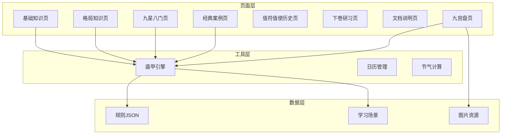
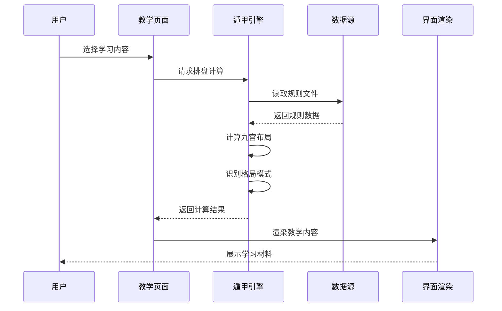
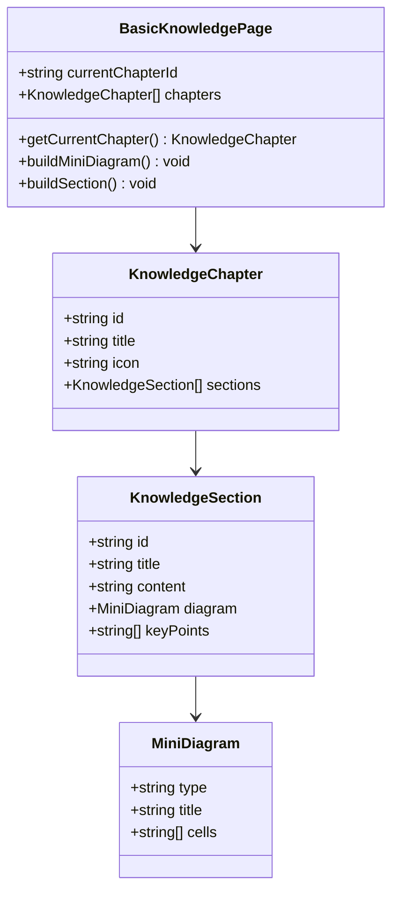
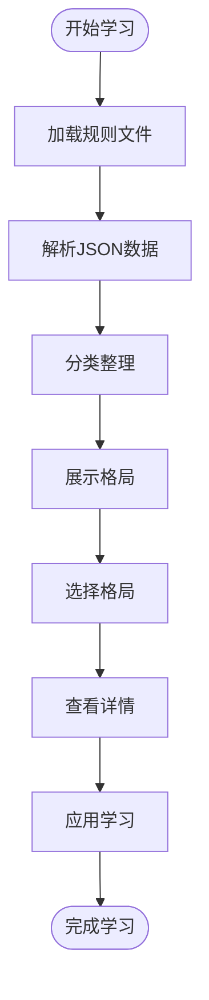
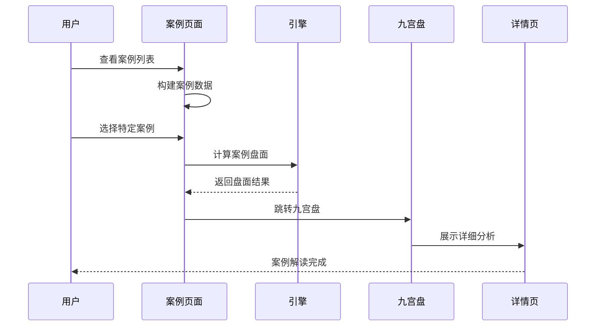
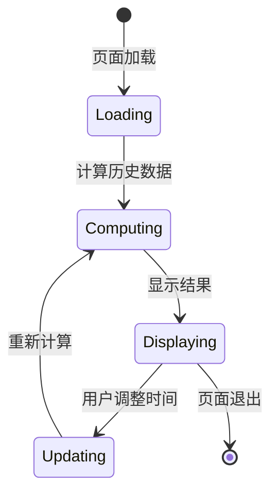
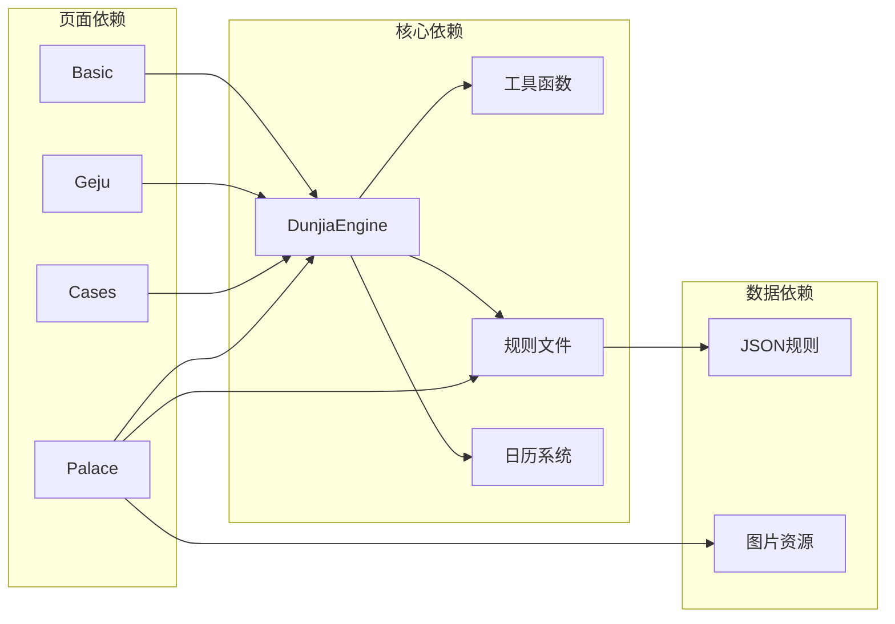

# 知识教育模块

<cite>
**本文档引用的文件**
- [BasicKnowledgePage.ets](file://entry/src/main/ets/pages/BasicKnowledgePage.ets)
- [GejuKnowledgePage.ets](file://entry/src/main/ets/pages/GejuKnowledgePage.ets)
- [JiuxingBamenKnowledgePage.ets](file://entry/src/main/ets/pages/JiuxingBamenKnowledgePage.ets)
- [ClassicalCasesPage.ets](file://entry/src/main/ets/pages/ClassicalCasesPage.ets)
- [ZhiFuZhiShiHistoryPage.ets](file://entry/src/main/ets/pages/ZhiFuZhiShiHistoryPage.ets)
- [XiajuanStudyPage.ets](file://entry/src/main/ets/pages/XiajuanStudyPage.ets)
- [DocsPage.ets](file://entry/src/main/ets/pages/DocsPage.ets)
- [DunjiaPalacePage.ets](file://entry/src/main/ets/pages/DunjiaPalacePage.ets)
- [DunjiaEngine.ets](file://entry/src/main/ets/utils/DunjiaEngine.ets)
- [jiuxing_duanyu_rules.json](file://entry/src/main/resources/rawfile/rules/jiuxing_duanyu_rules.json)
- [dunjia_scenes.json](file://entry/src/main/resources/rawfile/dunjia_scenes.json)
</cite>

## 目录
1. [简介](#简介)
2. [项目结构](#项目结构)
3. [核心组件](#核心组件)
4. [架构概览](#架构概览)
5. [详细组件分析](#详细组件分析)
6. [依赖分析](#依赖分析)
7. [性能考虑](#性能考虑)
8. [故障排除指南](#故障排除指南)
9. [结论](#结论)
10. [附录](#附录)

## 简介
本知识教育模块围绕遁甲（奇门遁甲）知识体系构建，提供从基础到高级的系统化教学路径。模块以《遁甲符应经》为核心依据，结合九宫排盘、九星八门、三奇六仪、神煞理论等核心概念，形成"理论-规则-案例-实践"的完整学习闭环。通过图文并茂的知识展示、交互式排盘体验、经典案例重演、历史轨迹追踪等功能，帮助学习者建立完整的遁甲知识图谱和实践能力。

## 项目结构
项目采用ArkTS + OpenHarmony技术栈，按照功能模块化组织：

**图表来源**
- [BasicKnowledgePage.ets](file://entry/src/main/ets/pages/BasicKnowledgePage.ets#L41-L794)
- [DunjiaEngine.ets](file://entry/src/main/ets/utils/DunjiaEngine.ets#L98-L162)

**章节来源**
- [BasicKnowledgePage.ets](file://entry/src/main/ets/pages/BasicKnowledgePage.ets#L1-L794)
- [DunjiaEngine.ets](file://entry/src/main/ets/utils/DunjiaEngine.ets#L1-L961)

## 核心组件
模块包含七个核心教学页面，每个页面承担不同的学习目标：

### 基础知识教学
- **奇门基础知识页**：系统讲解九星、八门、三奇、阴阳遁等基础概念
- **九星八门知识页**：深入解析九星属性、旺相休囚、八门吉凶
- **神煞理论页**：介绍九天九地、太阴六合等高级应用

### 规则与实践
- **格局识别页**：展示大吉、强凶、对敌战术等各类格局
- **经典案例页**：重现《遁甲符应经》中的代表性案例
- **值符值使历史页**：追踪12时辰动态演化

### 文献与资源
- **下卷研习页**：收录《遁甲符应经》下卷相关符咒与技法
- **文档说明页**：提供真太阳时等关键技术概念说明

**章节来源**
- [GejuKnowledgePage.ets](file://entry/src/main/ets/pages/GejuKnowledgePage.ets#L71-L846)
- [ClassicalCasesPage.ets](file://entry/src/main/ets/pages/ClassicalCasesPage.ets#L48-L625)
- [ZhiFuZhiShiHistoryPage.ets](file://entry/src/main/ets/pages/ZhiFuZhiShiHistoryPage.ets#L9-L237)

## 架构概览

**图表来源**
- [DunjiaEngine.ets](file://entry/src/main/ets/utils/DunjiaEngine.ets#L113-L162)
- [DunjiaPalacePage.ets](file://entry/src/main/ets/pages/DunjiaPalacePage.ets#L218-L236)

系统采用"页面-引擎-数据"三层架构：
- **页面层**：负责用户交互和内容展示
- **引擎层**：核心计算逻辑，基于《遁甲符应经》规则
- **数据层**：规则JSON文件和静态资源

## 详细组件分析

### 奇门基础知识教学系统

**图表来源**
- [BasicKnowledgePage.ets](file://entry/src/main/ets/pages/BasicKnowledgePage.ets#L6-L31)
- [BasicKnowledgePage.ets](file://entry/src/main/ets/pages/BasicKnowledgePage.ets#L43-L794)

**章节来源**
- [BasicKnowledgePage.ets](file://entry/src/main/ets/pages/BasicKnowledgePage.ets#L41-L794)

### 格局识别与判断系统

**图表来源**
- [GejuKnowledgePage.ets](file://entry/src/main/ets/pages/GejuKnowledgePage.ets#L295-L369)
- [GejuKnowledgePage.ets](file://entry/src/main/ets/pages/GejuKnowledgePage.ets#L562-L793)

**章节来源**
- [GejuKnowledgePage.ets](file://entry/src/main/ets/pages/GejuKnowledgePage.ets#L71-L846)

### 经典案例重演系统

**图表来源**
- [ClassicalCasesPage.ets](file://entry/src/main/ets/pages/ClassicalCasesPage.ets#L57-L316)
- [ClassicalCasesPage.ets](file://entry/src/main/ets/pages/ClassicalCasesPage.ets#L568-L584)

**章节来源**
- [ClassicalCasesPage.ets](file://entry/src/main/ets/pages/ClassicalCasesPage.ets#L48-L625)

### 值符值使动态追踪

**图表来源**
- [ZhiFuZhiShiHistoryPage.ets](file://entry/src/main/ets/pages/ZhiFuZhiShiHistoryPage.ets#L32-L76)
- [ZhiFuZhiShiHistoryPage.ets](file://entry/src/main/ets/pages/ZhiFuZhiShiHistoryPage.ets#L107-L174)

**章节来源**
- [ZhiFuZhiShiHistoryPage.ets](file://entry/src/main/ets/pages/ZhiFuZhiShiHistoryPage.ets#L9-L237)

## 依赖分析

**图表来源**
- [DunjiaEngine.ets](file://entry/src/main/ets/utils/DunjiaEngine.ets#L1-L961)
- [DunjiaPalacePage.ets](file://entry/src/main/ets/pages/DunjiaPalacePage.ets#L1-L1017)

模块依赖关系清晰，核心引擎独立于页面层，通过统一接口提供计算服务。规则文件采用JSON格式，便于维护和扩展。

**章节来源**
- [jiuxing_duanyu_rules.json](file://entry/src/main/resources/rawfile/rules/jiuxing_duanyu_rules.json#L1-L256)
- [dunjia_scenes.json](file://entry/src/main/resources/rawfile/dunjia_scenes.json#L1-L50)

## 性能考虑
- **异步计算**：排盘计算采用异步方式，避免阻塞UI线程
- **内存优化**：规则数据按需加载，使用完成后及时释放
- **缓存策略**：重复访问的案例数据进行本地缓存
- **渲染优化**：使用虚拟滚动技术处理大量列表数据

## 故障排除指南
- **规则加载失败**：检查JSON文件格式和编码，确保UTF-8格式
- **排盘计算错误**：验证输入时间精度，确保经度参数有效
- **页面渲染异常**：检查组件状态更新逻辑，避免竞态条件
- **资源加载失败**：确认文件路径正确，检查资源打包配置

**章节来源**
- [DocsPage.ets](file://entry/src/main/ets/pages/DocsPage.ets#L17-L46)
- [DunjiaPalacePage.ets](file://entry/src/main/ets/pages/DunjiaPalacePage.ets#L120-L148)

## 结论
本知识教育模块通过系统化的教学设计和丰富的交互功能，为遁甲学习者提供了完整的学习路径。模块不仅涵盖了理论知识的传授，更重要的是通过实践案例和动态演示，帮助学习者深入理解遁甲的内在逻辑和应用方法。基于《遁甲符应经》的权威规则和现代化的技术实现，模块能够适应不同层次学习者的需求，从入门到精通形成完整的知识体系。

## 附录

### 学习阶段组织
- **入门级**：奇门基础知识、九星八门基本概念
- **进阶级**：格局识别、经典案例分析、排盘实践
- **专家级**：神煞理论、高级应用、实战推演

### 知识图谱构建
模块通过规则文件和案例数据构建了完整的知识网络，支持知识点之间的关联查询和智能推荐。

### 互动学习功能
- 交互式排盘演示
- 案例对比分析
- 实时计算反馈
- 学习进度跟踪