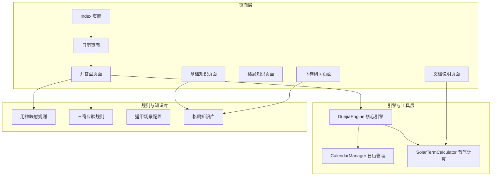
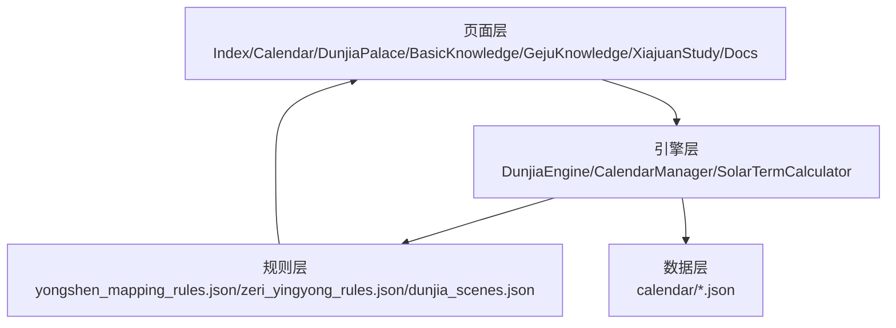
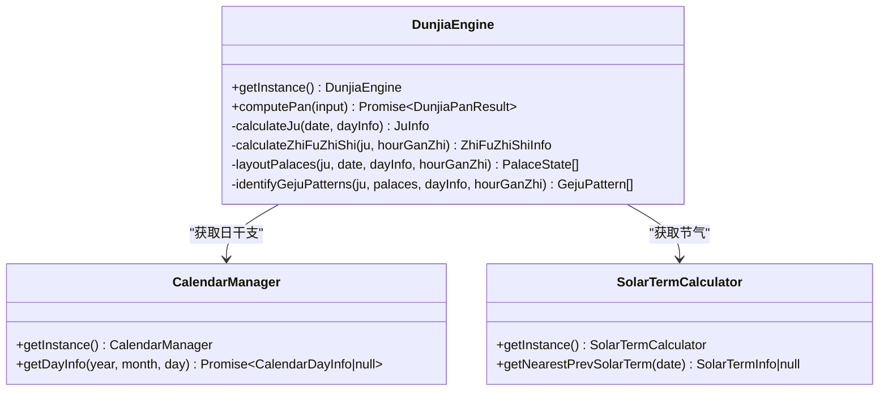
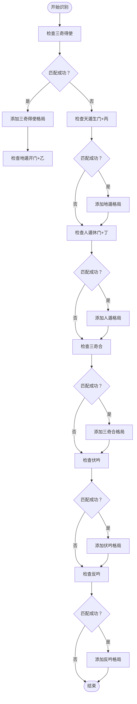

# 规则分析系统

<cite>
**本文档引用的文件**
- [DunjiaEngine.ets](file://entry/src/main/ets/utils/DunjiaEngine.ets)
- [CalendarManager.ets](file://entry/src/main/ets/utils/CalendarManager.ets)
- [SolarTermCalculator.ets](file://entry/src/main/ets/utils/SolarTermCalculator.ets)
- [DunjiaPalacePage.ets](file://entry/src/main/ets/pages/DunjiaPalacePage.ets)
- [BasicKnowledgePage.ets](file://entry/src/main/ets/pages/BasicKnowledgePage.ets)
- [GejuKnowledgePage.ets](file://entry/src/main/ets/pages/GejuKnowledgePage.ets)
- [Calendar.ets](file://entry/src/main/ets/pages/Calendar.ets)
- [XiajuanStudyPage.ets](file://entry/src/main/ets/pages/XiajuanStudyPage.ets)
- [DocsPage.ets](file://entry/src/main/ets/pages/DocsPage.ets)
- [yongshen_mapping_rules.json](file://entry/src/main/resources/rawfile/rules/yongshen_mapping_rules.json)
- [zeri_yingyong_rules.json](file://entry/src/main/resources/rawfile/rules/zeri_yingyong_rules.json)
- [dunjia_scenes.json](file://entry/src/main/resources/rawfile/dunjia_scenes.json)
</cite>

## 目录
1. [简介](#简介)
2. [项目结构](#项目结构)
3. [核心组件](#核心组件)
4. [架构总览](#架构总览)
5. [详细组件分析](#详细组件分析)
6. [依赖关系分析](#依赖关系分析)
7. [性能考虑](#性能考虑)
8. [故障排除指南](#故障排除指南)
9. [结论](#结论)
10. [附录](#附录)

## 简介
本系统围绕《遁甲符应经》构建，提供从基础排盘到高级格局分析的完整规则体系。系统以规则驱动为核心，支持普通研习、战略布局、时机窗口等多场景应用，具备规则识别算法、格局分析逻辑、规则数据存储与加载机制、规则解释与知识库组织、规则查询与筛选、规则关联关系与组合效应、规则验证与更新机制等功能。

## 项目结构
系统采用分层架构，核心引擎负责时空盘计算与规则识别，页面层负责场景化展示与交互，规则层提供结构化的规则数据与知识库。



**图表来源**
- [Index.ets](file://entry/src/main/ets/pages/Index.ets#L1-L88)
- [Calendar.ets](file://entry/src/main/ets/pages/Calendar.ets#L1-L602)
- [DunjiaPalacePage.ets](file://entry/src/main/ets/pages/DunjiaPalacePage.ets#L1-L1017)
- [BasicKnowledgePage.ets](file://entry/src/main/ets/pages/BasicKnowledgePage.ets#L1-L794)
- [GejuKnowledgePage.ets](file://entry/src/main/ets/pages/GejuKnowledgePage.ets#L1-L846)
- [XiajuanStudyPage.ets](file://entry/src/main/ets/pages/XiajuanStudyPage.ets#L1-L369)
- [DocsPage.ets](file://entry/src/main/ets/pages/DocsPage.ets#L1-L227)
- [DunjiaEngine.ets](file://entry/src/main/ets/utils/DunjiaEngine.ets#L1-L961)
- [CalendarManager.ets](file://entry/src/main/ets/utils/CalendarManager.ets#L1-L123)
- [SolarTermCalculator.ets](file://entry/src/main/ets/utils/SolarTermCalculator.ets#L1-L375)

**章节来源**
- [Index.ets](file://entry/src/main/ets/pages/Index.ets#L1-L88)
- [Calendar.ets](file://entry/src/main/ets/pages/Calendar.ets#L1-L602)
- [DunjiaPalacePage.ets](file://entry/src/main/ets/pages/DunjiaPalacePage.ets#L1-L1017)
- [BasicKnowledgePage.ets](file://entry/src/main/ets/pages/BasicKnowledgePage.ets#L1-L794)
- [GejuKnowledgePage.ets](file://entry/src/main/ets/pages/GejuKnowledgePage.ets#L1-L846)
- [XiajuanStudyPage.ets](file://entry/src/main/ets/pages/XiajuanStudyPage.ets#L1-L369)
- [DocsPage.ets](file://entry/src/main/ets/pages/DocsPage.ets#L1-L227)

## 核心组件
- 核心引擎（DunjiaEngine）
  - 负责从输入参数计算完整的遁甲盘面与结构化分析结果，包含局数计算、值符值使定位、九宫布局、规则命中与结构总结、格局识别等。
  - 关键接口：computePan、calculateJu、calculateZhiFuZhiShi、layoutPalaces、identifyGejuPatterns。
- 日历与节气工具
  - CalendarManager：提供万年历数据查询与缓存，支持按年份分片加载。
  - SolarTermCalculator：提供节气精确时刻计算与缓存，支持跨年节气检索。
- 规则与知识库
  - 用神映射规则：定义不同事务类型的用神选择与占断逻辑。
  - 三奇应验规则：提供三奇在不同宫位的应验现象与时间窗口。
  - 格局知识库：结构化展示各类格局的判定条件、效应与来源。
  - 场景配置：定义不同研习场景的标签、级别与要点。

**章节来源**
- [DunjiaEngine.ets](file://entry/src/main/ets/utils/DunjiaEngine.ets#L98-L162)
- [CalendarManager.ets](file://entry/src/main/ets/utils/CalendarManager.ets#L30-L92)
- [SolarTermCalculator.ets](file://entry/src/main/ets/utils/SolarTermCalculator.ets#L30-L159)
- [yongshen_mapping_rules.json](file://entry/src/main/resources/rawfile/rules/yongshen_mapping_rules.json#L1-L510)
- [zeri_yingyong_rules.json](file://entry/src/main/resources/rawfile/rules/zeri_yingyong_rules.json#L1-L145)
- [dunjia_scenes.json](file://entry/src/main/resources/rawfile/dunjia_scenes.json#L1-L50)

## 架构总览
系统采用“页面层-引擎层-规则层”的分层架构，页面层负责用户交互与场景化展示，引擎层负责核心计算与规则识别，规则层提供结构化数据支撑。



**图表来源**
- [DunjiaEngine.ets](file://entry/src/main/ets/utils/DunjiaEngine.ets#L98-L162)
- [CalendarManager.ets](file://entry/src/main/ets/utils/CalendarManager.ets#L30-L92)
- [SolarTermCalculator.ets](file://entry/src/main/ets/utils/SolarTermCalculator.ets#L30-L159)
- [yongshen_mapping_rules.json](file://entry/src/main/resources/rawfile/rules/yongshen_mapping_rules.json#L1-L510)
- [zeri_yingyong_rules.json](file://entry/src/main/resources/rawfile/rules/zeri_yingyong_rules.json#L1-L145)
- [dunjia_scenes.json](file://entry/src/main/resources/rawfile/dunjia_scenes.json#L1-L50)

## 详细组件分析

### 核心引擎（DunjiaEngine）
- 职责
  - 计算局数与阴阳遁类型，确定值符值使位置，布九宫（九星、八门、三奇六仪、八神），识别格局并生成结构化结果。
- 关键算法
  - 局数计算：依据节气与地支仲孟季判断上中下元，查表确定局数。
  - 值符值使：根据时干偏移与阴阳遁规则，顺逆飞布定位。
  - 九宫布局：固定九星与八门布局，按局数与阴阳遁规则布三奇六仪与八神。
  - 格局识别：基于天干地支组合、门、神等条件识别三奇得使、三遁、三奇合、伏吟、反吟等格局。
- 数据结构
  - 输入：DunjiaInput（日期时间、经度、研习场景）。
  - 输出：DunjiaPanResult（阴阳遁类型、局数标签、值符值使、九宫状态、规则命中、结构评估、日信息、时辰干支、真太阳时偏移、格局列表）。
  - 核心接口：computePan、calculateJu、calculateZhiFuZhiShi、layoutPalaces、identifyGejuPatterns。



**图表来源**
- [DunjiaEngine.ets](file://entry/src/main/ets/utils/DunjiaEngine.ets#L98-L162)
- [CalendarManager.ets](file://entry/src/main/ets/utils/CalendarManager.ets#L30-L92)
- [SolarTermCalculator.ets](file://entry/src/main/ets/utils/SolarTermCalculator.ets#L30-L159)

**章节来源**
- [DunjiaEngine.ets](file://entry/src/main/ets/utils/DunjiaEngine.ets#L98-L961)

### 规则识别与格局分析
- 规则识别算法
  - 三奇得使：检查值使门宫是否为三奇（乙/丙/丁）。
  - 三遁：根据门与三奇组合识别天遁（生门+丙）、地遁（开门+乙）、人遁（休门+丁）。
  - 三奇合：检查某宫是否同时包含三奇。
  - 伏吟：检查某宫天干地干相同。
  - 反吟：检查特定天干对冲组合。
  - 青龙返首、飞鸟跌穴等高级格局：基于天盘地盘干支组合识别。
- 格局分析逻辑
  - 将识别到的格局按等级（minor/major/special）与类型（吉/凶/中性）分类，提供描述与效应说明。
  - 与用神映射结合，针对不同事务类型给出占断指引。



**图表来源**
- [DunjiaEngine.ets](file://entry/src/main/ets/utils/DunjiaEngine.ets#L678-L846)

**章节来源**
- [DunjiaEngine.ets](file://entry/src/main/ets/utils/DunjiaEngine.ets#L678-L846)

### 研习场景应用
- 景祐时空盘研习：从时间、节气、真太阳时三个维度展示局数与九宫结构，帮助理解时空模型整体框架。
- 三奇应验与择日：展示三奇到宫后的应验现象、时间周期，结合宝日义日伐日判断，提供择日建议。
- 古籍案例重演：按《遁甲符应经》原文重建典型局例，用于对照研读与结构拆解。
- 结构化趋势分析：以学习视角给出当前盘面的结构特征提示，如更偏向主动突破、稳健推进，或适合观望评估。
- 分层研习路线：按认宫→局数→星门→格局的顺序设计研习关卡，结合原文与示意图，降低学习门槛。

**章节来源**
- [dunjia_scenes.json](file://entry/src/main/resources/rawfile/dunjia_scenes.json#L1-L50)

### 规则数据存储与加载机制
- 用神映射规则
  - 文件：yongshen_mapping_rules.json
  - 结构：categories 数组，每个事务类型包含主用神、次用神、判断逻辑、方向规则、时间提示等。
  - 页面加载：DunjiaPalacePage 通过资源管理器读取并解析 JSON，支持 UTF-8 解码。
- 三奇应验规则
  - 文件：zeri_yingyong_rules.json
  - 结构：rules 数组，包含五类日子吉凶、利客利主格局、五阳五阴时、十二日天门地户玉女反闭等。
  - 页面加载：DunjiaPalacePage 读取并解析，用于三奇象意筛选与展示。
- 场景配置
  - 文件：dunjia_scenes.json
  - 结构：sections 数组，描述不同研习场景的标题、副标题、摘要、级别、标签与强调色。

**章节来源**
- [yongshen_mapping_rules.json](file://entry/src/main/resources/rawfile/rules/yongshen_mapping_rules.json#L1-L510)
- [zeri_yingyong_rules.json](file://entry/src/main/resources/rawfile/rules/zeri_yingyong_rules.json#L1-L145)
- [dunjia_scenes.json](file://entry/src/main/resources/rawfile/dunjia_scenes.json#L1-L50)
- [DunjiaPalacePage.ets](file://entry/src/main/ets/pages/DunjiaPalacePage.ets#L117-L181)

### 规则解释与知识库组织
- 格局知识库
  - 文件：geju_jixiong_rules.json（通过 GejuKnowledgePage 动态加载）
  - 结构：rules 数组，每个规则包含 id、name、category、ruleSource、description、conditions、effects、sub_rules 等。
  - 页面：GejuKnowledgePage 分类展示大吉、强凶、对敌战术、其他格局，并支持详情弹窗查看判定条件与效应。
- 知识库组织方式
  - 按类别（吉格、凶格、特殊凶象）组织，支持子规则细化到宫位与方位。
  - 提供来源出处与效应说明，便于溯源与教学。

**章节来源**
- [GejuKnowledgePage.ets](file://entry/src/main/ets/pages/GejuKnowledgePage.ets#L71-L497)

### 规则查询与筛选功能
- 三奇应验筛选
  - DunjiaPalacePage 根据当前盘面中的三奇位置（乙/丙/丁）筛选对应规则，按事务类型提取象意文本。
  - 支持日奇、月奇、星奇分类展示与提示补充。
- 用神映射筛选
  - 根据事务类型（寻人、寻物、出行、婚恋、求职、求财、考试、健康）选择主用神与次用神，结合判断逻辑与方向规则给出占断指引。
- 时效性提示
  - 基于三奇应验的时间窗口与常见应期规则（如三奇应期、旬空应期、击刑应期等）给出时间建议。

**章节来源**
- [DunjiaPalacePage.ets](file://entry/src/main/ets/pages/DunjiaPalacePage.ets#L354-L465)
- [yongshen_mapping_rules.json](file://entry/src/main/resources/rawfile/rules/yongshen_mapping_rules.json#L479-L502)

### 规则之间的关联关系与组合效应
- 组合识别
  - 三奇合：三奇同宫形成强组合，主大吉昌隆。
  - 三遁：天遁（生门+丙）、地遁（开门+乙）、人遁（休门+丁）组合体现不同应用方向。
  - 三奇得使：三奇临值使门，主贵人扶助，事半功倍。
- 关联关系
  - 值符值使与门、星、神的关系影响格局强度与效应。
  - 三奇与门的组合（如三奇得使、三遁）与日干支、季节、云气征兆共同决定利客/利主态势。
- 组合效应
  - 多个格局叠加时，需综合考虑主次与相互制约关系，避免单一指标主导误判。

**章节来源**
- [DunjiaEngine.ets](file://entry/src/main/ets/utils/DunjiaEngine.ets#L678-L846)
- [yongshen_mapping_rules.json](file://entry/src/main/resources/rawfile/rules/yongshen_mapping_rules.json#L479-L502)

### 规则验证与更新机制
- 规则验证
  - 通过与《遁甲符应经》原文对照，确保排盘与格局识别符合正统规则。
  - 三奇应验与择日规则优先结构化干支择日、利客利主与五阳五阴时等核心内容。
- 更新机制
  - 规则文件采用 JSON 结构，便于版本控制与增量更新。
  - 页面层通过资源管理器读取最新规则，支持热更新与版本兼容。

**章节来源**
- [BasicKnowledgePage.ets](file://entry/src/main/ets/pages/BasicKnowledgePage.ets#L474-L483)
- [DocsPage.ets](file://entry/src/main/ets/pages/DocsPage.ets#L12-L46)

## 依赖关系分析
- 页面到引擎
  - DunjiaPalacePage 依赖 DunjiaEngine 进行排盘计算，依赖 CalendarManager 与 SolarTermCalculator 获取日历与节气信息。
- 引擎到工具
  - DunjiaEngine 依赖 CalendarManager 获取日干支，依赖 SolarTermCalculator 获取节气精确时刻。
- 规则到页面
  - 用神映射与三奇应验规则由页面动态加载并解析，用于占断与象意展示。

```mermaid
graph LR
Page[DunjiaPalacePage] --> Engine[DunjiaEngine]
Page --> CalMgr[CalendarManager]
Page --> SolCalc[SolarTermCalculator]
Engine --> CalMgr
Engine --> SolCalc
Page --> Rules[规则文件(JSON)]
```

**图表来源**
- [DunjiaPalacePage.ets](file://entry/src/main/ets/pages/DunjiaPalacePage.ets#L96-L114)
- [DunjiaEngine.ets](file://entry/src/main/ets/utils/DunjiaEngine.ets#L113-L162)
- [CalendarManager.ets](file://entry/src/main/ets/utils/CalendarManager.ets#L51-L92)
- [SolarTermCalculator.ets](file://entry/src/main/ets/utils/SolarTermCalculator.ets#L143-L159)

**章节来源**
- [DunjiaPalacePage.ets](file://entry/src/main/ets/pages/DunjiaPalacePage.ets#L96-L114)
- [DunjiaEngine.ets](file://entry/src/main/ets/utils/DunjiaEngine.ets#L113-L162)
- [CalendarManager.ets](file://entry/src/main/ets/utils/CalendarManager.ets#L51-L92)
- [SolarTermCalculator.ets](file://entry/src/main/ets/utils/SolarTermCalculator.ets#L143-L159)

## 性能考虑
- 缓存策略
  - SolarTermCalculator 使用 Map 缓存年份节气结果，减少重复计算。
  - CalendarManager 使用 Map 缓存年份日历数据，按年份文件分片加载。
- 异步加载
  - 页面通过 Promise.all 批量获取日历信息，提升日历渲染效率。
- 资源读取
  - 规则文件通过资源管理器异步读取，避免阻塞主线程。

**章节来源**
- [SolarTermCalculator.ets](file://entry/src/main/ets/utils/SolarTermCalculator.ets#L30-L86)
- [CalendarManager.ets](file://entry/src/main/ets/utils/CalendarManager.ets#L30-L92)
- [Calendar.ets](file://entry/src/main/ets/pages/Calendar.ets#L82-L85)

## 故障排除指南
- 规则加载失败
  - 现象：页面提示“无法获取资源管理器”或“文档加载失败”。
  - 处理：检查资源路径与文件是否存在，确认资源管理器初始化完成。
- 排盘计算异常
  - 现象：排盘结果为空或结构标签异常。
  - 处理：确认日历数据获取成功，检查节气计算与局数判断逻辑。
- 三奇应验筛选无结果
  - 现象：三奇象意列表为空。
  - 处理：确认当前盘面存在三奇，检查宫位名称转换与规则匹配逻辑。

**章节来源**
- [DunjiaPalacePage.ets](file://entry/src/main/ets/pages/DunjiaPalacePage.ets#L117-L181)
- [DocsPage.ets](file://entry/src/main/ets/pages/DocsPage.ets#L17-L46)
- [CalendarManager.ets](file://entry/src/main/ets/utils/CalendarManager.ets#L51-L92)

## 结论
本系统以规则为核心，结合《遁甲符应经》正统规则，构建了从基础排盘到高级格局分析的完整体系。通过结构化的规则数据与知识库、灵活的研习场景、完善的查询与筛选机制，以及严格的验证与更新机制，系统既满足普通研习需求，又能支持战略布局与时机窗口分析，为用户提供专业、准确、可追溯的遁甲规则分析体验。

## 附录
- 研习场景说明
  - 景祐时空盘研习：理解时空模型与局数结构。
  - 三奇应验与择日：择吉时、择吉日，结合三奇应验现象。
  - 古籍案例重演：对照原文，加深对规则的理解。
  - 结构化趋势分析：学习视角下的盘面特征提示。
  - 分层研习路线：循序渐进的学习路径设计。

**章节来源**
- [dunjia_scenes.json](file://entry/src/main/resources/rawfile/dunjia_scenes.json#L1-L50)