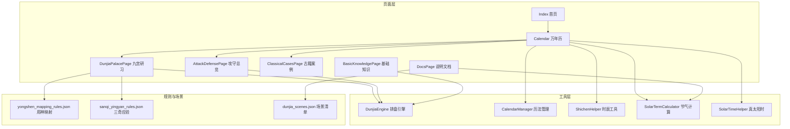
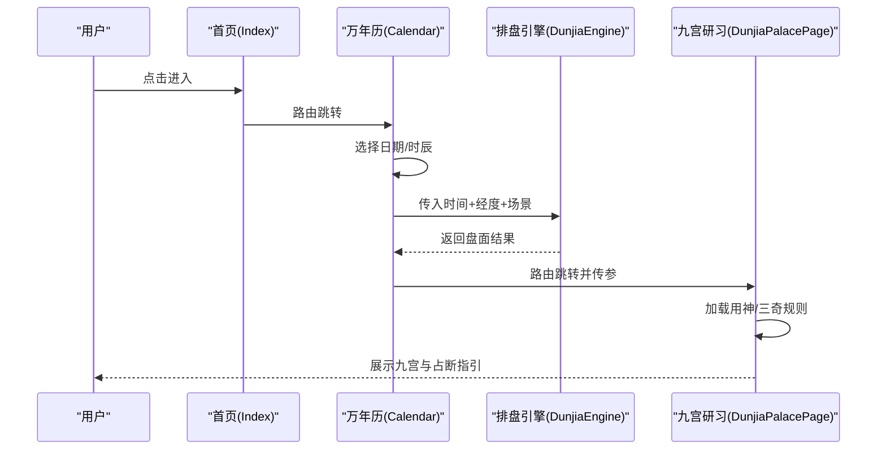
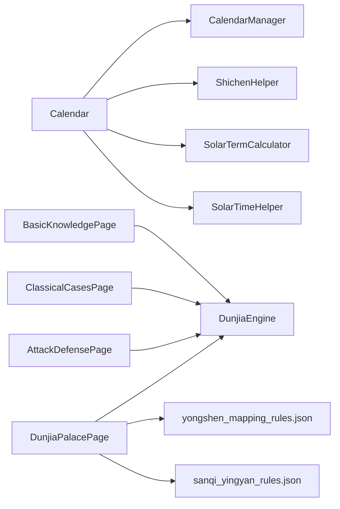

# 应用场景

<cite>
**本文引用的文件**
- [Index.ets](file://entry/src/main/ets/pages/Index.ets)
- [Calendar.ets](file://entry/src/main/ets/pages/Calendar.ets)
- [DunjiaPalacePage.ets](file://entry/src/main/ets/pages/DunjiaPalacePage.ets)
- [AttackDefensePage.ets](file://entry/src/main/ets/pages/AttackDefensePage.ets)
- [ClassicalCasesPage.ets](file://entry/src/main/ets/pages/ClassicalCasesPage.ets)
- [BasicKnowledgePage.ets](file://entry/src/main/ets/pages/BasicKnowledgePage.ets)
- [DocsPage.ets](file://entry/src/main/ets/pages/DocsPage.ets)
- [DunjiaEngine.ets](file://entry/src/main/ets/utils/DunjiaEngine.ets)
- [CalendarManager.ets](file://entry/src/main/ets/utils/CalendarManager.ets)
- [ShichenHelper.ets](file://entry/src/main/ets/utils/ShichenHelper.ets)
- [SolarTermCalculator.ets](file://entry/src/main/ets/utils/SolarTermCalculator.ets)
- [SolarTimeHelper.ets](file://entry/src/main/ets/utils/SolarTimeHelper.ets)
- [yongshen_mapping_rules.json](file://entry/src/main/resources/rawfile/rules/yongshen_mapping_rules.json)
- [sanqi_yingyan_rules.json](file://entry/src/main/resources/rawfile/rules/sanqi_yingyan_rules.json)
- [dunjia_scenes.json](file://entry/src/main/resources/rawfile/dunjia_scenes.json)
</cite>

## 目录
1. [引言](#引言)
2. [项目结构](#项目结构)
3. [核心组件](#核心组件)
4. [架构总览](#架构总览)
5. [详细组件分析](#详细组件分析)
6. [依赖分析](#依赖分析)
7. [性能考虑](#性能考虑)
8. [故障排查指南](#故障排查指南)
9. [结论](#结论)
10. [附录](#附录)

## 引言
本文件面向遁甲应用项目的使用者与开发者，系统梳理遁甲技术在现代社会中的应用场景与实践路径。项目以《遁甲符应经》为规则基础，提供从个人研习到战略布局、从时机选择到传统智慧现代转化的完整体验。通过“景祐时空盘研习”“三奇应验与择日”“古籍案例重演”“结构化趋势分析”“分层研习路线”等场景化页面，帮助不同专业背景的用户高效理解与应用遁甲。

## 项目结构
项目采用 ArkTS 页面与工具模块分离的组织方式，页面负责交互与展示，工具模块封装排盘引擎、历法与天文计算、规则映射等能力，形成清晰的职责边界与可扩展性。

图表来源
- [Index.ets](file://entry/src/main/ets/pages/Index.ets#L1-L88)
- [Calendar.ets](file://entry/src/main/ets/pages/Calendar.ets#L1-L602)
- [DunjiaPalacePage.ets](file://entry/src/main/ets/pages/DunjiaPalacePage.ets#L1-L1017)
- [AttackDefensePage.ets](file://entry/src/main/ets/pages/AttackDefensePage.ets#L1-L301)
- [ClassicalCasesPage.ets](file://entry/src/main/ets/pages/ClassicalCasesPage.ets#L1-L625)
- [BasicKnowledgePage.ets](file://entry/src/main/ets/pages/BasicKnowledgePage.ets#L1-L794)
- [DocsPage.ets](file://entry/src/main/ets/pages/DocsPage.ets#L1-L227)
- [DunjiaEngine.ets](file://entry/src/main/ets/utils/DunjiaEngine.ets#L1-L961)
- [CalendarManager.ets](file://entry/src/main/ets/utils/CalendarManager.ets#L1-L123)
- [ShichenHelper.ets](file://entry/src/main/ets/utils/ShichenHelper.ets#L1-L114)
- [SolarTermCalculator.ets](file://entry/src/main/ets/utils/SolarTermCalculator.ets#L1-L375)
- [SolarTimeHelper.ets](file://entry/src/main/ets/utils/SolarTimeHelper.ets#L1-L270)
- [yongshen_mapping_rules.json](file://entry/src/main/resources/rawfile/rules/yongshen_mapping_rules.json#L1-L510)
- [sanqi_yingyan_rules.json](file://entry/src/main/resources/rawfile/rules/sanqi_yingyan_rules.json#L1-L525)
- [dunjia_scenes.json](file://entry/src/main/resources/rawfile/dunjia_scenes.json#L1-L50)

章节来源
- [Index.ets](file://entry/src/main/ets/pages/Index.ets#L1-L88)
- [Calendar.ets](file://entry/src/main/ets/pages/Calendar.ets#L1-L602)
- [DunjiaPalacePage.ets](file://entry/src/main/ets/pages/DunjiaPalacePage.ets#L1-L1017)
- [AttackDefensePage.ets](file://entry/src/main/ets/pages/AttackDefensePage.ets#L1-L301)
- [ClassicalCasesPage.ets](file://entry/src/main/ets/pages/ClassicalCasesPage.ets#L1-L625)
- [BasicKnowledgePage.ets](file://entry/src/main/ets/pages/BasicKnowledgePage.ets#L1-L794)
- [DocsPage.ets](file://entry/src/main/ets/pages/DocsPage.ets#L1-L227)
- [DunjiaEngine.ets](file://entry/src/main/ets/utils/DunjiaEngine.ets#L1-L961)
- [CalendarManager.ets](file://entry/src/main/ets/utils/CalendarManager.ets#L1-L123)
- [ShichenHelper.ets](file://entry/src/main/ets/utils/ShichenHelper.ets#L1-L114)
- [SolarTermCalculator.ets](file://entry/src/main/ets/utils/SolarTermCalculator.ets#L1-L375)
- [SolarTimeHelper.ets](file://entry/src/main/ets/utils/SolarTimeHelper.ets#L1-L270)
- [yongshen_mapping_rules.json](file://entry/src/main/resources/rawfile/rules/yongshen_mapping_rules.json#L1-L510)
- [sanqi_yingyan_rules.json](file://entry/src/main/resources/rawfile/rules/sanqi_yingyan_rules.json#L1-L525)
- [dunjia_scenes.json](file://entry/src/main/resources/rawfile/dunjia_scenes.json#L1-L50)

## 核心组件
- 排盘引擎（DunjiaEngine）
  - 职责：从时间/地点计算遁甲时空盘，输出九宫状态、值符值使、三奇六仪、八神、格局识别与结构评估。
  - 关键能力：节气定位、局数计算、值符值使飞布、九宫布局、格局识别、真太阳时偏移。
- 历法与天文工具
  - CalendarManager：按年份加载万年历 JSON，提供干支、节气、节日等信息。
  - SolarTermCalculator：计算节气精确时刻，支持跨年节气检索。
  - SolarTimeHelper：计算真太阳时与经度时差修正，提供“均时差”“经度偏差”等细节。
  - ShichenHelper：计算时辰干支、显示文本与当前时辰索引。
- 规则与场景
  - 用神映射规则（yongshen_mapping_rules.json）：针对不同事务类别（寻人、寻物、出行、婚恋、求职、求财、考试、健康）给出主次用神与判断逻辑。
  - 三奇应验规则（sanqi_yingyan_rules.json）：按日奇/月奇/星奇落宫给出应验征兆、时间窗口与事务象意。
  - 场景清单（dunjia_scenes.json）：定义“景祐时空盘研习”“三奇应验与择日”“古籍案例重演”“结构化趋势分析”“分层研习路线”。

章节来源
- [DunjiaEngine.ets](file://entry/src/main/ets/utils/DunjiaEngine.ets#L1-L961)
- [CalendarManager.ets](file://entry/src/main/ets/utils/CalendarManager.ets#L1-L123)
- [SolarTermCalculator.ets](file://entry/src/main/ets/utils/SolarTermCalculator.ets#L1-L375)
- [SolarTimeHelper.ets](file://entry/src/main/ets/utils/SolarTimeHelper.ets#L1-L270)
- [ShichenHelper.ets](file://entry/src/main/ets/utils/ShichenHelper.ets#L1-L114)
- [yongshen_mapping_rules.json](file://entry/src/main/resources/rawfile/rules/yongshen_mapping_rules.json#L1-L510)
- [sanqi_yingyan_rules.json](file://entry/src/main/resources/rawfile/rules/sanqi_yingyan_rules.json#L1-L525)
- [dunjia_scenes.json](file://entry/src/main/resources/rawfile/dunjia_scenes.json#L1-L50)

## 架构总览
系统以“页面-工具-规则”三层架构组织，页面通过路由与参数传递时间、地点与场景类型，工具层完成天文历法与遁甲排盘，规则层提供占断指引与场景化建议。

图表来源
- [Index.ets](file://entry/src/main/ets/pages/Index.ets#L1-L88)
- [Calendar.ets](file://entry/src/main/ets/pages/Calendar.ets#L1-L602)
- [DunjiaPalacePage.ets](file://entry/src/main/ets/pages/DunjiaPalacePage.ets#L1-L1017)
- [DunjiaEngine.ets](file://entry/src/main/ets/utils/DunjiaEngine.ets#L1-L961)

## 详细组件分析

### 个人研习场景：自我认知提升、决策辅助、生活指导
- 场景入口
  - “景祐时空盘研习”“分层研习路线”“基础知识”页面，帮助用户建立对九宫、九星、八门、三奇、六仪、八神、值符值使、遁局与节气的系统认知。
- 实践要点
  - 通过“景祐时空盘研习”理解当前盘面的结构标签与概览说明，结合“结构化趋势分析”判断当前时段更适合“主动推进”还是“稳健观望”。
  - 在“基础知识”中对照九星断语、八门吉凶、神煞理论，加深对宫位与要素关系的理解。
- 应用价值
  - 提升对自身能量与外部环境的觉察，辅助日常决策与行动节奏把握。

章节来源
- [BasicKnowledgePage.ets](file://entry/src/main/ets/pages/BasicKnowledgePage.ets#L1-L794)
- [DunjiaEngine.ets](file://entry/src/main/ets/utils/DunjiaEngine.ets#L1-L961)
- [dunjia_scenes.json](file://entry/src/main/resources/rawfile/dunjia_scenes.json#L1-L50)

### 战略布局场景：商业竞争、投资决策、项目规划
- 场景入口
  - “攻守方位总览”页面，直观标注“五不可击”“三吉门+吉星”“观望区”，辅助判断行动方位与时机。
- 实践要点
  - 优先选择“优势区”（三吉门+吉星）开展对外合作、发布与推进；避开“五不可击”（值符、直使、生门、九天、九地）所在宫位。
  - 结合“三奇应验与择日”页面，依据三奇落宫的应验征兆与时间窗口，选择有利的启动/签约/发布时机。
- 应用价值
  - 为企业布局、竞标、投资与项目启动提供“方位—时机—格局”的三维参考。

章节来源
- [AttackDefensePage.ets](file://entry/src/main/ets/pages/AttackDefensePage.ets#L1-L301)
- [sanqi_yingyan_rules.json](file://entry/src/main/resources/rawfile/rules/sanqi_yingyan_rules.json#L1-L525)

### 时机选择场景：重要事件的时间安排、行动时机把握
- 场景入口
  - “三奇应验与择日”页面，展示日奇/月奇/星奇落宫的应验征兆、时间窗口与事务象意。
- 实践要点
  - 根据“三奇应验规则”选择“应期”（如日奇1/7日、月奇7/49日、星奇14/100日）与“门迫应期”“值符值使应期”等，结合“旬空”“击刑”等条件，确定最佳行动窗口。
  - 在“万年历”中选择真太阳时与合适时辰，确保排盘与择日的时点一致性。
- 应用价值
  - 将传统择日与现代日程管理结合，提升关键事件的成功概率。

章节来源
- [Calendar.ets](file://entry/src/main/ets/pages/Calendar.ets#L1-L602)
- [SolarTimeHelper.ets](file://entry/src/main/ets/utils/SolarTimeHelper.ets#L1-L270)
- [sanqi_yingyan_rules.json](file://entry/src/main/resources/rawfile/rules/sanqi_yingyan_rules.json#L1-L525)

### 传统应用的现代转化：风水调整、环境优化、健康养生
- 场景入口
  - “九宫研习”页面结合“用神映射规则”，对不同事务类别给出主次用神与判断逻辑，并提供方向与时间提示。
- 实践要点
  - 寻人/寻物：以“时干宫/六合/日干宫”“杜门/六合/值符”等为用神，结合“方向规则”与“时间提示”定位与行动。
  - 出行/婚恋/求职/求财/考试/健康：分别依据对应类别的用神组合与判断逻辑，选择最佳方位与时机。
- 应用价值
  - 将传统“用神占断”转化为可执行的生活与工作指导，兼顾心理暗示与行为策略。

章节来源
- [DunjiaPalacePage.ets](file://entry/src/main/ets/pages/DunjiaPalacePage.ets#L1-L1017)
- [yongshen_mapping_rules.json](file://entry/src/main/resources/rawfile/rules/yongshen_mapping_rules.json#L1-L510)

### 使用案例与实践指导
- 案例重演（古籍案例）
  - “古籍案例重演”页面按《遁甲符应经》原文重建典型局例，展示关键格局（如“天遁”“青龙返首”“飞鸟跌穴”“人遁”“三奇入墓”等）与分析要点，便于对照学习与结构拆解。
- 实践步骤
  - 选择案例时间与时辰，一键重建盘面；
  - 查看关键格局与结论；
  - 对照研习要点，逐步掌握识别与应用方法。

章节来源
- [ClassicalCasesPage.ets](file://entry/src/main/ets/pages/ClassicalCasesPage.ets#L1-L625)

### 应用的局限性与注意事项
- 局限性
  - 排盘依赖真太阳时与精确节气时刻，若时间/经度输入不准确，可能导致局数与值符值使位置偏差。
  - 规则为研习与参考用途，不直接做个人命运预测，需结合现实情境理性判断。
- 注意事项
  - 真太阳时与本地时间存在偏差，应以“真太阳时说明”为准进行校正。
  - 三奇应验规则为象意与时间窗口提示，不应作为唯一决策依据。
  - “五不可击”“三吉门+吉星”等仅为方位与格局参考，实际行动仍需结合现实条件。

章节来源
- [DocsPage.ets](file://entry/src/main/ets/pages/DocsPage.ets#L1-L227)
- [SolarTimeHelper.ets](file://entry/src/main/ets/utils/SolarTimeHelper.ets#L1-L270)
- [DunjiaEngine.ets](file://entry/src/main/ets/utils/DunjiaEngine.ets#L1-L961)

### 如何将传统智慧与现代科技相结合
- 数据驱动的排盘与规则
  - 使用天文算法计算节气与真太阳时，确保排盘的科学性与一致性。
  - 将规则以结构化 JSON 形式存储，便于在页面中动态渲染与交互。
- 用户体验与可访问性
  - 通过“景祐时空盘研习”“分层研习路线”降低学习门槛；
  - 通过“三奇应验与择日”“攻守方位总览”“九宫研习”提供可视化与可操作的指导。
- 可扩展性
  - 新增规则与场景时，只需扩展规则文件与页面组件，保持引擎与工具层稳定。

章节来源
- [DunjiaEngine.ets](file://entry/src/main/ets/utils/DunjiaEngine.ets#L1-L961)
- [SolarTermCalculator.ets](file://entry/src/main/ets/utils/SolarTermCalculator.ets#L1-L375)
- [dunjia_scenes.json](file://entry/src/main/resources/rawfile/dunjia_scenes.json#L1-L50)

## 依赖分析
- 页面与工具的耦合
  - Calendar 与 CalendarManager、ShichenHelper、SolarTermCalculator、SolarTimeHelper 强耦合，确保时间与历法数据的准确性。
  - DunjiaPalacePage 与 DunjiaEngine 强耦合，负责将排盘结果与规则映射结合。
- 规则与页面的耦合
  - 用神映射规则与三奇应验规则通过页面动态加载，实现“规则即插件”的灵活性。
- 依赖关系可视化

图表来源
- [Calendar.ets](file://entry/src/main/ets/pages/Calendar.ets#L1-L602)
- [DunjiaPalacePage.ets](file://entry/src/main/ets/pages/DunjiaPalacePage.ets#L1-L1017)
- [AttackDefensePage.ets](file://entry/src/main/ets/pages/AttackDefensePage.ets#L1-L301)
- [ClassicalCasesPage.ets](file://entry/src/main/ets/pages/ClassicalCasesPage.ets#L1-L625)
- [BasicKnowledgePage.ets](file://entry/src/main/ets/pages/BasicKnowledgePage.ets#L1-L794)
- [DunjiaEngine.ets](file://entry/src/main/ets/utils/DunjiaEngine.ets#L1-L961)
- [CalendarManager.ets](file://entry/src/main/ets/utils/CalendarManager.ets#L1-L123)
- [ShichenHelper.ets](file://entry/src/main/ets/utils/ShichenHelper.ets#L1-L114)
- [SolarTermCalculator.ets](file://entry/src/main/ets/utils/SolarTermCalculator.ets#L1-L375)
- [SolarTimeHelper.ets](file://entry/src/main/ets/utils/SolarTimeHelper.ets#L1-L270)
- [yongshen_mapping_rules.json](file://entry/src/main/resources/rawfile/rules/yongshen_mapping_rules.json#L1-L510)
- [sanqi_yingyan_rules.json](file://entry/src/main/resources/rawfile/rules/sanqi_yingyan_rules.json#L1-L525)

章节来源
- [Calendar.ets](file://entry/src/main/ets/pages/Calendar.ets#L1-L602)
- [DunjiaPalacePage.ets](file://entry/src/main/ets/pages/DunjiaPalacePage.ets#L1-L1017)
- [AttackDefensePage.ets](file://entry/src/main/ets/pages/AttackDefensePage.ets#L1-L301)
- [ClassicalCasesPage.ets](file://entry/src/main/ets/pages/ClassicalCasesPage.ets#L1-L625)
- [BasicKnowledgePage.ets](file://entry/src/main/ets/pages/BasicKnowledgePage.ets#L1-L794)
- [DunjiaEngine.ets](file://entry/src/main/ets/utils/DunjiaEngine.ets#L1-L961)
- [CalendarManager.ets](file://entry/src/main/ets/utils/CalendarManager.ets#L1-L123)
- [ShichenHelper.ets](file://entry/src/main/ets/utils/ShichenHelper.ets#L1-L114)
- [SolarTermCalculator.ets](file://entry/src/main/ets/utils/SolarTermCalculator.ets#L1-L375)
- [SolarTimeHelper.ets](file://entry/src/main/ets/utils/SolarTimeHelper.ets#L1-L270)
- [yongshen_mapping_rules.json](file://entry/src/main/resources/rawfile/rules/yongshen_mapping_rules.json#L1-L510)
- [sanqi_yingyan_rules.json](file://entry/src/main/resources/rawfile/rules/sanqi_yingyan_rules.json#L1-L525)

## 性能考虑
- 数据缓存
  - CalendarManager 对年份数据进行缓存，减少重复加载；SolarTermCalculator 对节气结果进行缓存，提高跨页面复用效率。
- 异步计算
  - 排盘计算与规则加载采用异步方式，避免阻塞 UI，提升交互流畅度。
- 规则加载
  - 用神映射与三奇应验规则通过资源管理器按需加载，避免一次性加载全部规则带来的内存压力。

章节来源
- [CalendarManager.ets](file://entry/src/main/ets/utils/CalendarManager.ets#L1-L123)
- [SolarTermCalculator.ets](file://entry/src/main/ets/utils/SolarTermCalculator.ets#L1-L375)
- [DunjiaPalacePage.ets](file://entry/src/main/ets/pages/DunjiaPalacePage.ets#L1-L1017)

## 故障排查指南
- 真太阳时显示异常
  - 检查经度输入是否正确；确认“真太阳时说明”文档与页面显示是否一致。
- 无法加载规则或页面空白
  - 检查资源管理器是否初始化成功；确认规则文件路径与命名是否匹配。
- 排盘结果为空或局数错误
  - 核对输入时间是否为真太阳时；检查节气计算是否返回有效值；确认符头与三元划分逻辑。
- 三奇应验无象意
  - 确认当前盘面中三奇位置与规则中的宫位映射一致；检查事务类别是否匹配。

章节来源
- [DocsPage.ets](file://entry/src/main/ets/pages/DocsPage.ets#L1-L227)
- [SolarTimeHelper.ets](file://entry/src/main/ets/utils/SolarTimeHelper.ets#L1-L270)
- [DunjiaEngine.ets](file://entry/src/main/ets/utils/DunjiaEngine.ets#L1-L961)
- [DunjiaPalacePage.ets](file://entry/src/main/ets/pages/DunjiaPalacePage.ets#L1-L1017)

## 结论
遁甲应用项目以规则为纲、以引擎为核心、以页面为载体，构建了从个人研习到战略布局、从时机选择到传统智慧现代转化的完整场景体系。通过真太阳时与节气计算保障排盘准确性，通过结构化规则与可视化界面提升可操作性，帮助不同专业背景的用户在现代生活中有序应用传统智慧。

## 附录
- 场景清单（摘要）
  - 景祐时空盘研习：入门，标签“时空模型、局数研习、节气结构”
  - 三奇应验与择日：进阶，标签“三奇应验、干支择日、宝义伐日”
  - 古籍案例重演：进阶，标签“案例研习、原文对照”
  - 结构化趋势分析：进阶，标签“结构评估、趋势研习”
  - 分层研习路线：基础，标签“学习路径、关卡式研习”

章节来源
- [dunjia_scenes.json](file://entry/src/main/resources/rawfile/dunjia_scenes.json#L1-L50)