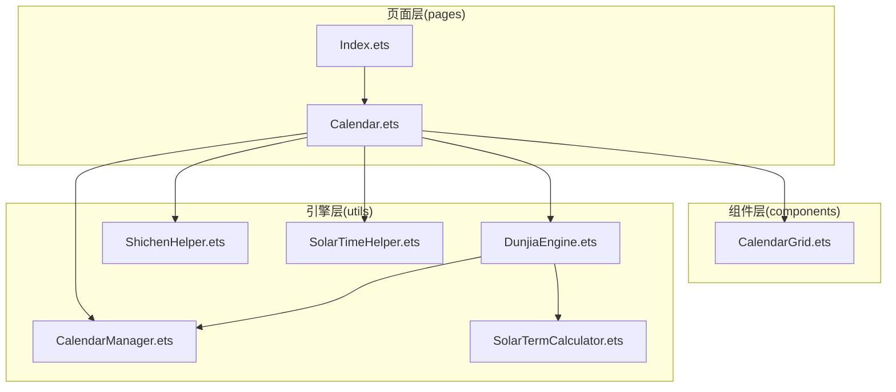
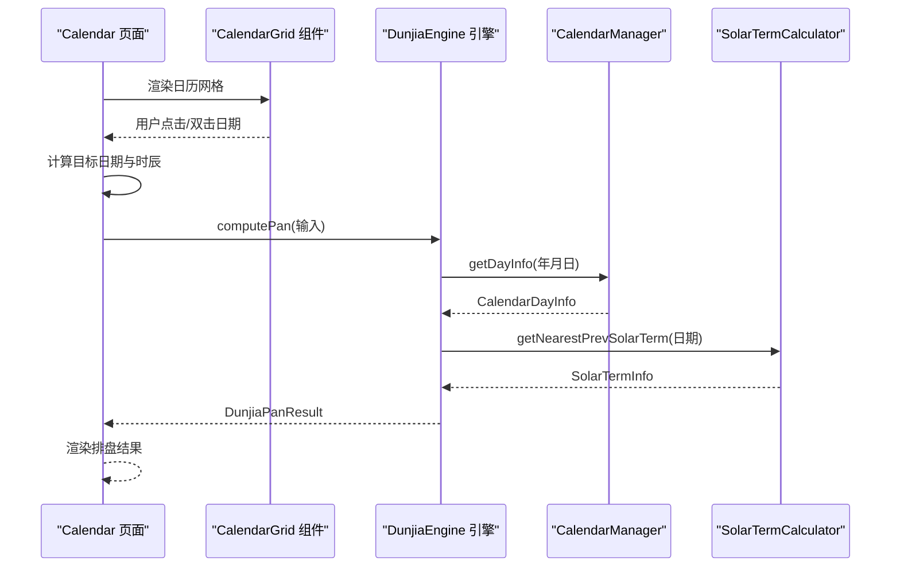
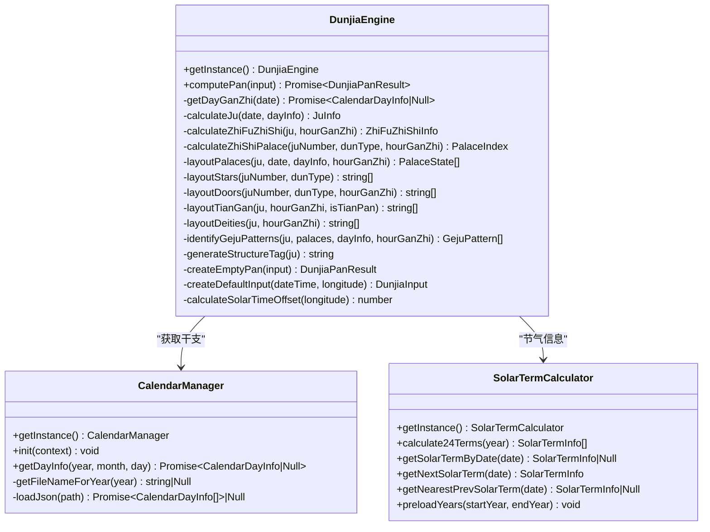
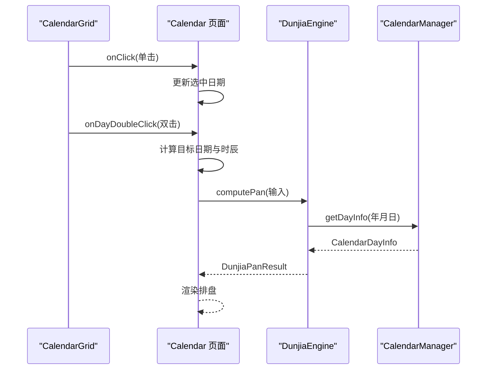
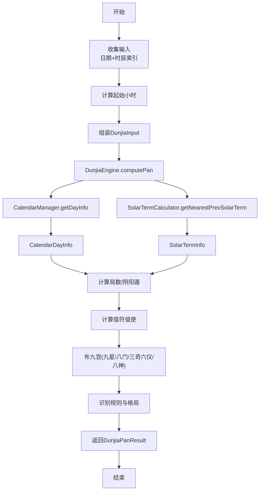
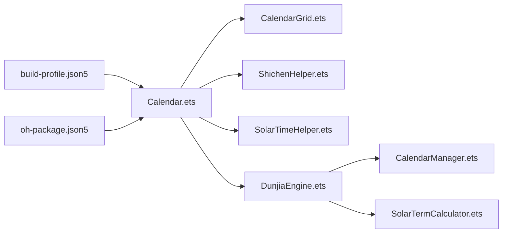

# 技术架构

<cite>
**本文引用的文件**
- [DunjiaEngine.ets](file://entry/src/main/ets/utils/DunjiaEngine.ets)
- [CalendarManager.ets](file://entry/src/main/ets/utils/CalendarManager.ets)
- [SolarTermCalculator.ets](file://entry/src/main/ets/utils/SolarTermCalculator.ets)
- [ShichenHelper.ets](file://entry/src/main/ets/utils/ShichenHelper.ets)
- [SolarTimeHelper.ets](file://entry/src/main/ets/utils/SolarTimeHelper.ets)
- [Calendar.ets](file://entry/src/main/ets/pages/Calendar.ets)
- [CalendarGrid.ets](file://entry/src/main/ets/components/CalendarGrid.ets)
- [Index.ets](file://entry/src/main/ets/pages/Index.ets)
- [build-profile.json5](file://entry/build-profile.json5)
- [oh-package.json5](file://oh-package.json5)
</cite>

## 目录
1. [简介](#简介)
2. [项目结构](#项目结构)
3. [核心组件](#核心组件)
4. [架构总览](#架构总览)
5. [详细组件分析](#详细组件分析)
6. [依赖关系分析](#依赖关系分析)
7. [性能考量](#性能考量)
8. [故障排查指南](#故障排查指南)
9. [结论](#结论)
10. [附录](#附录)

## 简介
本项目为基于 HarmonyOS 与 ArkTS 的遁甲应用，围绕《遁甲符应经》规则体系，提供“遁甲时空盘”的排盘与研习功能。技术栈采用 ArkTS + HarmonyOS，模块化组织遵循“引擎层-页面层-组件层”的分层设计，核心引擎 DunjiaEngine 采用单例模式统一计算时空盘与规则命中；页面层通过路由驱动导航，组件层提供可复用的 UI 组件与工具类，形成清晰的数据流与通信机制。

## 项目结构
项目采用“按功能域分层 + 模块化”的组织方式：
- 引擎层：位于 utils 目录，封装核心算法与数据模型，提供统一的计算入口与规则识别。
- 页面层：位于 pages 目录，承载业务页面与导航逻辑，负责数据采集与路由跳转。
- 组件层：位于 components 目录，封装通用 UI 组件，支持复用与组合。
- 资源与配置：resources/base 与 build-profile.json5、oh-package.json5 等，负责资源与构建配置。

图表来源
- [Index.ets](file://entry/src/main/ets/pages/Index.ets#L1-L88)
- [Calendar.ets](file://entry/src/main/ets/pages/Calendar.ets#L1-L602)
- [CalendarGrid.ets](file://entry/src/main/ets/components/CalendarGrid.ets#L1-L167)
- [DunjiaEngine.ets](file://entry/src/main/ets/utils/DunjiaEngine.ets#L1-L961)
- [CalendarManager.ets](file://entry/src/main/ets/utils/CalendarManager.ets#L1-L123)
- [SolarTermCalculator.ets](file://entry/src/main/ets/utils/SolarTermCalculator.ets#L1-L375)
- [ShichenHelper.ets](file://entry/src/main/ets/utils/ShichenHelper.ets#L1-L114)
- [SolarTimeHelper.ets](file://entry/src/main/ets/utils/SolarTimeHelper.ets#L1-L270)

章节来源
- [Index.ets](file://entry/src/main/ets/pages/Index.ets#L1-L88)
- [Calendar.ets](file://entry/src/main/ets/pages/Calendar.ets#L1-L602)
- [CalendarGrid.ets](file://entry/src/main/ets/components/CalendarGrid.ets#L1-L167)
- [DunjiaEngine.ets](file://entry/src/main/ets/utils/DunjiaEngine.ets#L1-L961)
- [CalendarManager.ets](file://entry/src/main/ets/utils/CalendarManager.ets#L1-L123)
- [SolarTermCalculator.ets](file://entry/src/main/ets/utils/SolarTermCalculator.ets#L1-L375)
- [ShichenHelper.ets](file://entry/src/main/ets/utils/ShichenHelper.ets#L1-L114)
- [SolarTimeHelper.ets](file://entry/src/main/ets/utils/SolarTimeHelper.ets#L1-L270)

## 核心组件
- DunjiaEngine：核心引擎，负责从时间/地点输入计算出完整的遁甲时空盘、值符值使、九宫状态、规则命中与格局识别，并提供便捷输入构造与真太阳时偏移计算。
- CalendarManager：日历数据管理，提供按年份分片的万年历 JSON 数据加载、缓存与按日查询。
- SolarTermCalculator：节气精确时刻计算，支持节气列表、最近前一个节气查询、跨年节气处理与缓存预加载。
- ShichenHelper：时辰工具，提供十二时辰基础信息、当前时辰索引、时干计算与显示文本格式化。
- SolarTimeHelper：真太阳时工具，提供均时差、经度时差与总偏差计算，以及格式化展示。
- Calendar 页面：日历页承载日期选择、节气/节日展示、时辰选择与进入排盘的导航逻辑。
- CalendarGrid 组件：日历网格组件，支持双击快速进入排盘、选中态高亮与节日标记。

章节来源
- [DunjiaEngine.ets](file://entry/src/main/ets/utils/DunjiaEngine.ets#L98-L162)
- [CalendarManager.ets](file://entry/src/main/ets/utils/CalendarManager.ets#L30-L92)
- [SolarTermCalculator.ets](file://entry/src/main/ets/utils/SolarTermCalculator.ets#L30-L159)
- [ShichenHelper.ets](file://entry/src/main/ets/utils/ShichenHelper.ets#L14-L113)
- [SolarTimeHelper.ets](file://entry/src/main/ets/utils/SolarTimeHelper.ets#L29-L202)
- [Calendar.ets](file://entry/src/main/ets/pages/Calendar.ets#L17-L304)
- [CalendarGrid.ets](file://entry/src/main/ets/components/CalendarGrid.ets#L29-L165)

## 架构总览
系统采用“单例引擎 + 分层页面 + 组合组件”的架构设计：
- 引擎层：DunjiaEngine 作为核心单例，聚合 CalendarManager 与 SolarTermCalculator，完成时空盘计算与规则识别。
- 页面层：Calendar 页面负责输入采集（日期、时辰），并通过路由传递参数进入排盘页面。
- 组件层：CalendarGrid 等组件承担 UI 交互与展示，通过属性与回调与页面层通信。
- 数据流：页面层收集输入 → 引擎层计算 → 返回结果 → 页面层渲染展示。

图表来源
- [Calendar.ets](file://entry/src/main/ets/pages/Calendar.ets#L227-L304)
- [CalendarGrid.ets](file://entry/src/main/ets/components/CalendarGrid.ets#L144-L164)
- [DunjiaEngine.ets](file://entry/src/main/ets/utils/DunjiaEngine.ets#L113-L162)
- [CalendarManager.ets](file://entry/src/main/ets/utils/CalendarManager.ets#L51-L92)
- [SolarTermCalculator.ets](file://entry/src/main/ets/utils/SolarTermCalculator.ets#L143-L159)

## 详细组件分析

### 核心引擎 DunjiaEngine 设计与单例实现
- 设计模式：单例模式，getInstance 提供全局唯一实例，避免重复初始化与状态污染。
- 数据模型：定义了输入、宫位状态、规则命中、格局模式与整体评估摘要等接口，确保结果结构化与可扩展。
- 计算流程：输入校验 → 获取干支 → 计算局数与阴阳遁 → 计算值符值使 → 布九宫（九星、八门、三奇六仪、八神） → 生成规则命中与格局识别 → 返回结果。
- 关键算法：
  - 值符值使：依据时干/时支进行顺逆飞布，跳过中宫。
  - 三奇六仪：阳遁顺布六仪逆布三奇，阴遁逆布六仪顺布三奇。
  - 八神定位：值符后/前若干宫位确定九天九地等。
  - 格局识别：涵盖三奇得使、三遁、伏吟、反吹、青龙返首、飞鸟跌穴、三奇入墓、太白入荧惑等多类格局。
- 真太阳时偏移：基于经度差乘以 4 分钟/度。

图表来源
- [DunjiaEngine.ets](file://entry/src/main/ets/utils/DunjiaEngine.ets#L98-L778)
- [CalendarManager.ets](file://entry/src/main/ets/utils/CalendarManager.ets#L30-L122)
- [SolarTermCalculator.ets](file://entry/src/main/ets/utils/SolarTermCalculator.ets#L30-L374)

章节来源
- [DunjiaEngine.ets](file://entry/src/main/ets/utils/DunjiaEngine.ets#L98-L778)
- [CalendarManager.ets](file://entry/src/main/ets/utils/CalendarManager.ets#L30-L122)
- [SolarTermCalculator.ets](file://entry/src/main/ets/utils/SolarTermCalculator.ets#L30-L374)

### 页面层与组件层通信机制
- Calendar 页面：
  - 通过 @State 管理选中日期、时辰索引、日历网格数据等状态。
  - 通过路由 pushUrl 传递日期与干支信息进入排盘页面。
  - 与 CalendarGrid 组件通过 @Prop/@Builder 传参与回调交互，支持单击/双击事件。
- CalendarGrid 组件：
  - 接收 DayCell 数组与选中日期，内部维护双击延迟逻辑，区分单击与双击。
  - 通过 onClick 回调向上通知父组件，支持快速进入排盘。

图表来源
- [CalendarGrid.ets](file://entry/src/main/ets/components/CalendarGrid.ets#L144-L164)
- [Calendar.ets](file://entry/src/main/ets/pages/Calendar.ets#L227-L304)
- [DunjiaEngine.ets](file://entry/src/main/ets/utils/DunjiaEngine.ets#L113-L162)
- [CalendarManager.ets](file://entry/src/main/ets/utils/CalendarManager.ets#L51-L92)

章节来源
- [Calendar.ets](file://entry/src/main/ets/pages/Calendar.ets#L17-L304)
- [CalendarGrid.ets](file://entry/src/main/ets/components/CalendarGrid.ets#L29-L165)

### 数据流向与处理逻辑
- 输入阶段：Calendar 页面收集日期与时辰索引，计算起始小时，组装输入参数。
- 引擎计算：DunjiaEngine 调用 CalendarManager 获取干支，调用 SolarTermCalculator 获取节气，计算局数与阴阳遁，再布九宫并识别规则与格局。
- 输出阶段：返回结构化的 DunjiaPanResult，页面层据此渲染排盘与说明文案。

图表来源
- [Calendar.ets](file://entry/src/main/ets/pages/Calendar.ets#L272-L304)
- [DunjiaEngine.ets](file://entry/src/main/ets/utils/DunjiaEngine.ets#L113-L162)
- [CalendarManager.ets](file://entry/src/main/ets/utils/CalendarManager.ets#L51-L92)
- [SolarTermCalculator.ets](file://entry/src/main/ets/utils/SolarTermCalculator.ets#L143-L159)

章节来源
- [Calendar.ets](file://entry/src/main/ets/pages/Calendar.ets#L272-L304)
- [DunjiaEngine.ets](file://entry/src/main/ets/utils/DunjiaEngine.ets#L113-L162)

## 依赖关系分析
- 引擎层依赖：
  - DunjiaEngine 依赖 CalendarManager 与 SolarTermCalculator，保证干支与节气数据的准确性与时效性。
- 页面层依赖：
  - Calendar 页面依赖组件层（CalendarGrid）与工具层（ShichenHelper、SolarTimeHelper），并通过路由与引擎层交互。
- 构建与测试：
  - build-profile.json5 控制构建选项与混淆规则；oh-package.json5 管理开发依赖。

图表来源
- [Calendar.ets](file://entry/src/main/ets/pages/Calendar.ets#L1-L10)
- [CalendarGrid.ets](file://entry/src/main/ets/components/CalendarGrid.ets#L1-L18)
- [ShichenHelper.ets](file://entry/src/main/ets/utils/ShichenHelper.ets#L1-L3)
- [SolarTimeHelper.ets](file://entry/src/main/ets/utils/SolarTimeHelper.ets#L1-L19)
- [DunjiaEngine.ets](file://entry/src/main/ets/utils/DunjiaEngine.ets#L4-L5)
- [CalendarManager.ets](file://entry/src/main/ets/utils/CalendarManager.ets#L1-L3)
- [SolarTermCalculator.ets](file://entry/src/main/ets/utils/SolarTermCalculator.ets#L1-L7)
- [build-profile.json5](file://entry/build-profile.json5#L1-L33)
- [oh-package.json5](file://oh-package.json5#L1-L11)

章节来源
- [Calendar.ets](file://entry/src/main/ets/pages/Calendar.ets#L1-L10)
- [DunjiaEngine.ets](file://entry/src/main/ets/utils/DunjiaEngine.ets#L4-L5)
- [CalendarManager.ets](file://entry/src/main/ets/utils/CalendarManager.ets#L1-L3)
- [SolarTermCalculator.ets](file://entry/src/main/ets/utils/SolarTermCalculator.ets#L1-L7)
- [build-profile.json5](file://entry/build-profile.json5#L1-L33)
- [oh-package.json5](file://oh-package.json5#L1-L11)

## 性能考量
- 数据缓存：
  - CalendarManager 对年份数据进行 Map 缓存，减少重复 IO。
  - SolarTermCalculator 对年份节气结果进行缓存，支持预加载。
- 批量查询：
  - Calendar 页面在生成日历网格时批量获取日期信息，降低多次异步调用开销。
- 单例模式：
  - DunjiaEngine、CalendarManager、SolarTermCalculator 均采用单例，避免重复初始化与状态同步问题。
- 构建优化：
  - build-profile.json5 中关闭混淆以提升调试效率，release 目标可按需开启混淆规则文件。

章节来源
- [CalendarManager.ets](file://entry/src/main/ets/utils/CalendarManager.ets#L33-L68)
- [SolarTermCalculator.ets](file://entry/src/main/ets/utils/SolarTermCalculator.ets#L61-L86)
- [Calendar.ets](file://entry/src/main/ets/pages/Calendar.ets#L83-L85)
- [build-profile.json5](file://entry/build-profile.json5#L10-L24)

## 故障排查指南
- 无法获取干支信息：
  - 现象：排盘为空盘或报错。
  - 排查：确认 CalendarManager.init 已在页面生命周期内调用；检查资源路径与年份分片文件是否存在。
- 节气计算异常：
  - 现象：节气时间不准确或跨年节气缺失。
  - 排查：确认 SolarTermCalculator.getNearestPrevSolarTerm 的日期范围与缓存策略；必要时调用 preloadYears 预热。
- 真太阳时显示异常：
  - 现象：真太阳时与本地时间差异过大。
  - 排查：确认经度设置正确；检查均时差与经度时差计算逻辑。
- 双击无效或误判：
  - 现象：双击未触发快速进入排盘。
  - 排查：检查 CalendarGrid 的双击延迟阈值与点击事件处理逻辑。

章节来源
- [CalendarManager.ets](file://entry/src/main/ets/utils/CalendarManager.ets#L44-L92)
- [SolarTermCalculator.ets](file://entry/src/main/ets/utils/SolarTermCalculator.ets#L143-L159)
- [SolarTimeHelper.ets](file://entry/src/main/ets/utils/SolarTimeHelper.ets#L54-L77)
- [CalendarGrid.ets](file://entry/src/main/ets/components/CalendarGrid.ets#L144-L164)

## 结论
本项目以 ArkTS 与 HarmonyOS 为基础，采用“单例引擎 + 分层页面 + 组合组件”的架构，实现了从输入到排盘结果的完整链路。核心引擎 DunjiaEngine 以单例模式提供稳定的计算能力，页面层与组件层通过明确的职责划分与清晰的数据流，保障了良好的可维护性与扩展性。配合缓存与批量查询等性能优化策略，满足了实际使用场景的需求。

## 附录
- 构建配置与依赖管理：
  - build-profile.json5：控制构建目标与混淆策略。
  - oh-package.json5：声明开发依赖（测试框架等）。
- 跨平台适配与性能优化：
  - 采用 ArkTS 与 HarmonyOS 原生能力，减少跨平台兼容成本。
  - 通过单例与缓存策略降低运行时开销，提升用户体验。

章节来源
- [build-profile.json5](file://entry/build-profile.json5#L1-L33)
- [oh-package.json5](file://oh-package.json5#L1-L11)