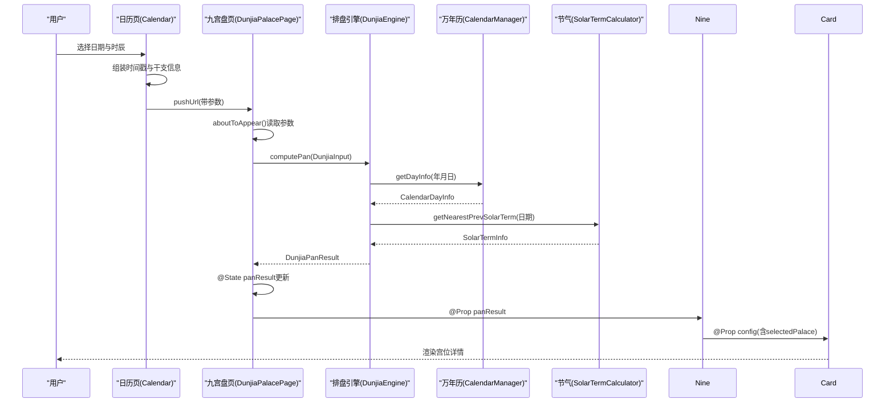
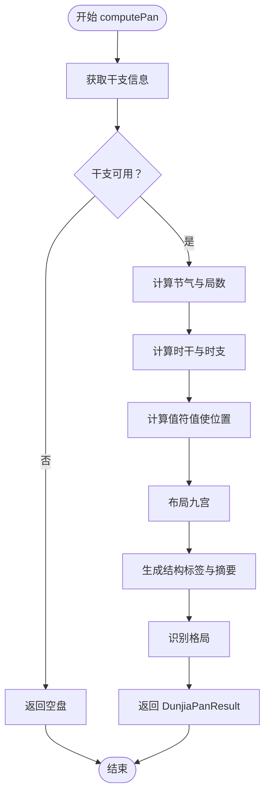
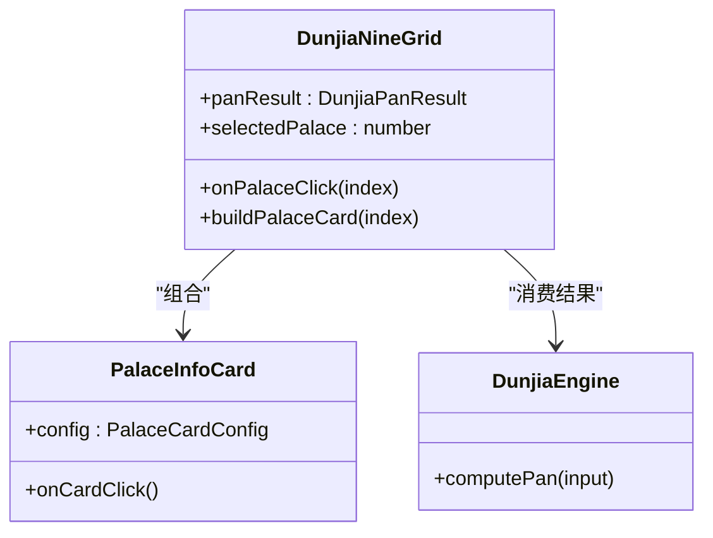
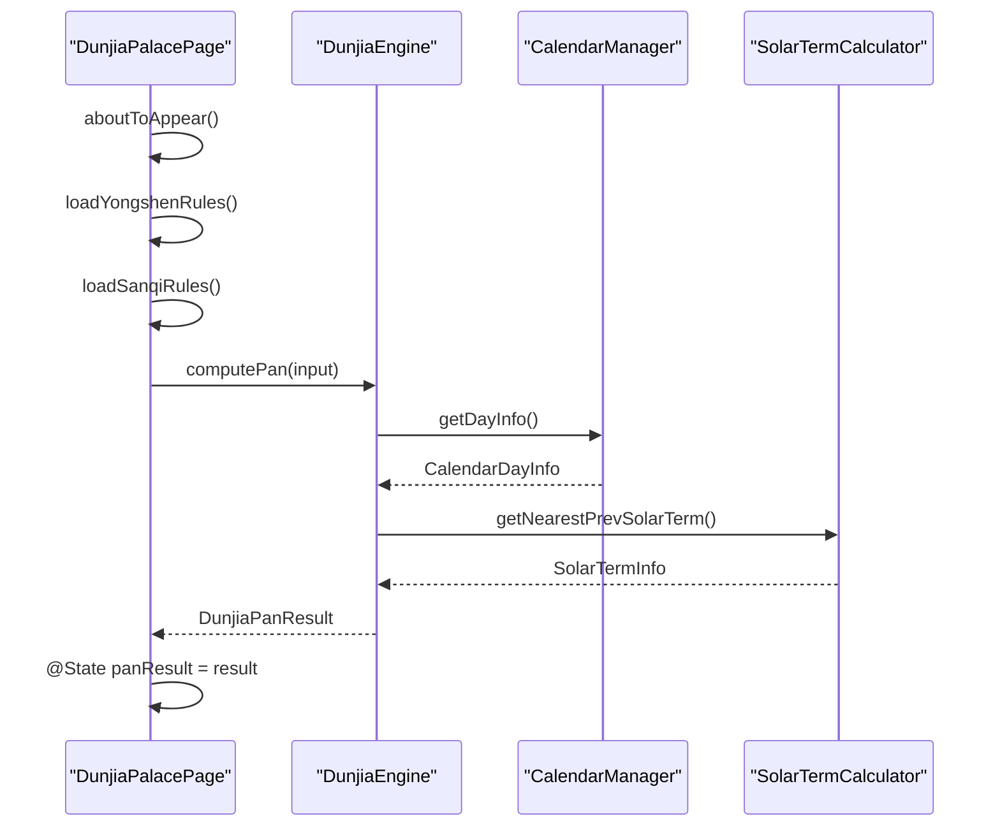
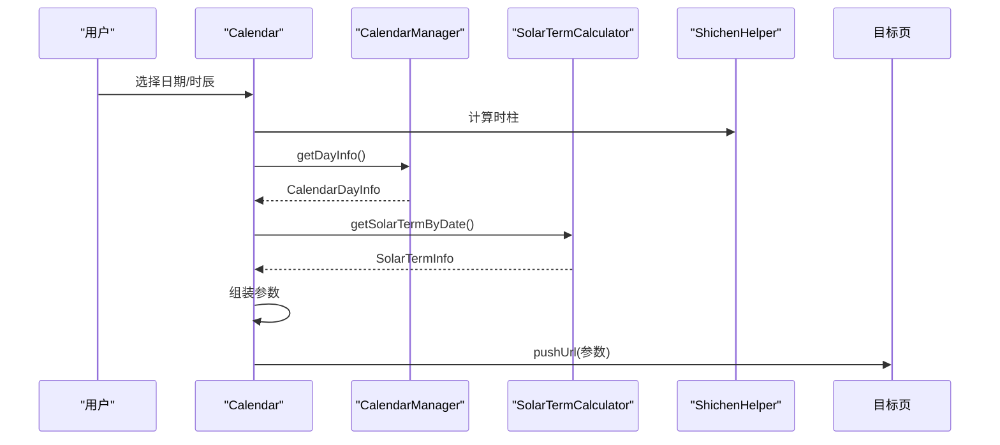
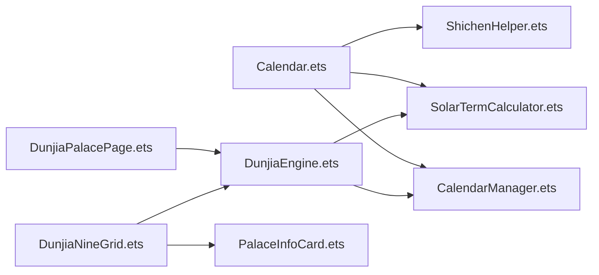

# 数据流设计

<cite>
**本文引用的文件**
- [DunjiaEngine.ets](file://entry/src/main/ets/utils/DunjiaEngine.ets)
- [DunjiaPalacePage.ets](file://entry/src/main/ets/pages/DunjiaPalacePage.ets)
- [DunjiaNineGrid.ets](file://entry/src/main/ets/components/DunjiaNineGrid.ets)
- [PalaceInfoCard.ets](file://entry/src/main/ets/components/PalaceInfoCard.ets)
- [CalendarManager.ets](file://entry/src/main/ets/utils/CalendarManager.ets)
- [Calendar.ets](file://entry/src/main/ets/pages/Calendar.ets)
- [SolarTermCalculator.ets](file://entry/src/main/ets/utils/SolarTermCalculator.ets)
- [ShichenHelper.ets](file://entry/src/main/ets/utils/ShichenHelper.ets)
- [组件化细要.md](file://组件化细要.md)
- [万年历json数据文件解读.md](file://entry/src/main/resources/rawfile/万年历json数据文件解读.md)
- [ArkTS开发规范指南.md](file://ArkTS开发规范指南.md)
</cite>

## 目录
1. [简介](#简介)
2. [项目结构](#项目结构)
3. [核心组件](#核心组件)
4. [架构总览](#架构总览)
5. [详细组件分析](#详细组件分析)
6. [依赖关系分析](#依赖关系分析)
7. [性能考量](#性能考量)
8. [故障排查指南](#故障排查指南)
9. [结论](#结论)
10. [附录](#附录)

## 简介
本文件围绕“从用户输入到界面渲染”的完整数据流进行系统化梳理，重点覆盖：
- 用户输入（公历时间、地理经度、研习场景）如何转化为排盘结果
- DunjiaInput 到 DunjiaPanResult 的数据转换链路
- 状态管理策略（局部状态、全局状态、组件间状态共享）
- 异步数据处理（Promise 链式调用、错误处理）
- 数据验证与预处理（CalendarManager、SolarTermCalculator）
- 缓存策略与性能优化（CalendarManager、SolarTermCalculator）
- 关键数据结构与组件间数据传递机制
- 实际代码示例与最佳实践

## 项目结构
本项目采用“页面 + 组件 + 工具类”的分层组织方式：
- 页面层：负责状态管理、路由参数接收、异步计算触发与结果渲染
- 组件层：负责 UI 展示与交互，接收来自页面的状态与回调
- 工具类层：封装复杂算法与数据源（日历、节气、排盘引擎）

```mermaid
graph TB
subgraph "页面层"
Cal["Calendar.ets<br/>日历选择页"]
DP["DunjiaPalacePage.ets<br/>九宫盘页"]
Panel["DunjiaPanel.ets<br/>研习台导航页"]
end
subgraph "组件层"
Nine["DunjiaNineGrid.ets<br/>九宫格组件"]
Card["PalaceInfoCard.ets<br/>宫位卡片组件"]
end
subgraph "工具类层"
CM["CalendarManager.ets<br/>万年历管理器"]
STC["SolarTermCalculator.ets<br/>节气计算器"]
SE["ShichenHelper.ets<br/>时辰工具"]
DE["DunjiaEngine.ets<br/>排盘引擎"]
end
Cal --> |路由参数| DP
DP --> |@Prop| Nine
Nine --> |@Prop| Card
DP --> |@State| DE
DE --> |async| CM
DE --> |async| STC
Cal --> |读取| CM
Cal --> |读取| STC
Cal --> |读取| SE
```

图示来源
- [Calendar.ets](file://entry/src/main/ets/pages/Calendar.ets#L272-L304)
- [DunjiaPalacePage.ets](file://entry/src/main/ets/pages/DunjiaPalacePage.ets#L98-L115)
- [DunjiaNineGrid.ets](file://entry/src/main/ets/components/DunjiaNineGrid.ets#L24-L27)
- [PalaceInfoCard.ets](file://entry/src/main/ets/components/PalaceInfoCard.ets#L23-L25)
- [CalendarManager.ets](file://entry/src/main/ets/utils/CalendarManager.ets#L30-L42)
- [SolarTermCalculator.ets](file://entry/src/main/ets/utils/SolarTermCalculator.ets#L30-L52)
- [ShichenHelper.ets](file://entry/src/main/ets/utils/ShichenHelper.ets#L14-L39)
- [DunjiaEngine.ets](file://entry/src/main/ets/utils/DunjiaEngine.ets#L98-L118)

章节来源
- [Calendar.ets](file://entry/src/main/ets/pages/Calendar.ets#L1-L602)
- [DunjiaPalacePage.ets](file://entry/src/main/ets/pages/DunjiaPalacePage.ets#L1-L1017)
- [DunjiaNineGrid.ets](file://entry/src/main/ets/components/DunjiaNineGrid.ets#L1-L179)
- [PalaceInfoCard.ets](file://entry/src/main/ets/components/PalaceInfoCard.ets#L1-L179)
- [CalendarManager.ets](file://entry/src/main/ets/utils/CalendarManager.ets#L1-L123)
- [SolarTermCalculator.ets](file://entry/src/main/ets/utils/SolarTermCalculator.ets#L1-L375)
- [ShichenHelper.ets](file://entry/src/main/ets/utils/ShichenHelper.ets#L1-L114)
- [DunjiaEngine.ets](file://entry/src/main/ets/utils/DunjiaEngine.ets#L1-L961)

## 核心组件
- 排盘引擎（DunjiaEngine）：负责从输入参数计算完整的遁甲盘与结构化分析结果，提供单例实例与异步计算接口
- 九宫格组件（DunjiaNineGrid）：展示九宫盘面、时间信息、局数、格局提示，并支持宫位点击
- 宫位卡片组件（PalaceInfoCard）：展示单宫的九星、八门、天干地干、八神、值符/值使标识与格局徽章
- 万年历管理器（CalendarManager）：按年份缓存 JSON 数据，提供异步获取干支信息的能力
- 节气计算器（SolarTermCalculator）：按年份缓存节气时刻，提供最近节气查询
- 时辰工具（ShichenHelper）：提供时辰列表、时干计算、显示文本生成
- 日历页（Calendar）：负责用户选择日期与时辰，组装时间戳并跳转到研习台
- 九宫盘页（DunjiaPalacePage）：负责加载规则、执行排盘计算、展示结果与交互

章节来源
- [DunjiaEngine.ets](file://entry/src/main/ets/utils/DunjiaEngine.ets#L98-L162)
- [DunjiaNineGrid.ets](file://entry/src/main/ets/components/DunjiaNineGrid.ets#L24-L70)
- [PalaceInfoCard.ets](file://entry/src/main/ets/components/PalaceInfoCard.ets#L23-L50)
- [CalendarManager.ets](file://entry/src/main/ets/utils/CalendarManager.ets#L30-L92)
- [SolarTermCalculator.ets](file://entry/src/main/ets/utils/SolarTermCalculator.ets#L30-L159)
- [ShichenHelper.ets](file://entry/src/main/ets/utils/ShichenHelper.ets#L14-L113)
- [Calendar.ets](file://entry/src/main/ets/pages/Calendar.ets#L272-L304)
- [DunjiaPalacePage.ets](file://entry/src/main/ets/pages/DunjiaPalacePage.ets#L98-L236)

## 架构总览
从用户输入到界面渲染的端到端数据流如下：



图示来源
- [Calendar.ets](file://entry/src/main/ets/pages/Calendar.ets#L272-L304)
- [DunjiaPalacePage.ets](file://entry/src/main/ets/pages/DunjiaPalacePage.ets#L98-L115)
- [DunjiaEngine.ets](file://entry/src/main/ets/utils/DunjiaEngine.ets#L113-L162)
- [CalendarManager.ets](file://entry/src/main/ets/utils/CalendarManager.ets#L51-L92)
- [SolarTermCalculator.ets](file://entry/src/main/ets/utils/SolarTermCalculator.ets#L143-L159)

## 详细组件分析

### 排盘引擎（DunjiaEngine）：DunjiaInput → DunjiaPanResult
- 输入：DunjiaInput（日期时间、经度、研习场景）
- 输出：DunjiaPanResult（阴阳遁、局数、值符值使、九宫状态、规则命中、格局、干支与真太阳时等）
- 关键流程：
  1) 获取干支信息（CalendarManager）
  2) 计算节气与局数（SolarTermCalculator）
  3) 计算时干与时支
  4) 计算值符值使位置
  5) 布局九宫（九星、八门、三奇六仪、八神）
  6) 生成结构标签与摘要
  7) 识别格局（三奇得使、天遁/地遁/人遁、伏吟、反吟等）
- 异步与错误处理：若干支信息缺失，返回空盘；计算过程中捕获异常并置 loading 状态



图示来源
- [DunjiaEngine.ets](file://entry/src/main/ets/utils/DunjiaEngine.ets#L113-L162)
- [DunjiaEngine.ets](file://entry/src/main/ets/utils/DunjiaEngine.ets#L247-L250)
- [DunjiaEngine.ets](file://entry/src/main/ets/utils/DunjiaEngine.ets#L256-L281)
- [DunjiaEngine.ets](file://entry/src/main/ets/utils/DunjiaEngine.ets#L358-L389)
- [DunjiaEngine.ets](file://entry/src/main/ets/utils/DunjiaEngine.ets#L678-L800)

章节来源
- [DunjiaEngine.ets](file://entry/src/main/ets/utils/DunjiaEngine.ets#L98-L162)
- [DunjiaEngine.ets](file://entry/src/main/ets/utils/DunjiaEngine.ets#L247-L250)
- [DunjiaEngine.ets](file://entry/src/main/ets/utils/DunjiaEngine.ets#L256-L281)
- [DunjiaEngine.ets](file://entry/src/main/ets/utils/DunjiaEngine.ets#L358-L389)
- [DunjiaEngine.ets](file://entry/src/main/ets/utils/DunjiaEngine.ets#L678-L800)

### 九宫格组件（DunjiaNineGrid）：展示与交互
- 接收 DunjiaPanResult 与选中宫位状态
- 渲染时间信息（阳历/农历/真太阳时偏移）、局数与概览
- 九宫格布局（上南下北），逐宫渲染 PalaceInfoCard
- 支持宫位点击回调，传递给父组件处理



图示来源
- [DunjiaNineGrid.ets](file://entry/src/main/ets/components/DunjiaNineGrid.ets#L24-L70)
- [PalaceInfoCard.ets](file://entry/src/main/ets/components/PalaceInfoCard.ets#L23-L50)
- [DunjiaEngine.ets](file://entry/src/main/ets/utils/DunjiaEngine.ets#L98-L118)

章节来源
- [DunjiaNineGrid.ets](file://entry/src/main/ets/components/DunjiaNineGrid.ets#L24-L179)
- [PalaceInfoCard.ets](file://entry/src/main/ets/components/PalaceInfoCard.ets#L1-L179)

### 九宫盘页（DunjiaPalacePage）：状态管理与异步计算
- 接收路由参数（时间戳、干支等），构造 DunjiaInput
- 加载用神与三奇规则 JSON（异步）
- 调用 DunjiaEngine.computePan，更新 @State panResult
- 提供宫位点击、时间调整、时辰切换等交互



图示来源
- [DunjiaPalacePage.ets](file://entry/src/main/ets/pages/DunjiaPalacePage.ets#L98-L115)
- [DunjiaPalacePage.ets](file://entry/src/main/ets/pages/DunjiaPalacePage.ets#L218-L236)
- [DunjiaEngine.ets](file://entry/src/main/ets/utils/DunjiaEngine.ets#L113-L162)
- [CalendarManager.ets](file://entry/src/main/ets/utils/CalendarManager.ets#L51-L92)
- [SolarTermCalculator.ets](file://entry/src/main/ets/utils/SolarTermCalculator.ets#L143-L159)

章节来源
- [DunjiaPalacePage.ets](file://entry/src/main/ets/pages/DunjiaPalacePage.ets#L98-L236)
- [DunjiaEngine.ets](file://entry/src/main/ets/utils/DunjiaEngine.ets#L113-L162)
- [CalendarManager.ets](file://entry/src/main/ets/utils/CalendarManager.ets#L51-L92)
- [SolarTermCalculator.ets](file://entry/src/main/ets/utils/SolarTermCalculator.ets#L143-L159)

### 日历页（Calendar）：用户输入与参数传递
- 选择日期与时辰，计算起始小时，构建 Date 对象
- 读取 CalendarDayInfo，拼装路由参数（时间戳、干支、时辰索引等）
- 跳转到 DunjiaPanel 或 DunjiaPalacePage



图示来源
- [Calendar.ets](file://entry/src/main/ets/pages/Calendar.ets#L272-L304)
- [CalendarManager.ets](file://entry/src/main/ets/utils/CalendarManager.ets#L51-L92)
- [SolarTermCalculator.ets](file://entry/src/main/ets/utils/SolarTermCalculator.ets#L93-L115)
- [ShichenHelper.ets](file://entry/src/main/ets/utils/ShichenHelper.ets#L59-L113)

章节来源
- [Calendar.ets](file://entry/src/main/ets/pages/Calendar.ets#L272-L304)
- [CalendarManager.ets](file://entry/src/main/ets/utils/CalendarManager.ets#L51-L92)
- [SolarTermCalculator.ets](file://entry/src/main/ets/utils/SolarTermCalculator.ets#L93-L115)
- [ShichenHelper.ets](file://entry/src/main/ets/utils/ShichenHelper.ets#L59-L113)

## 依赖关系分析
- DunjiaPalacePage 依赖 DunjiaEngine（单例）与路由参数
- DunjiaEngine 依赖 CalendarManager 与 SolarTermCalculator
- Calendar 依赖 CalendarManager、SolarTermCalculator、ShichenHelper
- DunjiaNineGrid 依赖 DunjiaEngine 的结果与 PalaceInfoCard
- PalaceInfoCard 依赖 DunjiaEngine 的 PalaceState



图示来源
- [Calendar.ets](file://entry/src/main/ets/pages/Calendar.ets#L1-L602)
- [DunjiaPalacePage.ets](file://entry/src/main/ets/pages/DunjiaPalacePage.ets#L1-L1017)
- [DunjiaEngine.ets](file://entry/src/main/ets/utils/DunjiaEngine.ets#L1-L961)
- [CalendarManager.ets](file://entry/src/main/ets/utils/CalendarManager.ets#L1-L123)
- [SolarTermCalculator.ets](file://entry/src/main/ets/utils/SolarTermCalculator.ets#L1-L375)
- [ShichenHelper.ets](file://entry/src/main/ets/utils/ShichenHelper.ets#L1-L114)
- [DunjiaNineGrid.ets](file://entry/src/main/ets/components/DunjiaNineGrid.ets#L1-L179)
- [PalaceInfoCard.ets](file://entry/src/main/ets/components/PalaceInfoCard.ets#L1-L179)

章节来源
- [组件化细要.md](file://组件化细要.md#L138-L154)
- [组件化细要.md](file://组件化细要.md#L283-L304)

## 性能考量
- 数据缓存
  - CalendarManager：按年份文件缓存 JSON 数组，避免重复读取磁盘
  - SolarTermCalculator：按年份缓节气时刻，避免重复计算
- 批量异步
  - Calendar 页批量获取多日期信息，使用 Promise.all 并行加载
- 懒加载
  - 节气与规则 JSON 在需要时才读取
- 计算优化
  - 真太阳时计算与节气计算均在毫秒级范围内
- 状态管理
  - 使用 @State 控制加载态与结果态，避免不必要的重渲染
  - 使用 @Prop 传递只读数据，减少跨组件状态传播

章节来源
- [CalendarManager.ets](file://entry/src/main/ets/utils/CalendarManager.ets#L62-L92)
- [SolarTermCalculator.ets](file://entry/src/main/ets/utils/SolarTermCalculator.ets#L61-L86)
- [Calendar.ets](file://entry/src/main/ets/pages/Calendar.ets#L83-L85)
- [万年历json数据文件解读.md](file://entry/src/main/resources/rawfile/万年历json数据文件解读.md#L501-L514)
- [组件化细要.md](file://组件化细要.md#L413-L427)

## 故障排查指南
- 万年历数据加载失败
  - 现象：返回空盘或干支信息缺失
  - 排查：确认 CalendarManager.init 已调用；检查 rawfile 路径与文件名映射
  - 参考：[CalendarManager.ets](file://entry/src/main/ets/utils/CalendarManager.ets#L44-L46)，[CalendarManager.ets](file://entry/src/main/ets/utils/CalendarManager.ets#L94-L109)
- 节气计算异常
  - 现象：局数或值符值使计算异常
  - 排查：确认 SolarTermCalculator 实例化与缓存；检查日期边界
  - 参考：[SolarTermCalculator.ets](file://entry/src/main/ets/utils/SolarTermCalculator.ets#L47-L52)，[SolarTermCalculator.ets](file://entry/src/main/ets/utils/SolarTermCalculator.ets#L143-L159)
- 排盘计算失败
  - 现象：页面长时间 loading
  - 排查：检查 computePan 的 try-catch；确认输入参数合法
  - 参考：[DunjiaPalacePage.ets](file://entry/src/main/ets/pages/DunjiaPalacePage.ets#L218-L236)，[DunjiaEngine.ets](file://entry/src/main/ets/utils/DunjiaEngine.ets#L113-L120)
- 三奇规则加载失败
  - 现象：三奇象意不显示
  - 排查：确认资源路径与 UTF-8 解码；检查 JSON 结构
  - 参考：[DunjiaPalacePage.ets](file://entry/src/main/ets/pages/DunjiaPalacePage.ets#L120-L181)，[DunjiaPalacePage.ets](file://entry/src/main/ets/pages/DunjiaPalacePage.ets#L183-L213)

章节来源
- [CalendarManager.ets](file://entry/src/main/ets/utils/CalendarManager.ets#L44-L46)
- [CalendarManager.ets](file://entry/src/main/ets/utils/CalendarManager.ets#L94-L109)
- [SolarTermCalculator.ets](file://entry/src/main/ets/utils/SolarTermCalculator.ets#L47-L52)
- [SolarTermCalculator.ets](file://entry/src/main/ets/utils/SolarTermCalculator.ets#L143-L159)
- [DunjiaPalacePage.ets](file://entry/src/main/ets/pages/DunjiaPalacePage.ets#L218-L236)
- [DunjiaEngine.ets](file://entry/src/main/ets/utils/DunjiaEngine.ets#L113-L120)
- [DunjiaPalacePage.ets](file://entry/src/main/ets/pages/DunjiaPalacePage.ets#L120-L181)
- [DunjiaPalacePage.ets](file://entry/src/main/ets/pages/DunjiaPalacePage.ets#L183-L213)

## 结论
本项目通过“页面 + 组件 + 工具类”的分层设计，实现了从用户输入到界面渲染的清晰数据流：
- 用户输入经由日历页与路由参数传递到九宫盘页
- 九宫盘页通过排盘引擎完成异步计算，期间依赖万年历与节气工具类
- 结果以只读数据形式通过 @Prop 传递给九宫格与宫位卡片组件进行渲染
- 状态管理采用局部状态与单例工具类相结合的方式，既保证了数据一致性，又提升了可维护性
- 缓存与批量异步加载有效降低了性能开销，提升了用户体验

## 附录
- 关键数据结构
  - DunjiaInput：输入参数集合
  - DunjiaPanResult：排盘结果集合
  - PalaceState：单宫状态
  - CalendarDayInfo：干支与节气信息
  - SolarTermInfo：节气时刻
- 最佳实践
  - 使用单例工具类封装复杂逻辑
  - 通过 @Prop 传递只读数据，避免跨组件状态耦合
  - 异步操作统一 try-catch 并提供降级方案
  - 合理使用缓存与批量加载，避免重复 IO 与计算

章节来源
- [DunjiaEngine.ets](file://entry/src/main/ets/utils/DunjiaEngine.ets#L21-L84)
- [CalendarManager.ets](file://entry/src/main/ets/utils/CalendarManager.ets#L5-L28)
- [SolarTermCalculator.ets](file://entry/src/main/ets/utils/SolarTermCalculator.ets#L23-L28)
- [组件化细要.md](file://组件化细要.md#L532-L612)
- [ArkTS开发规范指南.md](file://ArkTS开发规范指南.md#L684-L729)