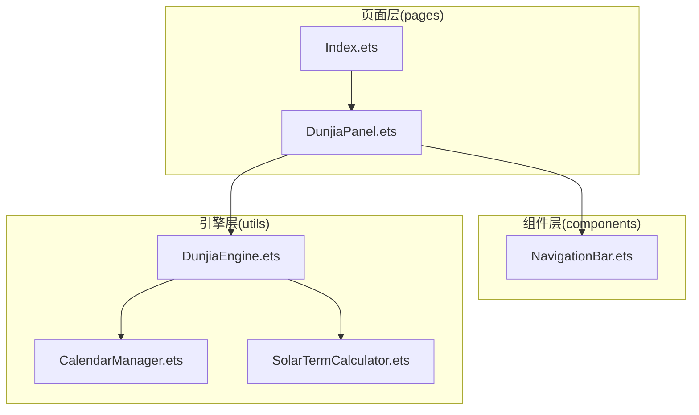
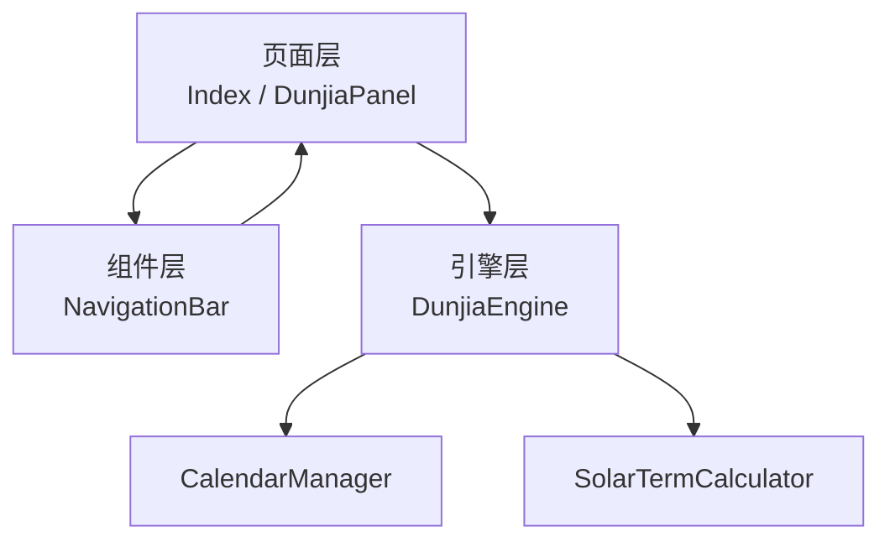
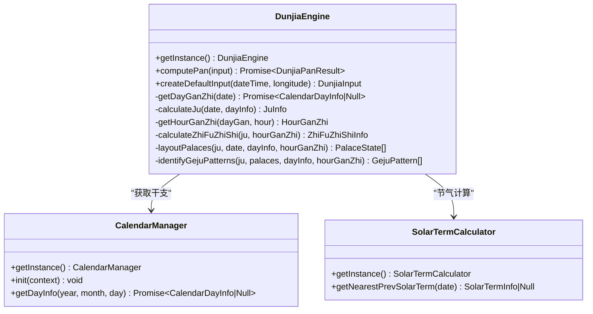
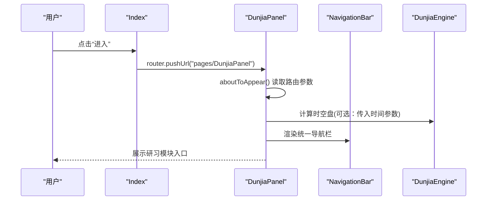
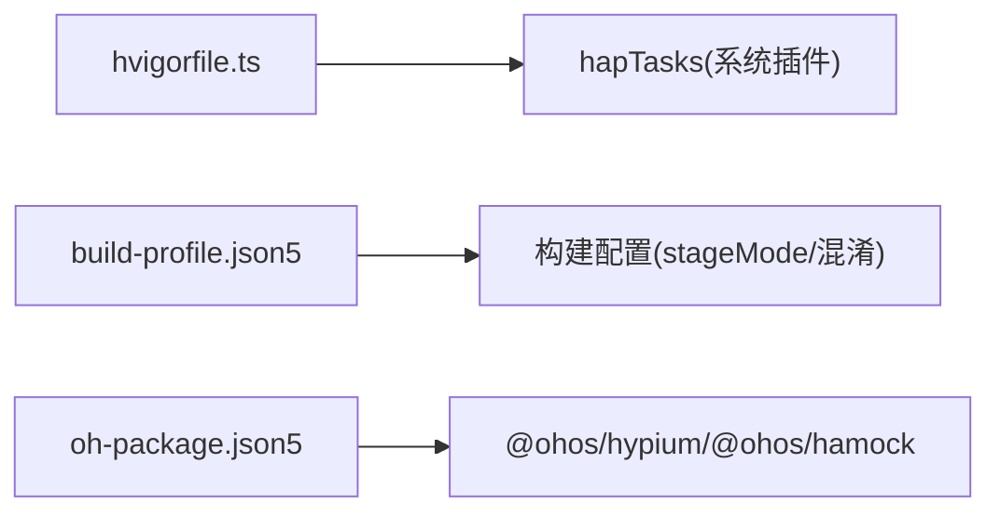

# 整体架构设计

<cite>
**本文档引用的文件**
- [DunjiaEngine.ets](file://entry/src/main/ets/utils/DunjiaEngine.ets)
- [CalendarManager.ets](file://entry/src/main/ets/utils/CalendarManager.ets)
- [SolarTermCalculator.ets](file://entry/src/main/ets/utils/SolarTermCalculator.ets)
- [DunjiaPanel.ets](file://entry/src/main/ets/pages/DunjiaPanel.ets)
- [Index.ets](file://entry/src/main/ets/pages/Index.ets)
- [NavigationBar.ets](file://entry/src/main/ets/components/NavigationBar.ets)
- [module.json5](file://entry/src/main/module.json5)
- [hvigorfile.ts](file://entry/hvigorfile.ts)
- [build-profile.json5](file://entry/build-profile.json5)
- [oh-package.json5](file://oh-package.json5)
- [组件化细要.md](file://组件化细要.md)
</cite>

## 目录
1. [简介](#简介)
2. [项目结构](#项目结构)
3. [核心组件](#核心组件)
4. [架构总览](#架构总览)
5. [详细组件分析](#详细组件分析)
6. [依赖分析](#依赖分析)
7. [性能考量](#性能考量)
8. [故障排查指南](#故障排查指南)
9. [结论](#结论)
10. [附录](#附录)

## 简介
本项目为基于 ArkTS 与 HarmonyOS 的遁甲应用，围绕“遁甲时空盘”核心能力，提供从时间/地点输入到九宫排盘、规则命中与格局识别的完整研习路径。系统采用模块化与分层设计，明确区分引擎层、页面层与组件层的职责边界，并通过单例模式管理全局状态与工具类，确保计算一致性与资源复用效率。

## 项目结构
项目采用“模块化 + 分层”的组织方式：
- 引擎层：位于 utils 目录，封装核心算法与数据模型，提供稳定的计算接口。
- 页面层：位于 pages 目录，承载业务页面与路由导航，负责数据接收与页面跳转。
- 组件层：位于 components 目录，提供可复用 UI 组件，统一风格与交互。
- 配置层：hvigorfile.ts、build-profile.json5、oh-package.json5 等，定义构建、打包与依赖策略。

**图示来源**
- [Index.ets](file://entry/src/main/ets/pages/Index.ets#L1-L88)
- [DunjiaPanel.ets](file://entry/src/main/ets/pages/DunjiaPanel.ets#L1-L189)
- [NavigationBar.ets](file://entry/src/main/ets/components/NavigationBar.ets#L1-L86)
- [DunjiaEngine.ets](file://entry/src/main/ets/utils/DunjiaEngine.ets#L1-L961)
- [CalendarManager.ets](file://entry/src/main/ets/utils/CalendarManager.ets#L1-L123)
- [SolarTermCalculator.ets](file://entry/src/main/ets/utils/SolarTermCalculator.ets#L1-L375)

**章节来源**
- [module.json5](file://entry/src/main/module.json5#L1-L50)
- [hvigorfile.ts](file://entry/hvigorfile.ts#L1-L6)
- [build-profile.json5](file://entry/build-profile.json5#L1-L33)
- [oh-package.json5](file://oh-package.json5#L1-L11)

## 核心组件
- 引擎层核心
  - DunjiaEngine：时空盘核心引擎，负责从输入参数计算完整的遁甲盘与结构化分析，提供单例访问与便捷输入构造。
  - CalendarManager：万年历数据管理，按年份缓存 JSON 数据，提供指定日期的干支与节气信息。
  - SolarTermCalculator：节气精确时刻计算工具，支持跨年节气查找与缓存预加载。
- 页面层核心
  - Index：应用首页，提供入口与法律协议跳转。
  - DunjiaPanel：研习台导航页，聚合多个研习模块入口，并接收来自日历页的时间参数进行透传。
- 组件层核心
  - NavigationBar：统一导航栏组件，支持自定义标题、返回行为与右侧操作按钮。

**章节来源**
- [DunjiaEngine.ets](file://entry/src/main/ets/utils/DunjiaEngine.ets#L98-L162)
- [CalendarManager.ets](file://entry/src/main/ets/utils/CalendarManager.ets#L30-L92)
- [SolarTermCalculator.ets](file://entry/src/main/ets/utils/SolarTermCalculator.ets#L30-L159)
- [Index.ets](file://entry/src/main/ets/pages/Index.ets#L1-L88)
- [DunjiaPanel.ets](file://entry/src/main/ets/pages/DunjiaPanel.ets#L19-L189)
- [NavigationBar.ets](file://entry/src/main/ets/components/NavigationBar.ets#L22-L86)

## 架构总览
系统采用“引擎驱动 + 页面导航 + 组件复用”的三层架构：
- 引擎层：封装遁甲排盘算法、节气计算与万年历数据，提供稳定的数据模型与计算结果。
- 页面层：负责用户交互与页面流转，接收参数并通过路由传递给目标页面。
- 组件层：提供通用 UI 组件，降低重复开发成本，提升一致性。

**图示来源**
- [DunjiaEngine.ets](file://entry/src/main/ets/utils/DunjiaEngine.ets#L1-L961)
- [CalendarManager.ets](file://entry/src/main/ets/utils/CalendarManager.ets#L1-L123)
- [SolarTermCalculator.ets](file://entry/src/main/ets/utils/SolarTermCalculator.ets#L1-L375)
- [DunjiaPanel.ets](file://entry/src/main/ets/pages/DunjiaPanel.ets#L1-L189)
- [NavigationBar.ets](file://entry/src/main/ets/components/NavigationBar.ets#L1-L86)

## 详细组件分析

### 引擎层：DunjiaEngine
- 单例模式
  - 通过静态 getInstance 提供全局唯一实例，避免重复初始化与状态分散。
- 数据模型
  - 输入：时间、经度、研习场景类型。
  - 输出：阴阳遁类型、局数、值符/值使宫位、九宫状态、规则命中、格局识别、干支与真太阳时偏移等。
- 关键流程
  - 获取当日干支 → 计算局数与阴阳遁 → 计算时干支 → 计算值符/值使 → 布九宫（九星、八门、三奇六仪、八神）→ 识别格局 → 生成结构化摘要。
- 性能与健壮性
  - 在无法获取干支时返回空盘占位，保证 UI 不中断。
  - 依赖 CalendarManager 与 SolarTermCalculator，确保节气与干支来源一致。

**图示来源**
- [DunjiaEngine.ets](file://entry/src/main/ets/utils/DunjiaEngine.ets#L98-L162)
- [CalendarManager.ets](file://entry/src/main/ets/utils/CalendarManager.ets#L30-L92)
- [SolarTermCalculator.ets](file://entry/src/main/ets/utils/SolarTermCalculator.ets#L143-L159)

**章节来源**
- [DunjiaEngine.ets](file://entry/src/main/ets/utils/DunjiaEngine.ets#L98-L162)
- [组件化细要.md](file://组件化细要.md#L269-L324)

### 页面层：DunjiaPanel 与 Index
- DunjiaPanel
  - 作为研习台导航页，聚合多个模块入口，支持从日历页透传时间参数，实现“从某日期进入时空盘”的场景。
  - 通过路由 pushUrl 实现页面跳转，并在特定模块下携带参数。
- Index
  - 应用入口页，提供“进入”按钮与法律协议链接，使用 router.pushUrl 进行页面跳转。

**图示来源**
- [Index.ets](file://entry/src/main/ets/pages/Index.ets#L6-L14)
- [DunjiaPanel.ets](file://entry/src/main/ets/pages/DunjiaPanel.ets#L34-L48)
- [NavigationBar.ets](file://entry/src/main/ets/components/NavigationBar.ets#L22-L86)
- [DunjiaEngine.ets](file://entry/src/main/ets/utils/DunjiaEngine.ets#L113-L162)

**章节来源**
- [DunjiaPanel.ets](file://entry/src/main/ets/pages/DunjiaPanel.ets#L19-L189)
- [Index.ets](file://entry/src/main/ets/pages/Index.ets#L1-L88)

### 组件层：NavigationBar
- 统一导航栏组件，支持自定义标题、返回按钮与右侧操作按钮，减少重复代码，提升一致性。
- 通过 @Prop 接收属性，内部 onClick 触发回调或默认返回。

**章节来源**
- [NavigationBar.ets](file://entry/src/main/ets/components/NavigationBar.ets#L22-L86)

### 数据流与组件通信
- 父子组件传递
  - @Prop：单向数据传递（父→子），适用于基本类型与对象。
  - @Link：双向绑定，父组件使用 $ 传递引用，子组件可修改并同步回父组件。
  - @ObjectLink + @Observed：用于复杂对象的响应式更新。
- 事件冒泡与状态提升
  - 页面层通过路由参数进行状态透传（如时间戳）。
  - 组件层通过回调函数向上冒泡，由父组件统一管理状态。
- 跨组件大对象传递
  - 建议通过工具类获取（如 CalendarManager），避免跨组件传递复杂对象，降低性能开销。

**章节来源**
- [组件化细要.md](file://组件化细要.md#L283-L304)

## 依赖分析
- 构建工具与插件
  - hvigorfile.ts 引入系统内置的 hapTasks 插件，提供默认构建任务。
- 构建配置
  - build-profile.json5 定义 stageMode 构建模式、资源拷贝策略与 release 配置下的混淆规则。
- 依赖声明
  - oh-package.json5 声明开发期依赖（@ohos/hypium、@ohos/hamock），生产依赖为空。

**图示来源**
- [hvigorfile.ts](file://entry/hvigorfile.ts#L1-L6)
- [build-profile.json5](file://entry/build-profile.json5#L1-L33)
- [oh-package.json5](file://oh-package.json5#L1-L11)

**章节来源**
- [hvigorfile.ts](file://entry/hvigorfile.ts#L1-L6)
- [build-profile.json5](file://entry/build-profile.json5#L1-L33)
- [oh-package.json5](file://oh-package.json5#L1-L11)

## 性能考量
- 单例与缓存
  - 引擎层与工具类均采用单例模式，减少重复初始化与内存占用。
  - CalendarManager 对年数据进行缓存，避免重复 IO。
  - SolarTermCalculator 对节气结果进行缓存，支持预加载指定年份范围。
- 数据结构与算法
  - 九宫布局采用固定映射与循环飞布，时间复杂度低，空间占用可控。
  - 节气计算使用牛顿迭代法与儒略日转换，兼顾精度与性能。
- UI 与路由
  - 页面间通过路由参数传递必要数据，避免跨组件传递大对象。
  - 组件层统一导航栏，减少重复渲染与样式差异带来的额外开销。

**章节来源**
- [CalendarManager.ets](file://entry/src/main/ets/utils/CalendarManager.ets#L30-L92)
- [SolarTermCalculator.ets](file://entry/src/main/ets/utils/SolarTermCalculator.ets#L30-L86)
- [DunjiaEngine.ets](file://entry/src/main/ets/utils/DunjiaEngine.ets#L358-L462)

## 故障排查指南
- 无法获取干支信息
  - 现象：返回空盘占位。
  - 排查：确认 CalendarManager 已初始化并正确加载对应年份的 JSON 文件；检查日期格式与范围。
- 节气计算异常
  - 现象：节气时间不准确或跨年节气缺失。
  - 排查：确认 SolarTermCalculator 缓存状态；必要时调用 preloadYears 预加载；检查日期边界。
- 页面参数丢失
  - 现象：从日历页进入研习台后，无法带入时间参数。
  - 排查：确认路由 pushUrl 时携带了必要的参数；在目标页面 aboutToAppear 中正确读取。
- 组件状态不同步
  - 现象：子组件修改值后父组件未更新。
  - 排查：使用 @Link 或 @ObjectLink + @Observed；避免直接修改 @Prop 值。

**章节来源**
- [CalendarManager.ets](file://entry/src/main/ets/utils/CalendarManager.ets#L44-L92)
- [SolarTermCalculator.ets](file://entry/src/main/ets/utils/SolarTermCalculator.ets#L369-L373)
- [DunjiaPanel.ets](file://entry/src/main/ets/pages/DunjiaPanel.ets#L34-L48)
- [组件化细要.md](file://组件化细要.md#L283-L304)

## 结论
本项目以 DunjiaEngine 为核心，结合 CalendarManager 与 SolarTermCalculator，形成稳定的引擎层；页面层与组件层分别承担业务与交互职责，通过单例模式与统一的状态传递规范，实现清晰的架构边界与高效的运行性能。配合 hvigor 构建工具与合理的依赖声明，项目具备良好的可维护性与扩展性。

## 附录
- 模块与设备类型
  - module.json5 定义模块类型为 entry，主元素为 EntryAbility，设备类型包含 phone，安装与启动窗口图标等资源已配置。
- 开发与测试
  - 开发期依赖 hypium 与 hamock，便于本地与自动化测试。

**章节来源**
- [module.json5](file://entry/src/main/module.json5#L1-L50)
- [oh-package.json5](file://oh-package.json5#L1-L11)