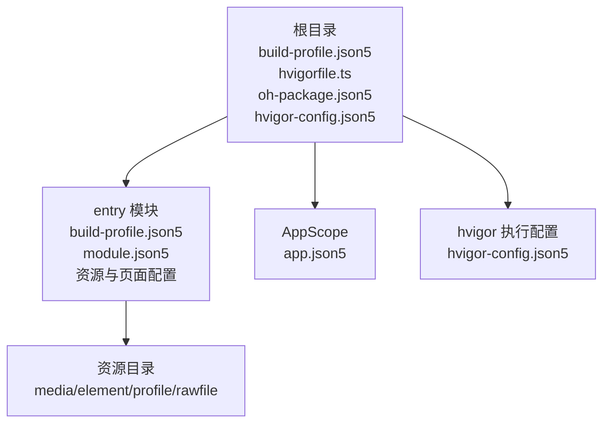
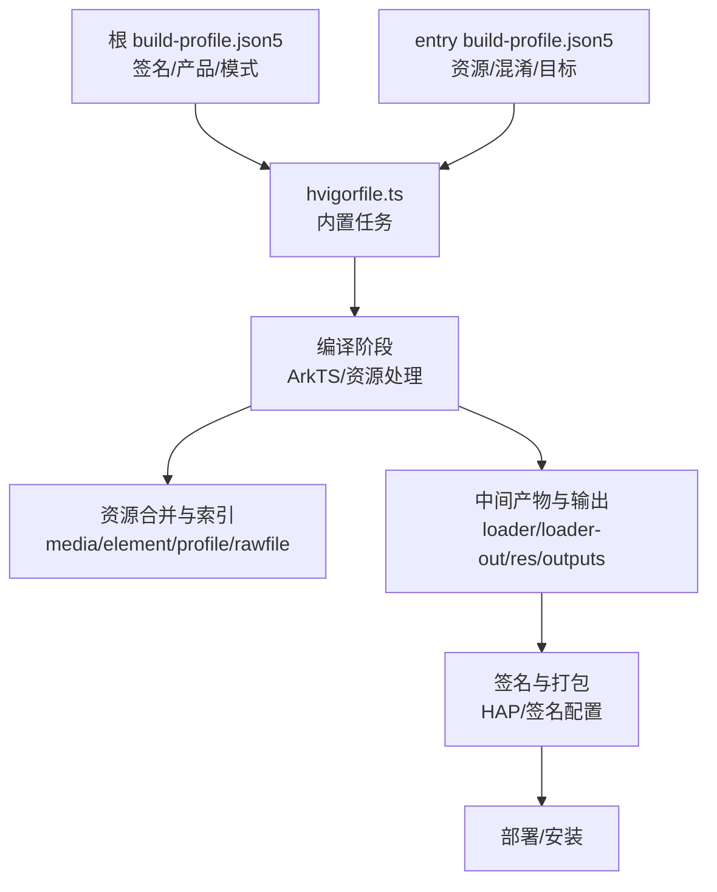
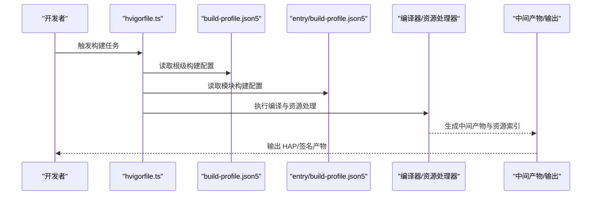
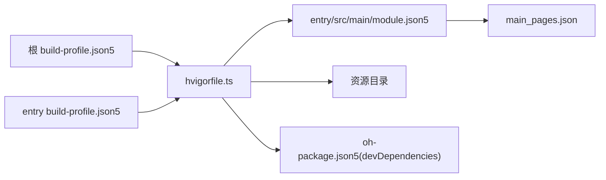

# 构建配置

<cite>
**本文引用的文件**
- [build-profile.json5（根）](file://build-profile.json5)
- [build-profile.json5（entry模块）](file://entry/build-profile.json5)
- [hvigorfile.ts](file://hvigorfile.ts)
- [hvigor-config.json5](file://hvigor/hvigor-config.json5)
- [oh-package.json5（根）](file://oh-package.json5)
- [oh-package.json5（entry模块）](file://entry/oh-package.json5)
- [obfuscation-rules.txt](file://entry/obfuscation-rules.txt)
- [AppScope/app.json5](file://AppScope/app.json5)
- [entry/src/main/module.json5](file://entry/src/main/module.json5)
- [entry/src/main/resources/base/profile/main_pages.json](file://entry/src/main/resources/base/profile/main_pages.json)
- [entry/src/main/resources/base/profile/backup_config.json](file://entry/src/main/resources/base/profile/backup_config.json)
- [entry/src/main/resources/base/element/string.json](file://entry/src/main/resources/base/element/string.json)
- [code-linter.json5](file://code-linter.json5)
</cite>

## 目录
1. [简介](#简介)
2. [项目结构](#项目结构)
3. [核心组件](#核心组件)
4. [架构总览](#架构总览)
5. [详细组件分析](#详细组件分析)
6. [依赖关系分析](#依赖关系分析)
7. [性能考量](#性能考量)
8. [故障排查指南](#故障排查指南)
9. [结论](#结论)
10. [附录](#附录)

## 简介
本文件面向开发者，系统梳理并解释本项目的构建配置与流程，重点覆盖以下方面：
- build-profile.json5 的配置项与作用：编译选项、资源处理、输出配置、构建模式（debug/release）差异与优化策略
- hvigorfile.ts 的构建脚本与任务定义：编译流程、打包策略、部署配置
- oh-package.json5 的依赖管理与版本控制策略
- 不同构建环境（debug/release）的配置差异与优化策略
- 资源文件处理流程：图片、JSON数据、样式文件的打包规则
- 代码混淆与压缩配置：生产环境的性能与安全
- 构建命令与调试技巧
- 常见构建问题排查与解决方案

## 项目结构
项目采用多模块结构，根目录包含全局构建配置与顶层依赖声明；entry 模块为应用入口模块，包含其独立的构建配置与资源。

图表来源
- [build-profile.json5（根）](file://build-profile.json5#L1-L56)
- [hvigorfile.ts](file://hvigorfile.ts#L1-L6)
- [hvigor-config.json5](file://hvigor/hvigor-config.json5#L1-L24)
- [entry/build-profile.json5](file://entry/build-profile.json5#L1-L33)
- [entry/src/main/module.json5](file://entry/src/main/module.json5#L1-L50)
- [AppScope/app.json5](file://AppScope/app.json5#L1-L11)

章节来源
- [build-profile.json5（根）](file://build-profile.json5#L1-L56)
- [hvigorfile.ts](file://hvigorfile.ts#L1-L6)
- [hvigor-config.json5](file://hvigor/hvigor-config.json5#L1-L24)
- [entry/build-profile.json5](file://entry/build-profile.json5#L1-L33)
- [entry/src/main/module.json5](file://entry/src/main/module.json5#L1-L50)
- [AppScope/app.json5](file://AppScope/app.json5#L1-L11)

## 核心组件
- 根级构建配置（build-profile.json5）
  - 定义签名配置、产品配置、构建模式集合、模块映射等
  - 关键点：签名材料路径、SDK兼容版本、严格模式开关、构建模式（debug/release）
- entry 模块构建配置（entry/build-profile.json5）
  - 定义资源处理策略、目标产物（default/ohosTest）、构建模式集（含 release 的 ArkTS 混淆规则）
- 构建脚本（hvigorfile.ts）
  - 引入内置应用任务，支持扩展插件
- hvigor 执行配置（hvigor-config.json5）
  - 控制执行分析模式、并行/增量编译、类型检查、日志级别、调试参数等
- 依赖管理（oh-package.json5）
  - 根与模块各自声明依赖与开发依赖，用于构建期与测试期工具链管理
- 资源与页面配置（entry/src/main/module.json5 及相关 JSON）
  - 页面清单、能力声明、备份配置、字符串资源等
- 代码质量（code-linter.json5）
  - ESLint 插件与规则集，限定扫描范围与安全规则

章节来源
- [build-profile.json5（根）](file://build-profile.json5#L1-L56)
- [entry/build-profile.json5](file://entry/build-profile.json5#L1-L33)
- [hvigorfile.ts](file://hvigorfile.ts#L1-L6)
- [hvigor-config.json5](file://hvigor/hvigor-config.json5#L1-L24)
- [oh-package.json5（根）](file://oh-package.json5#L1-L11)
- [oh-package.json5（entry模块）](file://entry/oh-package.json5#L1-L11)
- [entry/src/main/module.json5](file://entry/src/main/module.json5#L1-L50)
- [entry/src/main/resources/base/profile/main_pages.json](file://entry/src/main/resources/base/profile/main_pages.json#L1-L20)
- [entry/src/main/resources/base/profile/backup_config.json](file://entry/src/main/resources/base/profile/backup_config.json#L1-L3)
- [entry/src/main/resources/base/element/string.json](file://entry/src/main/resources/base/element/string.json#L1-L16)
- [code-linter.json5](file://code-linter.json5#L1-L32)

## 架构总览
下图展示从配置到产物的关键路径：配置驱动构建 → 编译与资源处理 → 产物生成与签名。

图表来源
- [build-profile.json5（根）](file://build-profile.json5#L1-L56)
- [entry/build-profile.json5](file://entry/build-profile.json5#L1-L33)
- [hvigorfile.ts](file://hvigorfile.ts#L1-L6)

## 详细组件分析

### 根级构建配置（build-profile.json5）
- 签名配置（app.signingConfigs）
  - 包含证书路径、密钥别名、密码、签名算法、存储文件与密码等
  - 用于发布包签名，保障应用完整性与来源可信
- 产品配置（app.products）
  - 指定目标 SDK 版本、兼容 SDK 版本、运行时 OS
  - 构建选项中启用严格模式：大小写敏感检查、OHM URL 规范化
- 构建模式（app.buildModeSet）
  - 提供 debug 与 release 两种模式，作为后续按需优化的基础
- 模块映射（modules）
  - 映射 entry 模块的源路径与目标产物

章节来源
- [build-profile.json5（根）](file://build-profile.json5#L1-L56)

### entry 模块构建配置（entry/build-profile.json5）
- apiType 与 stageMode
  - 指定构建模式为 stageMode，适配多产物与测试场景
- 资源处理（buildOption.resOptions.copyCodeResource.enable）
  - 关闭代码资源复制，避免重复打包，减少体积
- 构建模式集（buildOptionSet.release）
  - ArkTS 混淆规则：可启用/禁用，指定混淆规则文件路径
  - 便于在 release 模式下进行代码混淆以提升性能与安全性
- 目标产物（targets）
  - default：常规构建目标
  - ohosTest：测试目标

章节来源
- [entry/build-profile.json5](file://entry/build-profile.json5#L1-L33)

### hvigorfile.ts 与 hvigor 执行配置
- hvigorfile.ts
  - 引入内置应用任务，保持默认构建流程稳定
  - 支持通过 plugins 字段扩展自定义插件
- hvigor-config.json5
  - execution：可配置分析模式、守护进程、增量/并行编译、类型检查、优化策略
  - logging：日志级别
  - debugging：堆栈追踪开关
  - nodeOptions：Node.js 运行参数（如内存上限、GC 暴露）

章节来源
- [hvigorfile.ts](file://hvigorfile.ts#L1-L6)
- [hvigor-config.json5](file://hvigor/hvigor-config.json5#L1-L24)

### 依赖管理与版本控制（oh-package.json5）
- 根级 oh-package.json5
  - modelVersion：模型版本
  - devDependencies：测试与模拟框架（如 hypium、hamock），用于本地测试与模拟
- entry 模块 oh-package.json5
  - 模块元信息（名称、版本、依赖等），当前为空，表示无额外模块级依赖

章节来源
- [oh-package.json5（根）](file://oh-package.json5#L1-L11)
- [oh-package.json5（entry模块）](file://entry/oh-package.json5#L1-L11)

### 资源处理与页面配置
- 页面清单（entry/src/main/resources/base/profile/main_pages.json）
  - 列举所有页面入口路径，影响路由与打包范围
- 备份配置（entry/src/main/resources/base/profile/backup_config.json）
  - 控制是否允许备份与恢复
- 能力与页面（entry/src/main/module.json5）
  - abilities：主能力（EntryAbility）与技能实体/动作
  - extensionAbilities：备份扩展能力及其元数据
  - pages：绑定 main_pages.json
- 字符串资源（entry/src/main/resources/base/element/string.json）
  - 提供标签、描述等本地化文本占位

章节来源
- [entry/src/main/resources/base/profile/main_pages.json](file://entry/src/main/resources/base/profile/main_pages.json#L1-L20)
- [entry/src/main/resources/base/profile/backup_config.json](file://entry/src/main/resources/base/profile/backup_config.json#L1-L3)
- [entry/src/main/module.json5](file://entry/src/main/module.json5#L1-L50)
- [entry/src/main/resources/base/element/string.json](file://entry/src/main/resources/base/element/string.json#L1-L16)

### 代码混淆与压缩
- 混淆规则文件（entry/obfuscation-rules.txt）
  - 定义属性名混淆、顶级作用域混淆、文件名混淆、导出混淆等选项
  - 在 release 构建中可通过 build-profile.json5 启用
- 生产环境建议
  - 开启 ArkTS 混淆与规则文件引用
  - 结合资源压缩与 Tree-Shaking，进一步减小包体

章节来源
- [obfuscation-rules.txt](file://entry/obfuscation-rules.txt#L1-L23)
- [entry/build-profile.json5](file://entry/build-profile.json5#L10-L24)

### 构建流程与任务定义（序列图）

图表来源
- [hvigorfile.ts](file://hvigorfile.ts#L1-L6)
- [build-profile.json5（根）](file://build-profile.json5#L1-L56)
- [entry/build-profile.json5](file://entry/build-profile.json5#L1-L33)

## 依赖关系分析
- 配置耦合
  - 根 build-profile.json5 决定签名与产品策略，entry build-profile.json5 决定资源与混淆策略
  - hvigorfile.ts 作为统一入口，串联配置与任务
- 资源耦合
  - module.json5 的 pages 与 main_pages.json 对齐，决定页面打包范围
  - 资源目录（media/element/profile/rawfile）由资源处理逻辑参与合并与索引
- 依赖耦合
  - oh-package.json5 的 devDependencies 提供测试与模拟工具链，影响测试与本地验证流程

图表来源
- [build-profile.json5（根）](file://build-profile.json5#L1-L56)
- [entry/build-profile.json5](file://entry/build-profile.json5#L1-L33)
- [hvigorfile.ts](file://hvigorfile.ts#L1-L6)
- [entry/src/main/module.json5](file://entry/src/main/module.json5#L1-L50)
- [entry/src/main/resources/base/profile/main_pages.json](file://entry/src/main/resources/base/profile/main_pages.json#L1-L20)
- [oh-package.json5（根）](file://oh-package.json5#L1-L11)

章节来源
- [build-profile.json5（根）](file://build-profile.json5#L1-L56)
- [entry/build-profile.json5](file://entry/build-profile.json5#L1-L33)
- [hvigorfile.ts](file://hvigorfile.ts#L1-L6)
- [entry/src/main/module.json5](file://entry/src/main/module.json5#L1-L50)
- [entry/src/main/resources/base/profile/main_pages.json](file://entry/src/main/resources/base/profile/main_pages.json#L1-L20)
- [oh-package.json5（根）](file://oh-package.json5#L1-L11)

## 性能考量
- 并行与增量编译
  - hvigor-config.json5 中可开启并行与增量编译，缩短构建时间
- 资源压缩与裁剪
  - 关闭不必要的资源复制（entry build-profile.json5），减少冗余
  - 使用混淆规则与 Tree-Shaking，降低包体与运行时开销
- 严格模式
  - 根 build-profile.json5 启用严格模式，有助于早期发现潜在问题，提升稳定性

章节来源
- [hvigor-config.json5](file://hvigor/hvigor-config.json5#L1-L24)
- [entry/build-profile.json5](file://entry/build-profile.json5#L1-L33)
- [build-profile.json5（根）](file://build-profile.json5#L25-L30)

## 故障排查指南
- 签名失败或签名材料路径错误
  - 检查根 build-profile.json5 中 signingConfigs 的证书与存储文件路径是否正确
- 页面未生效或打包遗漏
  - 校验 entry/src/main/module.json5 的 pages 与 entry/src/main/resources/base/profile/main_pages.json 是否一致
- 资源未被识别
  - 确认资源目录命名与引用方式符合规范，避免 copyCodeResource 导致的重复
- 混淆导致运行异常
  - 在 release 构建中谨慎使用混淆，必要时调整 obfuscation-rules.txt 的 keep 规则
- 日志与调试
  - hvigor-config.json5 可临时提高日志级别或开启调试参数，辅助定位问题

章节来源
- [build-profile.json5（根）](file://build-profile.json5#L1-L56)
- [entry/src/main/module.json5](file://entry/src/main/module.json5#L1-L50)
- [entry/src/main/resources/base/profile/main_pages.json](file://entry/src/main/resources/base/profile/main_pages.json#L1-L20)
- [hvigor-config.json5](file://hvigor/hvigor-config.json5#L1-L24)
- [entry/obfuscation-rules.txt](file://entry/obfuscation-rules.txt#L1-L23)

## 结论
本项目的构建配置围绕“根级统一策略 + 模块级细化控制”展开，通过严格的配置与可选的混淆策略，在保证开发效率的同时兼顾生产环境的性能与安全。建议在团队内明确 debug/release 差异与资源处理规范，并结合 hvigor 执行配置持续优化构建性能。

## 附录
- 构建命令与调试技巧（基于现有配置）
  - 使用 hvigor 默认任务进行构建与打包
  - 如需更精细控制，可在 hvigor-config.json5 中启用并行/增量编译与类型检查
  - 测试阶段可利用 devDependencies 中的测试与模拟工具链
- 代码质量
  - code-linter.json5 已配置推荐规则集与安全规则，建议在 CI 中启用静态检查

章节来源
- [hvigorfile.ts](file://hvigorfile.ts#L1-L6)
- [hvigor-config.json5](file://hvigor/hvigor-config.json5#L1-L24)
- [code-linter.json5](file://code-linter.json5#L1-L32)
- [oh-package.json5（根）](file://oh-package.json5#L1-L11)