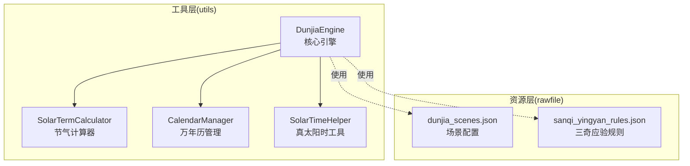
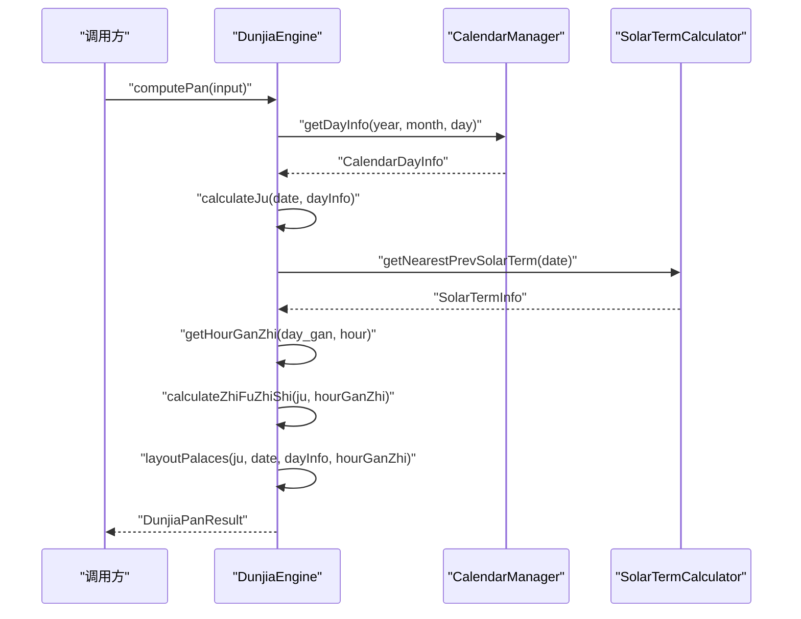
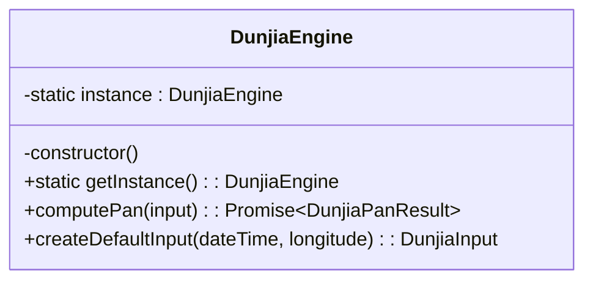
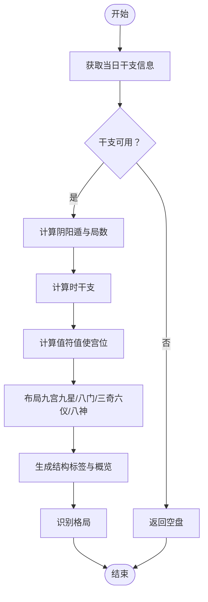
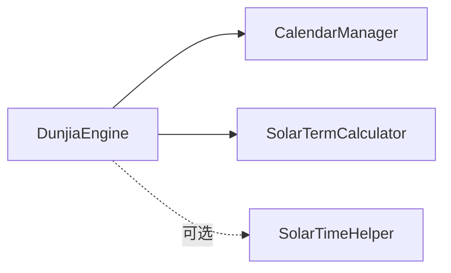

# 核心引擎架构

<cite>
**本文档引用的文件**
- [DunjiaEngine.ets](file://entry/src/main/ets/utils/DunjiaEngine.ets)
- [SolarTermCalculator.ets](file://entry/src/main/ets/utils/SolarTermCalculator.ets)
- [CalendarManager.ets](file://entry/src/main/ets/utils/CalendarManager.ets)
- [SolarTimeHelper.ets](file://entry/src/main/ets/utils/SolarTimeHelper.ets)
- [DunjiaEngine.ts](file://entry/src/main/ets/utils/DunjiaEngine.ts)
- [SolarTermCalculator.ts](file://entry/src/main/ets/utils/SolarTermCalculator.ts)
- [CalendarManager.ts](file://entry/src/main/ets/utils/CalendarManager.ts)
- [SolarTimeHelper.ts](file://entry/src/main/ets/utils/SolarTimeHelper.ts)
- [dunjia_scenes.json](file://entry/src/main/resources/rawfile/dunjia_scenes.json)
- [sanqi_yingyan_rules.json](file://entry/src/main/resources/rawfile/rules/sanqi_yingyan_rules.json)
</cite>

## 目录
1. [简介](#简介)
2. [项目结构](#项目结构)
3. [核心组件](#核心组件)
4. [架构总览](#架构总览)
5. [详细组件分析](#详细组件分析)
6. [依赖分析](#依赖分析)
7. [性能考量](#性能考量)
8. [故障排查指南](#故障排查指南)
9. [结论](#结论)
10. [附录](#附录)

## 简介
本文件面向“遁甲时空盘核心引擎”（DunjiaEngine）的架构与实现进行系统化技术文档梳理，重点覆盖：
- 设计模式与单例实现原理（私有构造、静态工厂、实例缓存）
- 输入参数到遁甲盘面生成的完整算法流程
- 关键算法细节：干支计算、节气判断、阴阳遁与局数、值符值使位置、九宫布局（九星、八门、三奇六仪、八神）
- 真太阳时转换与地理位置修正
- 算法流程图与关键代码片段路径，帮助开发者理解核心逻辑与扩展点

## 项目结构
该引擎位于应用模块的工具层，采用“工具类 + 单例 + 结构化结果”的组织方式，便于在页面组件中复用与测试。

图表来源
- [DunjiaEngine.ets](file://entry/src/main/ets/utils/DunjiaEngine.ets#L1-L961)
- [SolarTermCalculator.ets](file://entry/src/main/ets/utils/SolarTermCalculator.ets#L1-L375)
- [CalendarManager.ets](file://entry/src/main/ets/utils/CalendarManager.ets#L1-L123)
- [SolarTimeHelper.ets](file://entry/src/main/ets/utils/SolarTimeHelper.ets#L1-L270)
- [dunjia_scenes.json](file://entry/src/main/resources/rawfile/dunjia_scenes.json#L1-L50)
- [sanqi_yingyan_rules.json](file://entry/src/main/resources/rawfile/rules/sanqi_yingyan_rules.json#L1-L525)

章节来源
- [DunjiaEngine.ets](file://entry/src/main/ets/utils/DunjiaEngine.ets#L1-L961)
- [SolarTermCalculator.ets](file://entry/src/main/ets/utils/SolarTermCalculator.ets#L1-L375)
- [CalendarManager.ets](file://entry/src/main/ets/utils/CalendarManager.ets#L1-L123)
- [SolarTimeHelper.ets](file://entry/src/main/ets/utils/SolarTimeHelper.ets#L1-L270)
- [dunjia_scenes.json](file://entry/src/main/resources/rawfile/dunjia_scenes.json#L1-L50)
- [sanqi_yingyan_rules.json](file://entry/src/main/resources/rawfile/rules/sanqi_yingyan_rules.json#L1-L525)

## 核心组件
- DunjiaEngine：核心引擎，负责从输入参数到遁甲盘面与结构化分析的全流程计算
- SolarTermCalculator：节气精确时刻计算与缓存
- CalendarManager：万年历数据加载与缓存，提供干支信息
- SolarTimeHelper：真太阳时与经度修正计算（辅助功能）

章节来源
- [DunjiaEngine.ets](file://entry/src/main/ets/utils/DunjiaEngine.ets#L98-L162)
- [SolarTermCalculator.ets](file://entry/src/main/ets/utils/SolarTermCalculator.ets#L30-L54)
- [CalendarManager.ets](file://entry/src/main/ets/utils/CalendarManager.ets#L30-L46)
- [SolarTimeHelper.ets](file://entry/src/main/ets/utils/SolarTimeHelper.ets#L29-L47)

## 架构总览
DunjiaEngine 作为单例，对外暴露同步/异步计算接口，内部协调 CalendarManager 与 SolarTermCalculator 获取干支与节气，再执行遁甲算法，最终输出结构化的盘面结果。

图表来源
- [DunjiaEngine.ets](file://entry/src/main/ets/utils/DunjiaEngine.ets#L113-L162)
- [CalendarManager.ets](file://entry/src/main/ets/utils/CalendarManager.ets#L51-L92)
- [SolarTermCalculator.ets](file://entry/src/main/ets/utils/SolarTermCalculator.ets#L143-L159)

## 详细组件分析

### 设计模式与单例实现
- 私有构造函数：防止外部直接实例化
- 静态工厂方法：getInstance 返回全局唯一实例
- 实例缓存：静态字段保存实例，避免重复创建

图表来源
- [DunjiaEngine.ets](file://entry/src/main/ets/utils/DunjiaEngine.ets#L98-L108)

章节来源
- [DunjiaEngine.ets](file://entry/src/main/ets/utils/DunjiaEngine.ets#L98-L108)

### 输入参数到盘面生成的完整流程
- 输入：日期时间、地理经度、研习场景类型
- 输出：遁类型、局数、值符/值使宫位、九宫状态、规则命中、结构评估、日干支与时辰干支、真太阳时偏移、格局识别

图表来源
- [DunjiaEngine.ets](file://entry/src/main/ets/utils/DunjiaEngine.ets#L113-L162)

章节来源
- [DunjiaEngine.ets](file://entry/src/main/ets/utils/DunjiaEngine.ets#L113-L162)

### 关键算法详解

#### 1) 干支计算与时干支
- 时支划分：按23点-1点为子时，1点-3点为丑时…依此类推
- 时干起法：依据日干确定时干起始，按地支索引线性递增

章节来源
- [DunjiaEngine.ets](file://entry/src/main/ets/utils/DunjiaEngine.ets#L169-L198)

#### 2) 节气判断与阴阳遁
- 通过 SolarTermCalculator 获取最近前一个节气
- 阳遁：冬至后；阴遁：夏至后
- 局数映射：按节气名与“上/中/下元”索引查表

章节来源
- [DunjiaEngine.ets](file://entry/src/main/ets/utils/DunjiaEngine.ets#L256-L281)
- [SolarTermCalculator.ets](file://entry/src/main/ets/utils/SolarTermCalculator.ets#L143-L159)

#### 3) 值符值使位置计算
- 值符：随“时干”在局数宫位上顺/逆飞（跳过中宫），确定值符宫
- 值使：随“时支”在固定八门盘上顺/逆飞（跳过中宫），确定值使宫

章节来源
- [DunjiaEngine.ets](file://entry/src/main/ets/utils/DunjiaEngine.ets#L206-L246)
- [DunjiaEngine.ets](file://entry/src/main/ets/utils/DunjiaEngine.ets#L429-L462)

#### 4) 九宫布局（九星、八门、三奇六仪、八神）
- 九星固定对应九宫（地盘），不随局数飞布
- 八门固定对应九宫（地盘），不随局数飞布
- 三奇六仪（天盘/地盘）：阳遁顺布六仪逆布三奇，阴遁逆布六仪顺布三奇；地盘固定布局
- 八神：值符后/前若干宫位依次布列，中宫固定天禽

章节来源
- [DunjiaEngine.ets](file://entry/src/main/ets/utils/DunjiaEngine.ets#L397-L402)
- [DunjiaEngine.ets](file://entry/src/main/ets/utils/DunjiaEngine.ets#L413-L418)
- [DunjiaEngine.ets](file://entry/src/main/ets/utils/DunjiaEngine.ets#L470-L556)
- [DunjiaEngine.ets](file://entry/src/main/ets/utils/DunjiaEngine.ets#L561-L601)

#### 5) 真太阳时转换与地理位置修正
- 真太阳时 = 平太阳时 + 均时差 + 经度时差
- 经度时差 = (经度 - 标准时经度) × 4 分钟/度
- 引擎内部提供偏移量计算，供 UI 展示与对比

章节来源
- [DunjiaEngine.ets](file://entry/src/main/ets/utils/DunjiaEngine.ets#L658-L661)
- [SolarTimeHelper.ets](file://entry/src/main/ets/utils/SolarTimeHelper.ets#L54-L77)
- [SolarTimeHelper.ets](file://entry/src/main/ets/utils/SolarTimeHelper.ets#L196-L202)

#### 6) 格局识别（示例：三奇得使、三遁、三奇合、伏吟、反吹、青龙返首、飞鸟跌穴、三奇入墓、六仪击刑、太白入荧惑、荧惑入太白、天网四张）
- 三奇得使：三奇（乙/丙/丁）落在值使门宫
- 三遁：生门+丙、开门+乙、休门+丁
- 三奇合：同一宫天盘地盘合有三奇
- 伏吟：天盘地盘同干
- 反吹：特定干对相对宫位
- 青龙返首：天盘甲/戊己+地盘丙
- 飞鸟跌穴：天盘丙+地盘甲/戊己
- 三奇入墓：乙入坤宫（木墓），丙丁入戌宫（火墓）
- 六仪击刑：特定日干+时支触发
- 太白入荧惑：庚+丙
- 荧惑入太白：丙+庚
- 天网四张：时干癸

章节来源
- [DunjiaEngine.ets](file://entry/src/main/ets/utils/DunjiaEngine.ets#L678-L936)
- [sanqi_yingyan_rules.json](file://entry/src/main/resources/rawfile/rules/sanqi_yingyan_rules.json#L1-L525)

## 依赖分析
- DunjiaEngine 依赖 CalendarManager 获取干支，依赖 SolarTermCalculator 获取节气
- DunjiaEngine 与 SolarTimeHelper 在“真太阳时”概念上互补：前者提供偏移量，后者提供完整计算与格式化

图表来源
- [DunjiaEngine.ets](file://entry/src/main/ets/utils/DunjiaEngine.ets#L4-L5)
- [CalendarManager.ets](file://entry/src/main/ets/utils/CalendarManager.ets#L1-L3)
- [SolarTermCalculator.ets](file://entry/src/main/ets/utils/SolarTermCalculator.ets#L1-L2)

章节来源
- [DunjiaEngine.ets](file://entry/src/main/ets/utils/DunjiaEngine.ets#L4-L5)
- [CalendarManager.ets](file://entry/src/main/ets/utils/CalendarManager.ets#L1-L3)
- [SolarTermCalculator.ets](file://entry/src/main/ets/utils/SolarTermCalculator.ets#L1-L2)

## 性能考量
- 节气计算缓存：SolarTermCalculator 对年份级结果进行缓存，避免重复计算
- 万年历数据缓存：CalendarManager 对年数据进行内存缓存，减少 IO
- 盘面计算为纯函数式逻辑，时间复杂度 O(1)，空间复杂度 O(1)（九宫固定）
- 建议：在高频调用场景下，保持引擎单例实例复用，避免重复初始化

章节来源
- [SolarTermCalculator.ets](file://entry/src/main/ets/utils/SolarTermCalculator.ets#L32-L86)
- [CalendarManager.ets](file://entry/src/main/ets/utils/CalendarManager.ets#L33-L92)
- [DunjiaEngine.ets](file://entry/src/main/ets/utils/DunjiaEngine.ets#L113-L162)

## 故障排查指南
- 无法获取干支：确认 CalendarManager 已初始化且上下文有效
- 节气异常：检查 SolarTermCalculator 的年份范围与缓存策略
- 值符/值使错位：核对“时干/时支”索引与飞宫规则（跳过中宫）
- 三奇入墓/六仪击刑误判：确认日干、时干与宫位索引映射
- 真太阳时显示异常：检查经度输入与标准经度设置

章节来源
- [CalendarManager.ets](file://entry/src/main/ets/utils/CalendarManager.ets#L44-L92)
- [SolarTermCalculator.ets](file://entry/src/main/ets/utils/SolarTermCalculator.ets#L143-L159)
- [DunjiaEngine.ets](file://entry/src/main/ets/utils/DunjiaEngine.ets#L206-L246)
- [DunjiaEngine.ets](file://entry/src/main/ets/utils/DunjiaEngine.ets#L658-L661)

## 结论
DunjiaEngine 以单例模式封装了遁甲排盘的核心算法，通过与 CalendarManager 和 SolarTermCalculator 的协作，实现了从输入到盘面的完整链路。其设计强调：
- 可测试性：算法模块化，便于单元测试
- 可扩展性：格局识别与规则可插拔
- 可维护性：清晰的接口与结构化输出

## 附录

### 关键代码片段路径
- 单例与计算入口
  - [DunjiaEngine.getInstance](file://entry/src/main/ets/utils/DunjiaEngine.ets#L103-L108)
  - [DunjiaEngine.computePan](file://entry/src/main/ets/utils/DunjiaEngine.ets#L113-L162)
- 干支与时干支
  - [DunjiaEngine.getHourGanZhi](file://entry/src/main/ets/utils/DunjiaEngine.ets#L169-L198)
- 节气与局数
  - [DunjiaEngine.calculateJu](file://entry/src/main/ets/utils/DunjiaEngine.ets#L256-L281)
  - [SolarTermCalculator.getNearestPrevSolarTerm](file://entry/src/main/ets/utils/SolarTermCalculator.ets#L143-L159)
- 值符值使
  - [DunjiaEngine.calculateZhiFuZhiShi](file://entry/src/main/ets/utils/DunjiaEngine.ets#L206-L246)
  - [DunjiaEngine.calculateZhiShiPalace](file://entry/src/main/ets/utils/DunjiaEngine.ets#L429-L462)
- 九宫布局
  - [DunjiaEngine.layoutStars](file://entry/src/main/ets/utils/DunjiaEngine.ets#L397-L402)
  - [DunjiaEngine.layoutDoors](file://entry/src/main/ets/utils/DunjiaEngine.ets#L413-L418)
  - [DunjiaEngine.layoutTianGan](file://entry/src/main/ets/utils/DunjiaEngine.ets#L470-L556)
  - [DunjiaEngine.layoutDeities](file://entry/src/main/ets/utils/DunjiaEngine.ets#L561-L601)
- 真太阳时
  - [DunjiaEngine.calculateSolarTimeOffset](file://entry/src/main/ets/utils/DunjiaEngine.ets#L658-L661)
  - [SolarTimeHelper.getTrueSolarTime](file://entry/src/main/ets/utils/SolarTimeHelper.ets#L54-L77)
- 格局识别
  - [DunjiaEngine.identifyGejuPatterns](file://entry/src/main/ets/utils/DunjiaEngine.ets#L678-L936)
  - [sanqi_yingyan_rules.json](file://entry/src/main/resources/rawfile/rules/sanqi_yingyan_rules.json#L1-L525)