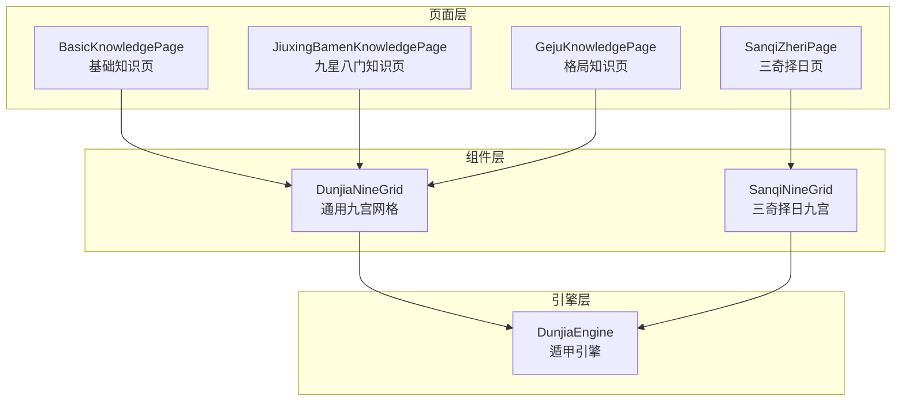
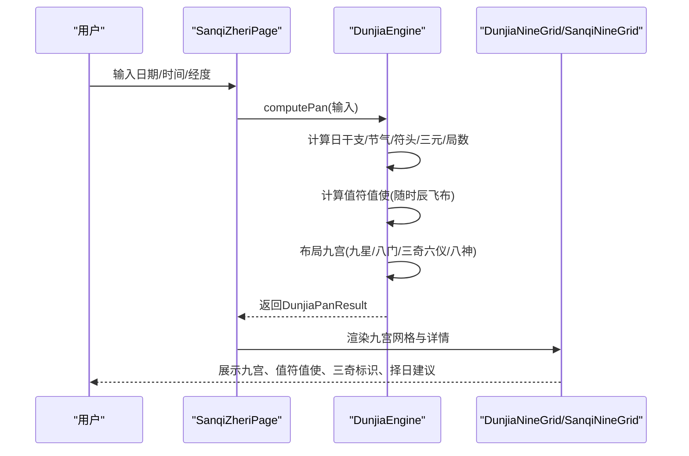
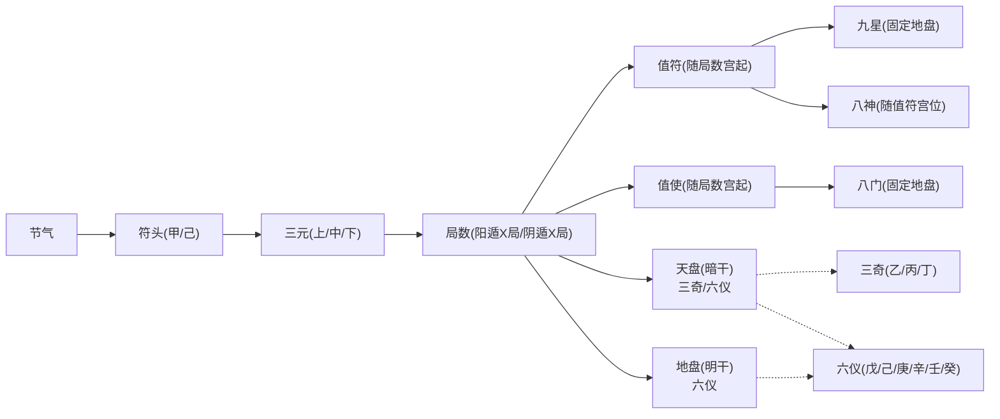
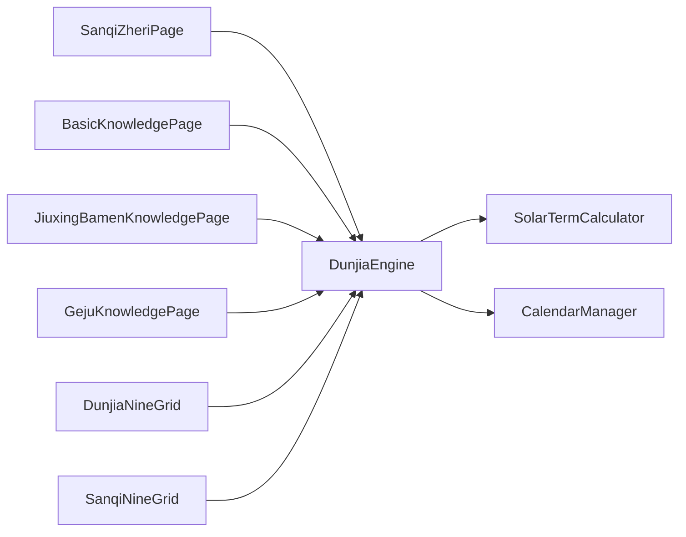

# 基本术语

<cite>
**本文引用的文件**
- [DunjiaEngine.ets](file://entry/src/main/ets/utils/DunjiaEngine.ets)
- [BasicKnowledgePage.ets](file://entry/src/main/ets/pages/BasicKnowledgePage.ets)
- [JiuxingBamenKnowledgePage.ets](file://entry/src/main/ets/pages/JiuxingBamenKnowledgePage.ets)
- [GejuKnowledgePage.ets](file://entry/src/main/ets/pages/GejuKnowledgePage.ets)
- [SanqiZheriPage.ets](file://entry/src/main/ets/pages/SanqiZheriPage.ets)
- [DunjiaNineGrid.ets](file://entry/src/main/ets/components/DunjiaNineGrid.ets)
- [SanqiNineGrid.ets](file://entry/src/main/ets/components/SanqiNineGrid.ets)
- [遁甲五阳五阴用时规则.md](file://规则/遁甲符应经原版/中卷-高级实战规则/遁甲五阳五阴用时规则.md)
</cite>

## 目录
1. [简介](#简介)
2. [项目结构](#项目结构)
3. [核心组件](#核心组件)
4. [架构总览](#架构总览)
5. [详细组件分析](#详细组件分析)
6. [依赖分析](#依赖分析)
7. [性能考虑](#性能考虑)
8. [故障排查指南](#故障排查指南)
9. [结论](#结论)
10. [附录](#附录)

## 简介
本篇“基本术语”面向遁甲应用使用者，系统梳理遁甲时空盘中的核心概念与术语，包括：阴阳遁、局数、九宫、值符值使、九星、八门、三奇六仪、八神等，并结合应用代码中的实现与《遁甲符应经》原文，解释各要素在盘面中的含义、定位规则与相互关系。文档既服务于初学者建立清晰的概念框架，也为进阶用户提供严谨的理论依据与实践指引。

## 项目结构
应用采用 ArkTS 页面与组件分层组织，核心排盘逻辑集中在引擎模块，页面负责展示与交互，组件负责九宫可视化与细节面板。

图表来源
- [BasicKnowledgePage.ets](file://entry/src/main/ets/pages/BasicKnowledgePage.ets#L41-L794)
- [JiuxingBamenKnowledgePage.ets](file://entry/src/main/ets/pages/JiuxingBamenKnowledgePage.ets#L53-L661)
- [GejuKnowledgePage.ets](file://entry/src/main/ets/pages/GejuKnowledgePage.ets#L71-L846)
- [SanqiZheriPage.ets](file://entry/src/main/ets/pages/SanqiZheriPage.ets#L76-L815)
- [DunjiaNineGrid.ets](file://entry/src/main/ets/components/DunjiaNineGrid.ets#L23-L179)
- [SanqiNineGrid.ets](file://entry/src/main/ets/components/SanqiNineGrid.ets#L16-L169)
- [DunjiaEngine.ets](file://entry/src/main/ets/utils/DunjiaEngine.ets#L98-L162)

章节来源
- [BasicKnowledgePage.ets](file://entry/src/main/ets/pages/BasicKnowledgePage.ets#L41-L794)
- [JiuxingBamenKnowledgePage.ets](file://entry/src/main/ets/pages/JiuxingBamenKnowledgePage.ets#L53-L661)
- [GejuKnowledgePage.ets](file://entry/src/main/ets/pages/GejuKnowledgePage.ets#L71-L846)
- [SanqiZheriPage.ets](file://entry/src/main/ets/pages/SanqiZheriPage.ets#L76-L815)
- [DunjiaNineGrid.ets](file://entry/src/main/ets/components/DunjiaNineGrid.ets#L23-L179)
- [SanqiNineGrid.ets](file://entry/src/main/ets/components/SanqiNineGrid.ets#L16-L169)
- [DunjiaEngine.ets](file://entry/src/main/ets/utils/DunjiaEngine.ets#L98-L162)

## 核心组件
- 遁甲引擎（DunjiaEngine）
  - 负责从输入时间与地点计算出完整的遁甲盘面，包括阴阳遁、局数、值符值使、九宫布置（九星、八门、三奇六仪、八神）以及格局识别与结构化摘要。
- 页面组件
  - 基础知识页：系统讲解九星、八门、三奇、阴阳遁、排盘流程与神煞理论。
  - 九星八门知识页：以卡片形式呈现九星与八门的属性、吉凶、宜忌与门迫。
  - 格局知识页：分类展示大吉、强凶、战术、其他等格局，给出判定条件与效应来源。
  - 三奇择日页：聚焦三奇应验与时辰用时（五阳五阴），提供择日建议与宫位详情。
- 可视化组件
  - 通用九宫网格：展示九宫、时间、局数、值符值使与格局徽章。
  - 三奇择日九宫：突出三奇标识，弱化八神，强调应验方位。

章节来源
- [DunjiaEngine.ets](file://entry/src/main/ets/utils/DunjiaEngine.ets#L98-L162)
- [BasicKnowledgePage.ets](file://entry/src/main/ets/pages/BasicKnowledgePage.ets#L41-L794)
- [JiuxingBamenKnowledgePage.ets](file://entry/src/main/ets/pages/JiuxingBamenKnowledgePage.ets#L53-L661)
- [GejuKnowledgePage.ets](file://entry/src/main/ets/pages/GejuKnowledgePage.ets#L71-L846)
- [SanqiZheriPage.ets](file://entry/src/main/ets/pages/SanqiZheriPage.ets#L76-L815)
- [DunjiaNineGrid.ets](file://entry/src/main/ets/components/DunjiaNineGrid.ets#L23-L179)
- [SanqiNineGrid.ets](file://entry/src/main/ets/components/SanqiNineGrid.ets#L16-L169)

## 架构总览
下图展示从输入到盘面输出的关键流程，以及术语在盘面中的定位关系。

图表来源
- [SanqiZheriPage.ets](file://entry/src/main/ets/pages/SanqiZheriPage.ets#L117-L134)
- [DunjiaEngine.ets](file://entry/src/main/ets/utils/DunjiaEngine.ets#L113-L162)
- [DunjiaNineGrid.ets](file://entry/src/main/ets/components/DunjiaNineGrid.ets#L72-L177)
- [SanqiNineGrid.ets](file://entry/src/main/ets/components/SanqiNineGrid.ets#L136-L167)

章节来源
- [SanqiZheriPage.ets](file://entry/src/main/ets/pages/SanqiZheriPage.ets#L96-L134)
- [DunjiaEngine.ets](file://entry/src/main/ets/utils/DunjiaEngine.ets#L113-L162)
- [DunjiaNineGrid.ets](file://entry/src/main/ets/components/DunjiaNineGrid.ets#L72-L177)
- [SanqiNineGrid.ets](file://entry/src/main/ets/components/SanqiNineGrid.ets#L136-L167)

## 详细组件分析

### 术语定义与相互关系
- 阴阳遁与局数
  - 阴阳遁依据节气判断：冬至后为阳遁，夏至后为阴遁；阳遁主进、阴遁主退。
  - 局数由节气与“符头”（甲/己日）确定，再按地支“仲孟季”划分上中下三元，每元五天（60时辰）。
  - 值符值使随时辰移动，阳遁从一宫（休门）顺飞，阴遁从九宫（景门）逆飞。
- 九宫
  - 九宫方位与宫名固定，宫位索引0-8对应一宫至九宫；中宫（索引4）特殊，常有天禽星驻留。
- 九星
  - 九星固定对应九宫（地盘），不随局数飞布；值符在九星盘上移动，代表“直符”。
- 八门
  - 八门固定对应九宫（地盘），不随局数飞布；值使在八门盘上移动，代表“直使”。
- 三奇六仪
  - 三奇：乙（日奇）、丙（月奇）、丁（星奇）；六仪：戊、己、庚、辛、壬、癸。
  - 天盘（暗干）按阴阳遁与局数顺逆飞布三奇与六仪；地盘（明干）按固定规则布列。
- 八神
  - 值符、九天、九地、太阴、六合、白虎、玄武、腾蛇；随值符宫位按阴阳遁规则定位。
- 值符值使
  - 值符随“时干”偏移，按局数宫起，阳遁顺飞、阴遁逆飞，跳过中宫。
  - 值使随“时支”移动，阳遁从一宫（休门）顺飞，阴遁从九宫（景门）逆飞，跳过中宫。

章节来源
- [DunjiaEngine.ets](file://entry/src/main/ets/utils/DunjiaEngine.ets#L7-L84)
- [DunjiaEngine.ets](file://entry/src/main/ets/utils/DunjiaEngine.ets#L252-L323)
- [DunjiaEngine.ets](file://entry/src/main/ets/utils/DunjiaEngine.ets#L391-L462)
- [DunjiaEngine.ets](file://entry/src/main/ets/utils/DunjiaEngine.ets#L464-L601)
- [DunjiaEngine.ets](file://entry/src/main/ets/utils/DunjiaEngine.ets#L200-L246)

### 术语在盘面中的含义与作用机制
- 九星
  - 代表天时变化与吉凶主轴，配合八门与三奇六仪共同判断某宫的总体能量属性。
- 八门
  - 代表人事流转枢纽，三吉门（休、生、开）主推进，三凶门（死、惊、伤）主阻滞，中平门（杜、景）居中。
- 三奇六仪
  - 三奇为贵人与机密之气，遇吉门吉星为大吉；六仪为替身，与三奇配合决定宫位的“仪态”。
- 八神
  - 指导军事与趋避：九天（陈兵）、九地（伏藏）、太阴（逃亡）、六合（密谋）等方位与时机。
- 值符值使
  - 值符带九星飞布，值使带八门飞布，二者共同决定“直符宫”与“直使宫”的动态位置，影响全局吉凶。

章节来源
- [BasicKnowledgePage.ets](file://entry/src/main/ets/pages/BasicKnowledgePage.ets#L48-L166)
- [BasicKnowledgePage.ets](file://entry/src/main/ets/pages/BasicKnowledgePage.ets#L168-L277)
- [BasicKnowledgePage.ets](file://entry/src/main/ets/pages/BasicKnowledgePage.ets#L279-L333)
- [BasicKnowledgePage.ets](file://entry/src/main/ets/pages/BasicKnowledgePage.ets#L335-L382)
- [BasicKnowledgePage.ets](file://entry/src/main/ets/pages/BasicKnowledgePage.ets#L385-L484)
- [BasicKnowledgePage.ets](file://entry/src/main/ets/pages/BasicKnowledgePage.ets#L487-L622)

### 术语之间的逻辑关系图

图表来源
- [DunjiaEngine.ets](file://entry/src/main/ets/utils/DunjiaEngine.ets#L252-L323)
- [DunjiaEngine.ets](file://entry/src/main/ets/utils/DunjiaEngine.ets#L391-L462)
- [DunjiaEngine.ets](file://entry/src/main/ets/utils/DunjiaEngine.ets#L464-L601)
- [DunjiaEngine.ets](file://entry/src/main/ets/utils/DunjiaEngine.ets#L200-L246)

章节来源
- [DunjiaEngine.ets](file://entry/src/main/ets/utils/DunjiaEngine.ets#L252-L323)
- [DunjiaEngine.ets](file://entry/src/main/ets/utils/DunjiaEngine.ets#L391-L462)
- [DunjiaEngine.ets](file://entry/src/main/ets/utils/DunjiaEngine.ets#L464-L601)
- [DunjiaEngine.ets](file://entry/src/main/ets/utils/DunjiaEngine.ets#L200-L246)

### 与《遁甲符应经》的对应关系
- 阴阳遁与局数
  - 依据节气与符头确定三元与局数，体现“超神接气”与“拆补局”的完整性。
- 值符值使飞布
  - 值符随时干偏移，值使随时支移动，体现“直符直使”动态飞转。
- 三奇六仪与八神
  - 天盘三奇与地盘六仪的布列规则，以及八神随值符宫位的定位规则，均来自经书原文。
- 五阳五阴用时
  - 时干分五阳（甲乙丙丁戊）与五阴（己庚辛壬癸），分别对应“为客/为主”的用时策略。

章节来源
- [DunjiaEngine.ets](file://entry/src/main/ets/utils/DunjiaEngine.ets#L252-L323)
- [DunjiaEngine.ets](file://entry/src/main/ets/utils/DunjiaEngine.ets#L200-L246)
- [DunjiaEngine.ets](file://entry/src/main/ets/utils/DunjiaEngine.ets#L464-L601)
- [遁甲五阳五阴用时规则.md](file://规则/遁甲符应经原版/中卷-高级实战规则/遁甲五阳五阴用时规则.md#L1-L89)

### 术语在页面与组件中的呈现
- 通用九宫网格
  - 展示宫名、九星、八门、天干地干、值符值使角标与格局徽章，帮助用户直观理解术语在盘面中的位置与作用。
- 三奇择日九宫
  - 突出三奇标识（日奇/月奇/星奇），弱化八神，强调三奇应验方位与择日建议。
- 知识页
  - 以图文与要点形式解释九星、八门、三奇、阴阳遁、排盘流程与神煞理论，便于学习与查阅。

章节来源
- [DunjiaNineGrid.ets](file://entry/src/main/ets/components/DunjiaNineGrid.ets#L72-L177)
- [SanqiNineGrid.ets](file://entry/src/main/ets/components/SanqiNineGrid.ets#L136-L167)
- [BasicKnowledgePage.ets](file://entry/src/main/ets/pages/BasicKnowledgePage.ets#L41-L794)

## 依赖分析
- 页面到引擎
  - SanqiZheriPage 通过 DunjiaEngine 计算盘面；其他页面通过 DunjiaEngine 获取九宫状态与规则命中。
- 组件到引擎
  - 九宫网格组件接收 DunjiaPanResult，渲染宫位信息与交互事件。
- 引擎到工具
  - 引擎内部依赖日历与节气工具（SolarTermCalculator、CalendarManager）获取干支与节气信息。

图表来源
- [SanqiZheriPage.ets](file://entry/src/main/ets/pages/SanqiZheriPage.ets#L1-L10)
- [DunjiaEngine.ets](file://entry/src/main/ets/utils/DunjiaEngine.ets#L4-L5)
- [DunjiaNineGrid.ets](file://entry/src/main/ets/components/DunjiaNineGrid.ets#L1-L3)
- [SanqiNineGrid.ets](file://entry/src/main/ets/components/SanqiNineGrid.ets#L1-L3)

章节来源
- [SanqiZheriPage.ets](file://entry/src/main/ets/pages/SanqiZheriPage.ets#L1-L10)
- [DunjiaEngine.ets](file://entry/src/main/ets/utils/DunjiaEngine.ets#L4-L5)
- [DunjiaNineGrid.ets](file://entry/src/main/ets/components/DunjiaNineGrid.ets#L1-L3)
- [SanqiNineGrid.ets](file://entry/src/main/ets/components/SanqiNineGrid.ets#L1-L3)

## 性能考虑
- 计算复杂度
  - 盘面计算主要为常数级数组映射与循环（九宫、天干地支、节气查找），整体为 O(1)。
- 数据结构
  - 九宫状态以数组存储，索引访问为 O(1)，查询效率高。
- 建议
  - 对于频繁切换日期/时间的场景，可缓存节气与符头计算结果，减少重复 IO 与计算。

## 故障排查指南
- 无法获取干支信息
  - 现象：盘面为空或仅显示宫位。
  - 处理：检查日历工具初始化与网络状态；确认输入日期有效。
- 值符值使位置异常
  - 现象：值符/值使不在预期宫位。
  - 处理：核对节气、符头、三元与局数计算；确认时干/时支偏移与飞布规则。
- 三奇六仪错位
  - 现象：三奇与六仪位置不符合阴阳遁与局数。
  - 处理：检查天盘/地盘布列逻辑；确认跳过中宫规则与起始宫位。
- 五不过时误判
  - 现象：择日建议与强凶提示不符。
  - 处理：核对时干与日干的相克关系；确认 JSON 规则映射。

章节来源
- [DunjiaEngine.ets](file://entry/src/main/ets/utils/DunjiaEngine.ets#L610-L639)
- [SanqiZheriPage.ets](file://entry/src/main/ets/pages/SanqiZheriPage.ets#L406-L427)

## 结论
本篇“基本术语”将遁甲时空盘的核心要素与应用实现相结合，既给出术语定义与相互关系，又通过页面与组件的可视化呈现帮助用户建立直观认知。结合《遁甲符应经》原文，确保理论来源权威，为初学者与进阶用户提供一致、准确的学习路径与实践依据。

## 附录
- 术语速查
  - 阴阳遁：依据节气与符头确定，阳遁顺飞，阴遁逆飞。
  - 局数：由节气与三元（上/中/下）决定，每元五天。
  - 值符值使：随“时干/时支”动态飞布，跳过中宫。
  - 九宫：固定方位与宫名，中宫特殊。
  - 九星：固定对应九宫，值符在九星盘上移动。
  - 八门：固定对应九宫，值使在八门盘上移动。
  - 三奇六仪：天盘三奇与地盘六仪，配合判断宫位能量。
  - 八神：随值符宫位定位，指导军事与趋避。