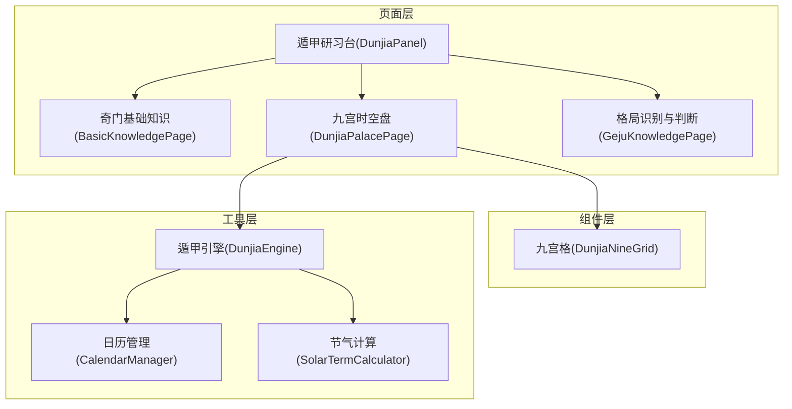
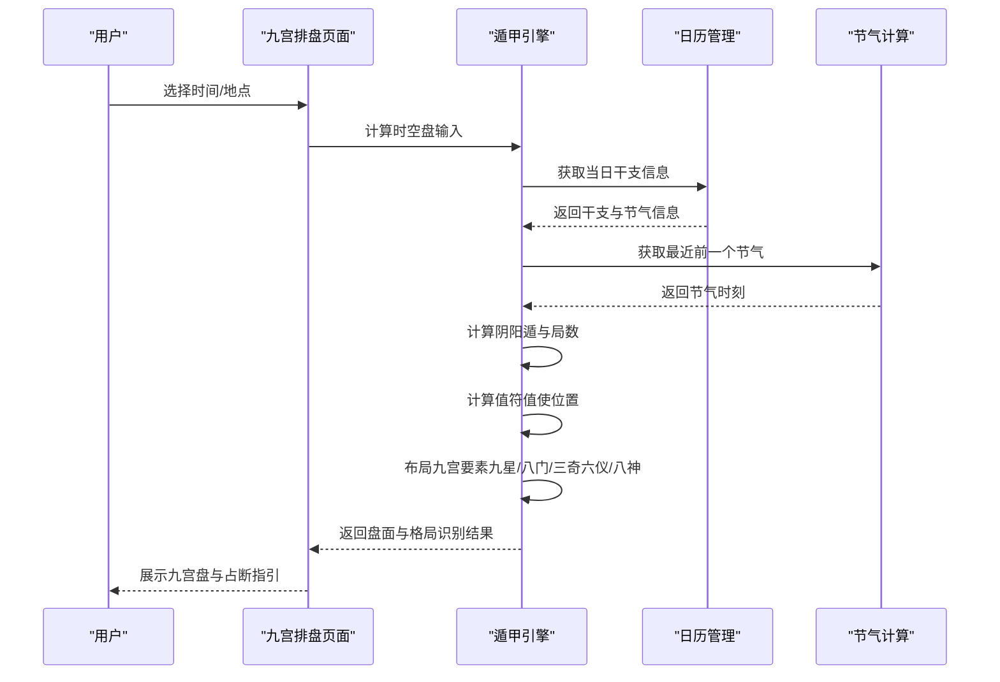
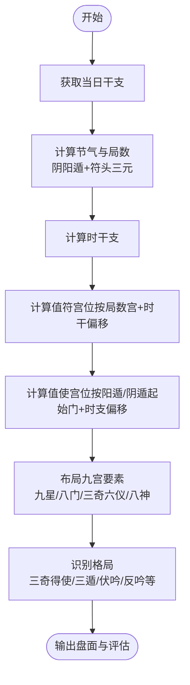
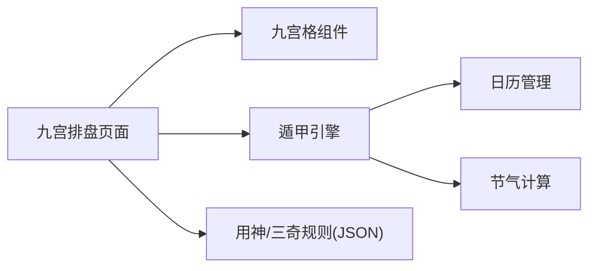

# 核心概念

<cite>
**本文引用的文件**
- [DunjiaEngine.ets](file://entry/src/main/ets/utils/DunjiaEngine.ets)
- [DunjiaPanel.ets](file://entry/src/main/ets/pages/DunjiaPanel.ets)
- [DunjiaNineGrid.ets](file://entry/src/main/ets/components/DunjiaNineGrid.ets)
- [BasicKnowledgePage.ets](file://entry/src/main/ets/pages/BasicKnowledgePage.ets)
- [GejuKnowledgePage.ets](file://entry/src/main/ets/pages/GejuKnowledgePage.ets)
- [DunjiaPalacePage.ets](file://entry/src/main/ets/pages/DunjiaPalacePage.ets)
- [CalendarManager.ets](file://entry/src/main/ets/utils/CalendarManager.ets)
- [SolarTermCalculator.ets](file://entry/src/main/ets/utils/SolarTermCalculator.ets)
- [上卷.md](file://规则/遁甲符应经原版/上卷.md)
</cite>

## 目录
1. [引言](#引言)
2. [项目结构](#项目结构)
3. [核心组件](#核心组件)
4. [架构总览](#架构总览)
5. [详细组件分析](#详细组件分析)
6. [依赖分析](#依赖分析)
7. [性能考虑](#性能考虑)
8. [故障排查指南](#故障排查指南)
9. [结论](#结论)
10. [附录](#附录)

## 引言
本文件面向“遁甲应用项目”的核心概念与技术实现，系统阐述奇门遁甲的时空盘基本原理与排盘规则，结合项目代码与《遁甲符应经》的理论依据，帮助初学者建立清晰的认知框架，同时为进阶用户提供严谨的技术细节与实现路径。内容涵盖：
- 奇门遁甲的起源与历史脉络
- 阴阳遁、局数、九宫、九星、八门、三奇、六仪、八神等核心概念及其相互关系
- 值符、值使的动态运转机制
- 项目基于《遁甲符应经》的规则实现与界面呈现
- 从基础研习到实战应用的学习路径与模块导航

## 项目结构
项目采用模块化组织，围绕“遁甲时空盘”引擎为核心，提供基础研习、排盘展示、格局识别、实战应用等功能模块。核心目录与职责概览如下：
- 页面层：提供研习导航、基础知识、九宫排盘、格局知识、实战应用等页面
- 组件层：通用九宫网格、宫位详情等可复用组件
- 工具层：日历与节气计算、引擎计算等工具模块
- 规则层：来自《遁甲符应经》与项目内部规则的JSON数据

图表来源
- [DunjiaPanel.ets](file://entry/src/main/ets/pages/DunjiaPanel.ets#L50-L125)
- [DunjiaPalacePage.ets](file://entry/src/main/ets/pages/DunjiaPalacePage.ets#L84-L115)
- [DunjiaNineGrid.ets](file://entry/src/main/ets/components/DunjiaNineGrid.ets#L23-L70)
- [DunjiaEngine.ets](file://entry/src/main/ets/utils/DunjiaEngine.ets#L98-L162)
- [CalendarManager.ets](file://entry/src/main/ets/utils/CalendarManager.ets#L30-L92)
- [SolarTermCalculator.ets](file://entry/src/main/ets/utils/SolarTermCalculator.ets#L30-L86)

章节来源
- [DunjiaPanel.ets](file://entry/src/main/ets/pages/DunjiaPanel.ets#L19-L125)
- [DunjiaPalacePage.ets](file://entry/src/main/ets/pages/DunjiaPalacePage.ets#L84-L115)
- [DunjiaNineGrid.ets](file://entry/src/main/ets/components/DunjiaNineGrid.ets#L23-L70)
- [DunjiaEngine.ets](file://entry/src/main/ets/utils/DunjiaEngine.ets#L98-L162)
- [CalendarManager.ets](file://entry/src/main/ets/utils/CalendarManager.ets#L30-L92)
- [SolarTermCalculator.ets](file://entry/src/main/ets/utils/SolarTermCalculator.ets#L30-L86)

## 核心组件
- 遁甲引擎（DunjiaEngine）
  - 职责：从输入时间、地点与场景，计算阴阳遁、局数、值符值使、九宫要素（九星、八门、三奇六仪、八神），并生成结构化结果与格局识别
  - 关键能力：节气定位、符头三元、局数计算、值符值使动态飞布、九宫要素布局、格局识别
- 九宫格组件（DunjiaNineGrid）
  - 职责：渲染九宫格、时间与局数信息、宫位详情与格局提示
- 九宫排盘页面（DunjiaPalacePage）
  - 职责：页面状态管理、调用引擎计算、加载用神与三奇应验规则、提供占断指引
- 奇门基础知识页面（BasicKnowledgePage）
  - 职责：系统讲解九星、八门、三奇、阴阳遁、排盘流程、神煞理论等
- 格局知识页面（GejuKnowledgePage）
  - 职责：分类展示大吉、强凶、战术等格局，支持来源与条件说明
- 日历与节气工具（CalendarManager、SolarTermCalculator）
  - 职责：提供干支历、节气精确时刻，支撑符头三元与局数计算

章节来源
- [DunjiaEngine.ets](file://entry/src/main/ets/utils/DunjiaEngine.ets#L98-L162)
- [DunjiaNineGrid.ets](file://entry/src/main/ets/components/DunjiaNineGrid.ets#L23-L70)
- [DunjiaPalacePage.ets](file://entry/src/main/ets/pages/DunjiaPalacePage.ets#L84-L115)
- [BasicKnowledgePage.ets](file://entry/src/main/ets/pages/BasicKnowledgePage.ets#L41-L794)
- [GejuKnowledgePage.ets](file://entry/src/main/ets/pages/GejuKnowledgePage.ets#L71-L293)
- [CalendarManager.ets](file://entry/src/main/ets/utils/CalendarManager.ets#L30-L92)
- [SolarTermCalculator.ets](file://entry/src/main/ets/utils/SolarTermCalculator.ets#L30-L86)

## 架构总览
遁甲引擎作为核心，串联时间与地理输入，结合《遁甲符应经》规则，完成从节气、符头、三元、局数到九宫要素与格局识别的完整流程。

图表来源
- [DunjiaPalacePage.ets](file://entry/src/main/ets/pages/DunjiaPalacePage.ets#L218-L236)
- [DunjiaEngine.ets](file://entry/src/main/ets/utils/DunjiaEngine.ets#L113-L162)
- [CalendarManager.ets](file://entry/src/main/ets/utils/CalendarManager.ets#L51-L92)
- [SolarTermCalculator.ets](file://entry/src/main/ets/utils/SolarTermCalculator.ets#L143-L159)

## 详细组件分析

### 遁甲引擎（DunjiaEngine）——核心算法与规则实现
- 输入与输出
  - 输入：公历时间、地理经度、研习场景类型
  - 输出：阴阳遁类型、局数标签、值符值使宫位、九宫状态、规则命中、整体结构评估、干支与真太阳时信息、识别的格局
- 关键流程
  - 获取干支信息：依赖日历管理器
  - 计算局数：基于节气与符头三元（上/中/下元）
  - 计算值符值使：随时辰动态飞布，阳遁顺飞、阴遁逆飞，跳过中宫
  - 布局九宫要素：九星固定、八门固定、三奇六仪按阴阳遁与局数飞布、八神随值符宫位定位
  - 格局识别：三奇得使、三遁、三奇合、伏吟、反吟、青龙返首等
- 技术要点
  - 值符：随“时干”偏移，从局数宫起，按阴阳遁顺逆飞
  - 值使：随“时支”确定，从阳遁休门或阴遁景门起，按阴阳遁顺逆飞
  - 三奇六仪：阳遁顺布六仪逆布三奇，阴遁逆布六仪顺布三奇
  - 八神：九天、九地、太阴、六合依值符宫位按阴阳遁规则定位

图表来源
- [DunjiaEngine.ets](file://entry/src/main/ets/utils/DunjiaEngine.ets#L113-L162)
- [DunjiaEngine.ets](file://entry/src/main/ets/utils/DunjiaEngine.ets#L256-L281)
- [DunjiaEngine.ets](file://entry/src/main/ets/utils/DunjiaEngine.ets#L358-L389)
- [DunjiaEngine.ets](file://entry/src/main/ets/utils/DunjiaEngine.ets#L678-L800)

章节来源
- [DunjiaEngine.ets](file://entry/src/main/ets/utils/DunjiaEngine.ets#L98-L162)
- [DunjiaEngine.ets](file://entry/src/main/ets/utils/DunjiaEngine.ets#L256-L353)
- [DunjiaEngine.ets](file://entry/src/main/ets/utils/DunjiaEngine.ets#L358-L462)
- [DunjiaEngine.ets](file://entry/src/main/ets/utils/DunjiaEngine.ets#L470-L601)
- [DunjiaEngine.ets](file://entry/src/main/ets/utils/DunjiaEngine.ets#L678-L800)

### 九宫格组件（DunjiaNineGrid）——盘面可视化与交互
- 功能要点
  - 展示时间信息（阳历、农历、真太阳时）、局数、摘要
  - 九宫格按传统方位布局（上南下北），支持宫位点击与选中态
  - 基于盘面结果渲染宫位卡片，突出值符/值使与格局提示
- 设计说明
  - 采用三行三列布局，对应巽、离、坤；震、中、兑；艮、坎、乾
  - 通过属性传递与回调处理宫位点击事件

章节来源
- [DunjiaNineGrid.ets](file://entry/src/main/ets/components/DunjiaNineGrid.ets#L23-L70)
- [DunjiaNineGrid.ets](file://entry/src/main/ets/components/DunjiaNineGrid.ets#L72-L179)

### 九宫排盘页面（DunjiaPalacePage）——研习与占断指引
- 功能要点
  - 页面状态管理：当前时间、选中宫位、加载状态、用神与三奇应验规则
  - 调用引擎计算：构造输入并异步获取盘面结果
  - 用神指引：按事类（寻人、求财、出行等）给出主用神、次用神、判断逻辑与方位提示
  - 三奇象意：根据当前盘面三奇位置，筛选对应事类的应验征兆与时间窗口
- 实现要点
  - 用神映射与三奇规则来自JSON资源，运行时解析并缓存
  - 通过宫位名称与规则中的方位映射，筛选匹配的象意

章节来源
- [DunjiaPalacePage.ets](file://entry/src/main/ets/pages/DunjiaPalacePage.ets#L84-L115)
- [DunjiaPalacePage.ets](file://entry/src/main/ets/pages/DunjiaPalacePage.ets#L120-L181)
- [DunjiaPalacePage.ets](file://entry/src/main/ets/pages/DunjiaPalacePage.ets#L357-L423)
- [DunjiaPalacePage.ets](file://entry/src/main/ets/pages/DunjiaPalacePage.ets#L507-L772)

### 奇门基础知识页面（BasicKnowledgePage）——入门研习
- 内容结构
  - 九星、八门、三奇、阴阳遁、排盘流程、神煞理论等章节
  - 每节包含要点总结与迷你九宫示意图，便于理解与记忆
- 教学目标
  - 建立对九星、八门、三奇、阴阳遁、符头三元、直符直使等核心概念的系统认知
  - 通过示意图与要点，降低初学者理解门槛

章节来源
- [BasicKnowledgePage.ets](file://entry/src/main/ets/pages/BasicKnowledgePage.ets#L41-L794)

### 格局知识页面（GejuKnowledgePage）——高级分析
- 内容结构
  - 大吉格局（三奇得使、三遁、青龙返首等）
  - 强凶格局（六仪击刑、天网四张、五不过时、三奇入墓等）
  - 对敌战术（太白入荧惑、荧惑入太白、五不可击等）
  - 其他格局（伏吟、反吟等）
- 实现要点
  - 从JSON规则文件加载并动态合并
  - 支持详情弹窗展示判定条件与效应来源

章节来源
- [GejuKnowledgePage.ets](file://entry/src/main/ets/pages/GejuKnowledgePage.ets#L71-L293)
- [GejuKnowledgePage.ets](file://entry/src/main/ets/pages/GejuKnowledgePage.ets#L299-L471)

### 日历与节气工具（CalendarManager、SolarTermCalculator）——时间与历法基础
- 日历管理（CalendarManager）
  - 提供指定日期的干支历信息（年/月/日上下文、生肖、节日、节气等）
  - 按年份缓存万年历JSON，提升访问性能
- 节气计算（SolarTermCalculator）
  - 计算24节气精确时刻（北京时间），支持跨年节气查找
  - 提供最近前一个节气，用于局数与符头三元判定

章节来源
- [CalendarManager.ets](file://entry/src/main/ets/utils/CalendarManager.ets#L30-L92)
- [SolarTermCalculator.ets](file://entry/src/main/ets/utils/SolarTermCalculator.ets#L30-L86)
- [SolarTermCalculator.ets](file://entry/src/main/ets/utils/SolarTermCalculator.ets#L143-L159)

## 依赖分析
- 页面与组件
  - 九宫排盘页面依赖遁甲引擎与九宫格组件
  - 九宫格组件依赖盘面结果与宫位详情组件
- 引擎与工具
  - 引擎依赖日历管理器与节气计算器
  - 日历管理器依赖资源管理器与节气计算器
- 规则与数据
  - 页面与引擎通过JSON规则文件加载用神映射与三奇应验规则

图表来源
- [DunjiaPalacePage.ets](file://entry/src/main/ets/pages/DunjiaPalacePage.ets#L84-L115)
- [DunjiaNineGrid.ets](file://entry/src/main/ets/components/DunjiaNineGrid.ets#L23-L70)
- [DunjiaEngine.ets](file://entry/src/main/ets/utils/DunjiaEngine.ets#L98-L162)
- [CalendarManager.ets](file://entry/src/main/ets/utils/CalendarManager.ets#L30-L92)
- [SolarTermCalculator.ets](file://entry/src/main/ets/utils/SolarTermCalculator.ets#L30-L86)

章节来源
- [DunjiaPalacePage.ets](file://entry/src/main/ets/pages/DunjiaPalacePage.ets#L84-L115)
- [DunjiaNineGrid.ets](file://entry/src/main/ets/components/DunjiaNineGrid.ets#L23-L70)
- [DunjiaEngine.ets](file://entry/src/main/ets/utils/DunjiaEngine.ets#L98-L162)
- [CalendarManager.ets](file://entry/src/main/ets/utils/CalendarManager.ets#L30-L92)
- [SolarTermCalculator.ets](file://entry/src/main/ets/utils/SolarTermCalculator.ets#L30-L86)

## 性能考虑
- 数据缓存
  - 节气计算与日历数据按年缓存，减少重复IO与计算
- 异步计算
  - 盘面计算采用异步，避免阻塞UI线程
- 组件渲染
  - 九宫格采用按需渲染与选中态切换，降低重绘成本
- 规则加载
  - JSON规则按需加载并缓存，避免重复解析

## 故障排查指南
- 无法获取干支信息
  - 检查日历管理器初始化与资源路径
  - 确认目标年份的万年历JSON是否存在
- 节气时刻异常
  - 核对当前日期是否跨年，确认节气计算的跨年查找逻辑
- 盘面为空或默认盘
  - 检查干支信息返回是否为空，必要时回退到默认盘
- 格局识别缺失
  - 确认JSON规则文件加载成功，检查规则ID与盘面要素匹配逻辑

章节来源
- [CalendarManager.ets](file://entry/src/main/ets/utils/CalendarManager.ets#L51-L92)
- [SolarTermCalculator.ets](file://entry/src/main/ets/utils/SolarTermCalculator.ets#L143-L159)
- [DunjiaEngine.ets](file://entry/src/main/ets/utils/DunjiaEngine.ets#L613-L639)
- [GejuKnowledgePage.ets](file://entry/src/main/ets/pages/GejuKnowledgePage.ets#L299-L369)

## 结论
本项目以《遁甲符应经》为理论基石，构建了从时间/地点输入到九宫时空盘输出的完整流程，覆盖基础研习、排盘展示、格局识别与实战应用。通过模块化设计与规则驱动，既满足初学者的入门需求，也为进阶用户提供严谨的排盘与分析工具。建议在实践中持续完善规则库与示意图，增强用户体验与教学效果。

## 附录

### 术语与概念速览
- 阴阳遁：以二十四节气为界，冬至后为阳遁，夏至后为阴遁；阳遁主进、阴遁主退
- 局数：由节气与符头三元共同决定的九宫飞布序列（阳一至阳九、阴一至阴九）
- 九宫：九个方位宫位，对应九星、八门、三奇六仪、八神的落宫
- 九星：天蓬、天芮、天冲、天辅、天禽、天心、天柱、天任、天英
- 八门：休、生、伤、杜、景、死、惊、开（中宫无门）
- 三奇：日奇（乙）、月奇（丙）、星奇（丁）
- 六仪：戊、己、庚、辛、壬、癸
- 八神：值符、九天、九地、太阴、六合、白虎、玄武、腾蛇
- 值符值使：随时辰动态飞布的“星”与“门”，分别代表直符与直使

章节来源
- [BasicKnowledgePage.ets](file://entry/src/main/ets/pages/BasicKnowledgePage.ets#L41-L794)
- [DunjiaEngine.ets](file://entry/src/main/ets/utils/DunjiaEngine.ets#L397-L462)
- [上卷.md](file://规则/遁甲符应经原版/上卷.md#L14-L62)