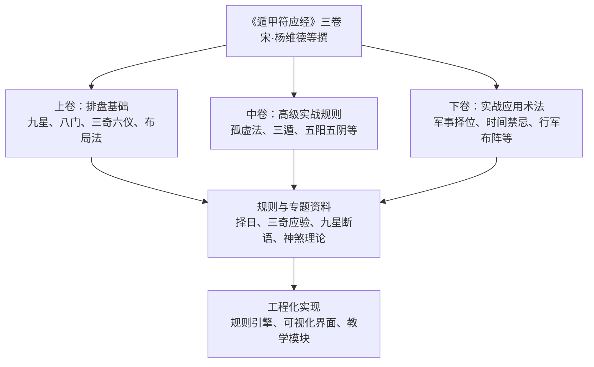
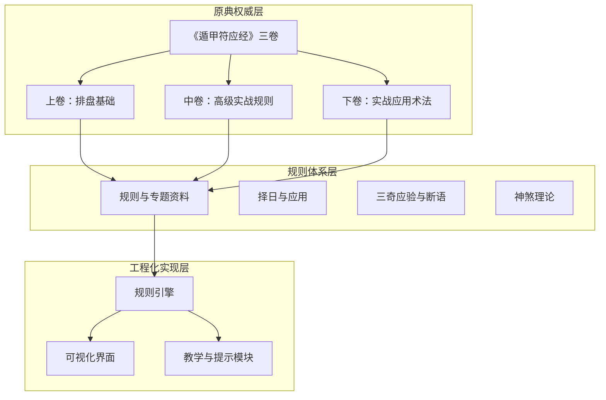
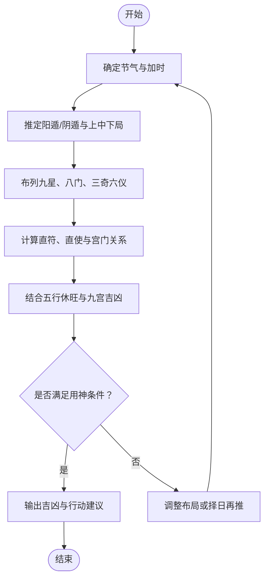
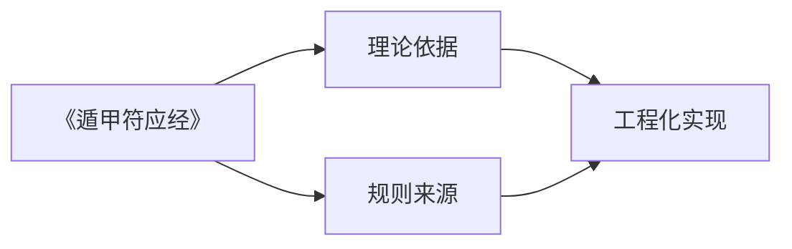
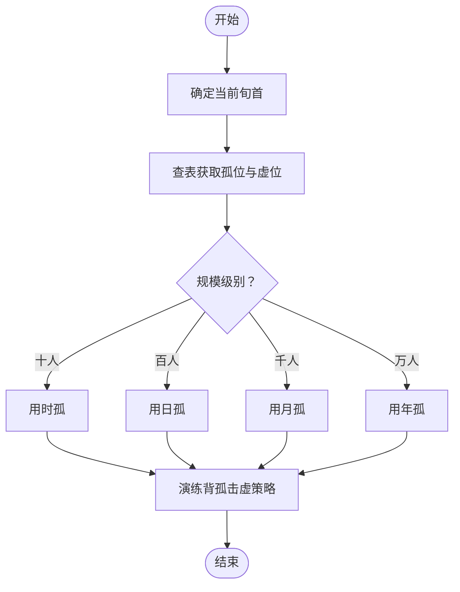

# 理论基础

<cite>
**本文引用的文件**
- [《遁甲符应经》三卷，宋·杨维德等撰。杨维德字里生平不详，《宋史方技传》称其能传浑仪法。《遁甲符应经》三卷不见于《束史·艺文志》，载于郑樵《通志》、钱遵王《述古堂书目》，并作三卷。马端临《文献通考》著录为二卷。此书以遁甲论行军趋避之用、百事凶吉，《四库来收书提要》称其书“立术精密，考较详明．宜五行之家所不废”。有《宛委别藏》本。](file://规则/遁甲符应经-宋-杨维德.md)
- [景祐遁甲符应经卷之上 上](file://规则/遁甲符应经原版/上卷.md)
- [《遁甲符应经·中卷》孤虚法规则](file://规则/遁甲符应经原版/中卷-高级实战规则/孤虚法规则.md)
</cite>

## 目录
1. [引言](#引言)
2. [项目结构](#项目结构)
3. [核心组件](#核心组件)
4. [架构总览](#架构总览)
5. [详细组件分析](#详细组件分析)
6. [依赖关系分析](#依赖关系分析)
7. [性能考量](#性能考量)
8. [故障排查指南](#故障排查指南)
9. [结论](#结论)
10. [附录](#附录)

## 引言
本文件面向“遁甲应用项目”的理论基础建设，系统梳理遁甲的起源、发展脉络与核心思想，明确《遁甲符应经》作为项目理论依据的权威性与价值，并阐述遁甲在中国古代术数体系中的地位。同时，结合项目现有资料，给出面向初学者的入门路径与面向专家的深度背景，帮助开发者与使用者建立一致、严谨的理论认知框架。

## 项目结构
项目围绕“遁甲”主题构建，包含以下关键层次：
- 原典与权威依据：《遁甲符应经》三卷（宋·杨维德等撰），以及其原版上卷、中卷、下卷的整理文本与注疏。
- 规则与实战：高级实战规则（如孤虚法）、择日与应用、三奇应验、九星断语、神煞理论等专题资料。
- 应用场景：军事、择日、风水、养生等传统应用领域的规则与案例。
- 工程化实现：基于上述理论，形成可复用的规则引擎与可视化界面，支撑排盘、推演、提示与教学。

**图表来源**
- [《遁甲符应经》三卷，宋·杨维德等撰。杨维德字里生平不详，《宋史方技传》称其能传浑仪法。《遁甲符应经》三卷不见于《束史·艺文志》，载于郑樵《通志》、钱遵王《述古堂书目》，并作三卷。马端临《文献通考》著录为二卷。此书以遁甲论行军趋避之用、百事凶吉，《四库来收书提要》称其书“立术精密，考较详明．宜五行之家所不废”。有《宛委别藏》本。](file://规则/遁甲符应经-宋-杨维德.md#L1-L645)
- [景祐遁甲符应经卷之上 上](file://规则/遁甲符应经原版/上卷.md#L1-L463)
- [《遁甲符应经·中卷》孤虚法规则](file://规则/遁甲符应经原版/中卷-高级实战规则/孤虚法规则.md#L1-L69)

**章节来源**
- [《遁甲符应经》三卷，宋·杨维德等撰。杨维德字里生平不详，《宋史方技传》称其能传浑仪法。《遁甲符应经》三卷不见于《束史·艺文志》，载于郑樵《通志》、钱遵王《述古堂书目》，并作三卷。马端临《文献通考》著录为二卷。此书以遁甲论行军趋避之用、百事凶吉，《四库来收书提要》称其书“立术精密，考较详明．宜五行之家所不废”。有《宛委别藏》本。](file://规则/遁甲符应经-宋-杨维德.md#L1-L645)
- [景祐遁甲符应经卷之上 上](file://规则/遁甲符应经原版/上卷.md#L1-L463)
- [《遁甲符应经·中卷》孤虚法规则](file://规则/遁甲符应经原版/中卷-高级实战规则/孤虚法规则.md#L1-L69)

## 核心组件
- 原典权威：《遁甲符应经》三卷，系统阐述遁甲的造式法、九星八门、三奇六仪、布局与变局、择日与吉凶、三遁与五阳五阴等核心内容，是项目理论根基。
- 规则体系：上卷奠定排盘基础，中卷提供高级实战规则（如孤虚法），下卷聚焦实战应用（军事、择位、时间禁忌等）。
- 工程化组件：将规则转化为可执行的引擎模块（如排盘、择日、吉凶判断、提示与教学），并与可视化界面集成。

**章节来源**
- [《遁甲符应经》三卷，宋·杨维德等撰。杨维德字里生平不详，《宋史方技传》称其能传浑仪法。《遁甲符应经》三卷不见于《束史·艺文志》，载于郑樵《通志》、钱遵王《述古堂书目》，并作三卷。马端临《文献通考》著录为二卷。此书以遁甲论行军趋避之用、百事凶吉，《四库来收书提要》称其书“立术精密，考较详明．宜五行之家所不废”。有《宛委别藏》本。](file://规则/遁甲符应经-宋-杨维德.md#L1-L645)
- [景祐遁甲符应经卷之上 上](file://规则/遁甲符应经原版/上卷.md#L1-L463)
- [《遁甲符应经·中卷》孤虚法规则](file://规则/遁甲符应经原版/中卷-高级实战规则/孤虚法规则.md#L1-L69)

## 架构总览
项目采用“原典权威 + 规则体系 + 工程化实现”的三层架构：
- 原典权威层：以《遁甲符应经》为核心，确保理论来源的正统性与权威性。
- 规则体系层：将原典内容结构化为可执行规则（排盘、择日、实战规则、应用领域），并形成专题资料库。
- 工程化实现层：通过规则引擎与可视化界面，提供排盘、推演、提示与教学功能，服务于不同用户层级。

**图表来源**
- [《遁甲符应经》三卷，宋·杨维德等撰。杨维德字里生平不详，《宋史方技传》称其能传浑仪法。《遁甲符应经》三卷不见于《束史·艺文志》，载于郑樵《通志》、钱遵王《述古堂书目》，并作三卷。马端临《文献通考》著录为二卷。此书以遁甲论行军趋避之用、百事凶吉，《四库来收书提要》称其书“立术精密，考较详明．宜五行之家所不废”。有《宛委别藏》本。](file://规则/遁甲符应经-宋-杨维德.md#L1-L645)
- [景祐遁甲符应经卷之上 上](file://规则/遁甲符应经原版/上卷.md#L1-L463)
- [《遁甲符应经·中卷》孤虚法规则](file://规则/遁甲符应经原版/中卷-高级实战规则/孤虚法规则.md#L1-L69)

## 详细组件分析

### 组件A：遁甲理论核心（天人合一、阴阳五行、时空转换）
- 天人合一：遁甲以“三才”（天、地、人）为法象，上层布九星、中层开八门、下层列六仪，体现“天人感应”的整体思维。
- 阴阳五行：通过“阳遁/阴遁”“上中下三局”“九宫吉凶”“九星休旺”等概念，将五行生克与时空流转结合，指导吉凶判断。
- 时空转换：以“节气”“加时”“超神接气”“拆局补局”等机制，动态调整布局与用神，实现“时移势易”的推演。

**图表来源**
- [景祐遁甲符应经卷之上 上](file://规则/遁甲符应经原版/上卷.md#L1-L463)
- [《遁甲符应经》三卷，宋·杨维德等撰。杨维德字里生平不详，《宋史方技传》称其能传浑仪法。《遁甲符应经》三卷不见于《束史·艺文志》，载于郑樵《通志》、钱遵王《述古堂书目》，并作三卷。马端临《文献通考》著录为二卷。此书以遁甲论行军趋避之用、百事凶吉，《四库来收书提要》称其书“立术精密，考较详明．宜五行之家所不废”。有《宛委别藏》本。](file://规则/遁甲符应经-宋-杨维德.md#L1-L645)

**章节来源**
- [景祐遁甲符应经卷之上 上](file://规则/遁甲符应经原版/上卷.md#L1-L463)
- [《遁甲符应经》三卷，宋·杨维德等撰。杨维德字里生平不详，《宋史方技传》称其能传浑仪法。《遁甲符应经》三卷不见于《束史·艺文志》，载于郑樵《通志》、钱遵王《述古堂书目》，并作三卷。马端临《文献通考》著录为二卷。此书以遁甲论行军趋避之用、百事凶吉，《四库来收书提要》称其书“立术精密，考较详明．宜五行之家所不废”。有《宛委别藏》本。](file://规则/遁甲符应经-宋-杨维德.md#L1-L645)

### 组件B：《遁甲符应经》权威性与价值
- 权威性：作为宋代官方组织编纂的典籍，系统总结了遁甲在行军、趋避、百事吉凶方面的应用，具有极高的学术与实践价值。
- 价值：为项目提供统一的理论依据与规则来源，确保排盘、推演与提示的准确性与一致性。

**图表来源**
- [《遁甲符应经》三卷，宋·杨维德等撰。杨维德字里生平不详，《宋史方技传》称其能传浑仪法。《遁甲符应经》三卷不见于《束史·艺文志》，载于郑樵《通志》、钱遵王《述古堂书目》，并作三卷。马端临《文献通考》著录为二卷。此书以遁甲论行军趋避之用、百事凶吉，《四库来收书提要》称其书“立术精密，考较详明．宜五行之家所不废”。有《宛委别藏》本。](file://规则/遁甲符应经-宋-杨维德.md#L1-L645)

**章节来源**
- [《遁甲符应经》三卷，宋·杨维德等撰。杨维德字里生平不详，《宋史方技传》称其能传浑仪法。《遁甲符应经》三卷不见于《束史·艺文志》，载于郑樵《通志》、钱遵王《述古堂书目》，并作三卷。马端临《文献通考》著录为二卷。此书以遁甲论行军趋避之用、百事凶吉，《四库来收书提要》称其书“立术精密，考较详明．宜五行之家所不废”。有《宛委别藏》本。](file://规则/遁甲符应经-宋-杨维德.md#L1-L645)

### 组件C：高级实战规则（孤虚法）
- 规则定位：出自《遁甲符应经·中卷》“孤虚法”，强调“背孤击虚”的攻守推演，适用于不同规模的兵力配置。
- 工程化建议：将六旬“孤/虚”映射表结构化，便于在高级研习模块中呈现与查询；不作为初级自动提示，避免误导。

**图表来源**
- [《遁甲符应经·中卷》孤虚法规则](file://规则/遁甲符应经原版/中卷-高级实战规则/孤虚法规则.md#L1-L69)

**章节来源**
- [《遁甲符应经·中卷》孤虚法规则](file://规则/遁甲符应经原版/中卷-高级实战规则/孤虚法规则.md#L1-L69)

### 组件D：应用领域概览（军事、择日、风水、养生）
- 军事：行军布阵、择位、时间禁忌、奇门遁甲在战场上的应用（如三遁、五阳五阴、孤虚法等）。
- 择日：以“宝日/义日/制日/和日/伐日”等择日原则，指导出兵、兴造、婚嫁等百事。
- 风水：结合九宫、八门、三奇六仪，进行方位与环境的吉凶判断。
- 养生：依据节气与九星休旺，配合作息与调养，达到顺时养生的目的。

**章节来源**
- [《遁甲符应经》三卷，宋·杨维德等撰。杨维德字里生平不详，《宋史方技传》称其能传浑仪法。《遁甲符应经》三卷不见于《束史·艺文志》，载于郑樵《通志》、钱遵王《述古堂书目》，并作三卷。马端临《文献通考》著录为二卷。此书以遁甲论行军趋避之用、百事凶吉，《四库来收书提要》称其书“立术精密，考较详明．宜五行之家所不废”。有《宛委别藏》本。](file://规则/遁甲符应经-宋-杨维德.md#L1-L645)
- [景祐遁甲符应经卷之上 上](file://规则/遁甲符应经原版/上卷.md#L1-L463)

## 依赖关系分析
- 原典权威对规则体系具有决定性影响，规则体系对工程化实现提供约束与输入。
- 工程化实现需要将规则进行结构化与模块化，确保可维护性与扩展性。
- 不同应用领域（军事、择日、风水、养生）共享同一套核心规则，但在具体使用上有所侧重。

**图表来源**
- [《遁甲符应经》三卷，宋·杨维德等撰。杨维德字里生平不详，《宋史方技传》称其能传浑仪法。《遁甲符应经》三卷不见于《束史·艺文志》，载于郑樵《通志》、钱遵王《述古堂书目》，并作三卷。马端临《文献通考》著录为二卷。此书以遁甲论行军趋避之用、百事凶吉，《四库来收书提要》称其书“立术精密，考较详明．宜五行之家所不废”。有《宛委别藏》本。](file://规则/遁甲符应经-宋-杨维德.md#L1-L645)
- [景祐遁甲符应经卷之上 上](file://规则/遁甲符应经原版/上卷.md#L1-L463)

**章节来源**
- [《遁甲符应经》三卷，宋·杨维德等撰。杨维德字里生平不详，《宋史方技传》称其能传浑仪法。《遁甲符应经》三卷不见于《束史·艺文志》，载于郑樵《通志》、钱遵王《述古堂书目》，并作三卷。马端临《文献通考》著录为二卷。此书以遁甲论行军趋避之用、百事凶吉，《四库来收书提要》称其书“立术精密，考较详明．宜五行之家所不废”。有《宛委别藏》本。](file://规则/遁甲符应经-宋-杨维德.md#L1-L645)
- [景祐遁甲符应经卷之上 上](file://规则/遁甲符应经原版/上卷.md#L1-L463)

## 性能考量
- 规则计算复杂度：排盘与择日涉及节气、加时、布局与变局的多次迭代，需优化算法以降低时间复杂度。
- 数据结构设计：将九宫、八门、九星、三奇六仪等映射为高效的数据结构，减少查询与更新成本。
- 用户体验：在工程化实现中，优先保证核心流程的响应速度，同时提供缓存与预计算能力，提升交互流畅度。

## 故障排查指南
- 原典理解偏差：若出现规则应用错误，应回溯至《遁甲符应经》原文，核对节气、加时与布局法。
- 规则冲突：当多个规则同时生效时，应明确优先级（如择日优先于排盘），并在提示中清晰标注。
- 工程化实现问题：检查数据结构映射与边界条件处理，确保异常输入不会导致崩溃。

**章节来源**
- [《遁甲符应经》三卷，宋·杨维德等撰。杨维德字里生平不详，《宋史方技传》称其能传浑仪法。《遁甲符应经》三卷不见于《束史·艺文志》，载于郑樵《通志》、钱遵王《述古堂书目》，并作三卷。马端临《文献通考》著录为二卷。此书以遁甲论行军趋避之用、百事凶吉，《四库来收书提要》称其书“立术精密，考较详明．宜五行之家所不废”。有《宛委别藏》本。](file://规则/遁甲符应经-宋-杨维德.md#L1-L645)
- [景祐遁甲符应经卷之上 上](file://规则/遁甲符应经原版/上卷.md#L1-L463)

## 结论
本文件明确了遁甲理论的三大基石（天人合一、阴阳五行、时空转换），确立了《遁甲符应经》作为项目权威依据的地位，并梳理了规则体系与工程化实现的关系。通过结构化的规则与模块化实现，项目可在保持学术严谨的同时，为不同层次用户提供一致、可靠的理论基础与实践指导。

## 附录
- 初学者入门建议：从《遁甲符应经·上卷》入手，掌握九星、八门、三奇六仪与布局法；结合“择日”“三奇应验”等专题资料，逐步深入。
- 专家级参考：研读《遁甲符应经·中卷》“孤虚法”等高级规则，结合工程化实现进行推演与验证。