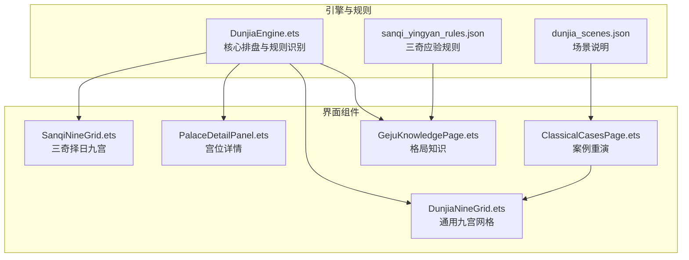
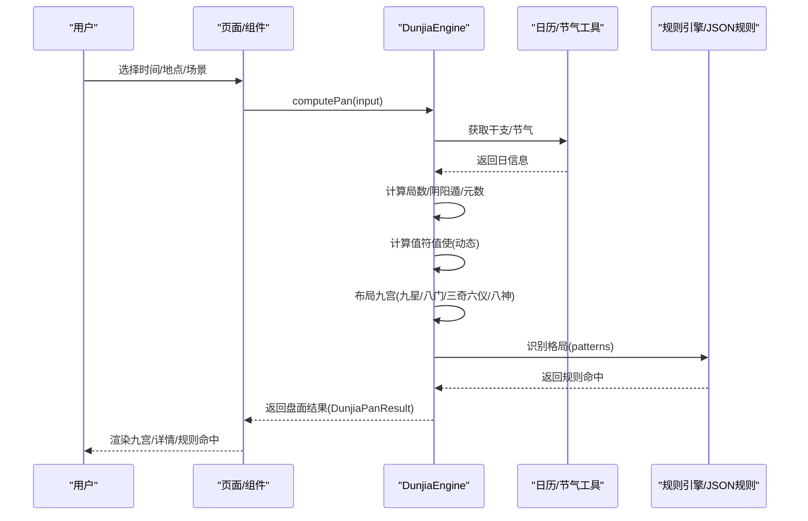
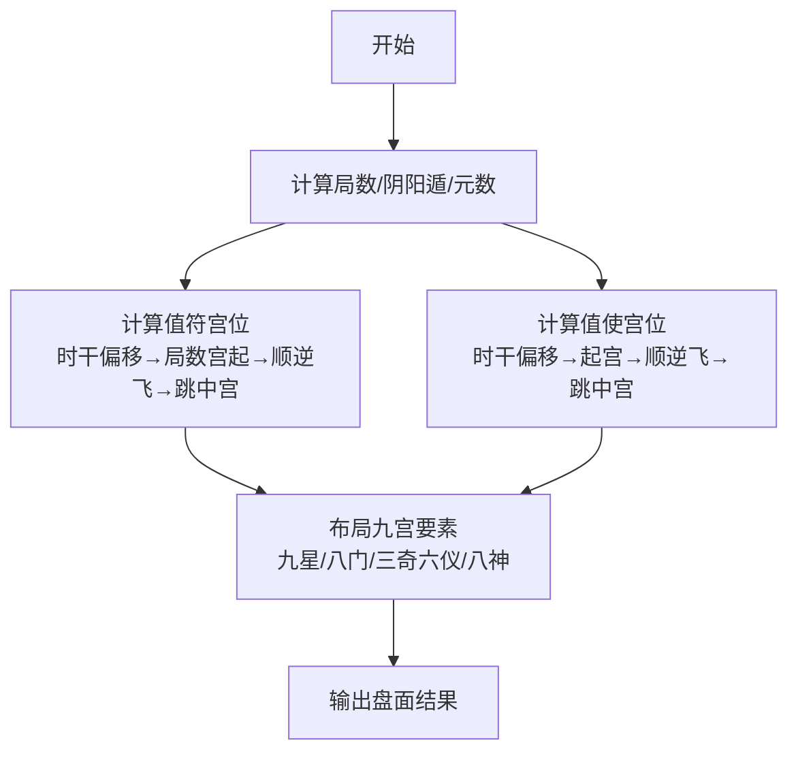
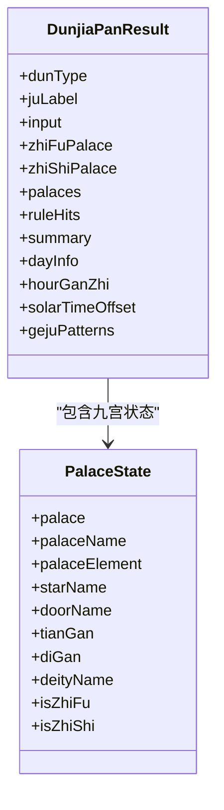
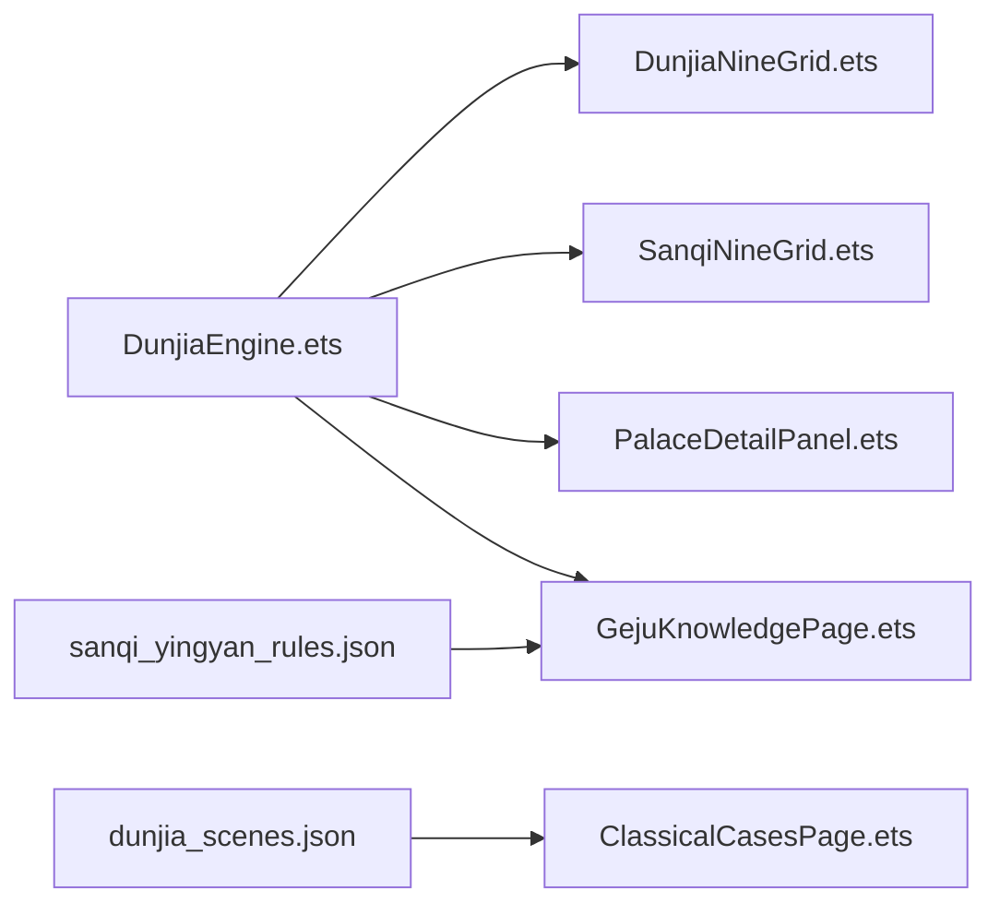

# 盘面构成

<cite>
**本文引用的文件**
- [DunjiaEngine.ets](file://entry/src/main/ets/utils/DunjiaEngine.ets)
- [DunjiaNineGrid.ets](file://entry/src/main/ets/components/DunjiaNineGrid.ets)
- [SanqiNineGrid.ets](file://entry/src/main/ets/components/SanqiNineGrid.ets)
- [PalaceDetailPanel.ets](file://entry/src/main/ets/components/PalaceDetailPanel.ets)
- [ClassicalCasesPage.ets](file://entry/src/main/ets/pages/ClassicalCasesPage.ets)
- [GejuKnowledgePage.ets](file://entry/src/main/ets/pages/GejuKnowledgePage.ets)
- [sanqi_yingyan_rules.json](file://entry/src/main/resources/rawfile/rules/sanqi_yingyan_rules.json)
- [dunjia_scenes.json](file://entry/src/main/resources/rawfile/dunjia_scenes.json)
</cite>

## 目录
1. [简介](#简介)
2. [项目结构](#项目结构)
3. [核心组件](#核心组件)
4. [架构总览](#架构总览)
5. [详细组件分析](#详细组件分析)
6. [依赖关系分析](#依赖关系分析)
7. [性能考量](#性能考量)
8. [故障排查指南](#故障排查指南)
9. [结论](#结论)
10. [附录](#附录)

## 简介
本文件面向遁甲应用项目，系统阐述“遁甲时空盘”的盘面构成与排盘逻辑，重点覆盖：
- 九宫结构与方位布局
- 九星、八门、三奇六仪、八神的固定与动态分布
- 值符、值使的动态定位与计算方法
- 天盘与地盘的区别与作用
- 盘面解读的原则与方法论
- 结合具体排盘实例展示要素组合

## 项目结构
项目采用 ArkTS + 组件化架构，核心逻辑集中在“引擎”模块，界面通过组件渲染盘面与信息卡片。关键目录与文件如下：
- 引擎与规则
  - 引擎：entry/src/main/ets/utils/DunjiaEngine.ets
  - 规则：entry/src/main/resources/rawfile/rules/*.json
- 盘面组件
  - 通用九宫：entry/src/main/ets/components/DunjiaNineGrid.ets
  - 三奇择日九宫：entry/src/main/ets/components/SanqiNineGrid.ets
  - 宫位详情：entry/src/main/ets/components/PalaceDetailPanel.ets
- 示例与知识
  - 古籍案例重演：entry/src/main/ets/pages/ClassicalCasesPage.ets
  - 格局知识：entry/src/main/ets/pages/GejuKnowledgePage.ets
  - 场景说明：entry/src/main/resources/rawfile/dunjia_scenes.json

图表来源
- [DunjiaEngine.ets](file://entry/src/main/ets/utils/DunjiaEngine.ets#L1-L160)
- [DunjiaNineGrid.ets](file://entry/src/main/ets/components/DunjiaNineGrid.ets#L1-L179)
- [SanqiNineGrid.ets](file://entry/src/main/ets/components/SanqiNineGrid.ets#L1-L169)
- [PalaceDetailPanel.ets](file://entry/src/main/ets/components/PalaceDetailPanel.ets#L1-L481)
- [ClassicalCasesPage.ets](file://entry/src/main/ets/pages/ClassicalCasesPage.ets#L1-L625)
- [GejuKnowledgePage.ets](file://entry/src/main/ets/pages/GejuKnowledgePage.ets#L64-L504)
- [sanqi_yingyan_rules.json](file://entry/src/main/resources/rawfile/rules/sanqi_yingyan_rules.json#L1-L525)
- [dunjia_scenes.json](file://entry/src/main/resources/rawfile/dunjia_scenes.json#L1-L50)

章节来源
- [DunjiaEngine.ets](file://entry/src/main/ets/utils/DunjiaEngine.ets#L1-L160)
- [DunjiaNineGrid.ets](file://entry/src/main/ets/components/DunjiaNineGrid.ets#L1-L179)
- [SanqiNineGrid.ets](file://entry/src/main/ets/components/SanqiNineGrid.ets#L1-L169)
- [PalaceDetailPanel.ets](file://entry/src/main/ets/components/PalaceDetailPanel.ets#L1-L481)
- [ClassicalCasesPage.ets](file://entry/src/main/ets/pages/ClassicalCasesPage.ets#L1-L625)
- [GejuKnowledgePage.ets](file://entry/src/main/ets/pages/GejuKnowledgePage.ets#L64-L504)
- [sanqi_yingyan_rules.json](file://entry/src/main/resources/rawfile/rules/sanqi_yingyan_rules.json#L1-L525)
- [dunjia_scenes.json](file://entry/src/main/resources/rawfile/dunjia_scenes.json#L1-L50)

## 核心组件
- 引擎 DunjiaEngine
  - 输入：时间（含真太阳时校正）、地理经度、研习场景
  - 输出：盘面结果（九宫状态、值符值使、规则命中、格局识别、摘要）
  - 关键能力：局数计算、值符值使动态定位、九星八门固定布局、三奇六仪天盘地盘、八神定位、格局识别
- 通用九宫 DunjiaNineGrid
  - 渲染九宫网格，展示时间、局数、宫位信息与值符值使
- 三奇择日九宫 SanqiNineGrid
  - 侧重三奇标识，突出应验方位与值符值使
- 宫位详情 PalaceDetailPanel
  - 九星断语、八门吉凶、五行生克、值符值使说明、相关格局
- 古籍案例重演 ClassicalCasesPage
  - 按原文重现经典案例，辅助对照研读
- 格局知识 GejuKnowledgePage
  - 分类展示大吉/凶/特殊凶象等格局知识

章节来源
- [DunjiaEngine.ets](file://entry/src/main/ets/utils/DunjiaEngine.ets#L98-L162)
- [DunjiaNineGrid.ets](file://entry/src/main/ets/components/DunjiaNineGrid.ets#L23-L179)
- [SanqiNineGrid.ets](file://entry/src/main/ets/components/SanqiNineGrid.ets#L16-L169)
- [PalaceDetailPanel.ets](file://entry/src/main/ets/components/PalaceDetailPanel.ets#L32-L481)
- [ClassicalCasesPage.ets](file://entry/src/main/ets/pages/ClassicalCasesPage.ets#L48-L625)
- [GejuKnowledgePage.ets](file://entry/src/main/ets/pages/GejuKnowledgePage.ets#L64-L504)

## 架构总览
下图展示从输入到盘面输出的端到端流程，以及关键组件之间的交互关系。

图表来源
- [DunjiaEngine.ets](file://entry/src/main/ets/utils/DunjiaEngine.ets#L113-L162)
- [sanqi_yingyan_rules.json](file://entry/src/main/resources/rawfile/rules/sanqi_yingyan_rules.json#L1-L525)

章节来源
- [DunjiaEngine.ets](file://entry/src/main/ets/utils/DunjiaEngine.ets#L113-L162)

## 详细组件分析

### 九宫结构与方位布局
- 九宫索引与名称
  - 0=一宫坎、1=二宫坤、2=三宫震、3=四宫巽、4=五宫中、5=六宫乾、6=七宫兑、7=八宫艮、8=九宫离
- 方位布局（传统南上北下）
  - 第一行（上南）：巽4、离9、坤2
  - 第二行（中）：震3、中5、兑7
  - 第三行（下北）：艮8、坎1、乾6
- 五行属性
  - 九宫元素分别为：水、土、木、木、土、金、金、土、火
- 九星固定布局
  - 九星固定对应九宫（地盘），不随局数飞布
  - 天蓬主一宫、天芮主二宫、天冲主三宫、天辅主四宫、天禽主五宫、天心主六宫、天柱主七宫、天任主八宫、天英主九宫
- 八门固定布局
  - 八门固定对应九宫（地盘），不随局数飞布
  - 休门在坎一、死门在坤二、伤门在震三、杜门在巽四、中宫无门、开门在乾六、惊门在兑七、生门在艮八、景门在离九

章节来源
- [DunjiaEngine.ets](file://entry/src/main/ets/utils/DunjiaEngine.ets#L18-L389)
- [DunjiaNineGrid.ets](file://entry/src/main/ets/components/DunjiaNineGrid.ets#L143-L171)
- [PalaceDetailPanel.ets](file://entry/src/main/ets/components/PalaceDetailPanel.ets#L58-L82)

### 三奇六仪与天盘地盘
- 三奇六仪
  - 三奇：乙、丙、丁
  - 六仪：戊、己、庚、辛、壬、癸
- 天盘（暗干）
  - 阳遁：顺布六仪、逆布三奇
  - 阴遁：逆布六仪、顺布三奇
  - 起始宫：局数宫（阳遁从一宫起，阴遁从九宫起）
  - 跳过中宫（索引4）
- 地盘（明干）
  - 固定布局（与九宫固定对应），跳过中宫
  - 九宫同时有乙与丙时，地盘显示为“乙”
- 三奇应验
  - 三奇到宫应验规则来自 sanqi_yingyan_rules.json，按宫位、方向、征兆、时间窗口、吉凶与事务含义进行结构化描述

章节来源
- [DunjiaEngine.ets](file://entry/src/main/ets/utils/DunjiaEngine.ets#L464-L556)
- [sanqi_yingyan_rules.json](file://entry/src/main/resources/rawfile/rules/sanqi_yingyan_rules.json#L1-L525)

### 八神定位
- 八神：值符、腾蛇、太阴、六合、白虎、玄武、九地、九天
- 定位规则
  - 阳遁：值符后一为九天，后二为九地，前二为太阴，前三为六合
  - 阴遁：值符前一为九天，前二为九地，后二为太阴，后三为六合
  - 中宫固定为天禽

章节来源
- [DunjiaEngine.ets](file://entry/src/main/ets/utils/DunjiaEngine.ets#L558-L601)

### 值符值使的动态变化与计算
- 值符（天盘甲）
  - 起点：局数宫（阳遁从一宫起，阴遁从九宫起）
  - 飞行：按阴阳遁顺逆飞，跳过中宫
  - 计算：时干相对“甲”的偏移量，按偏移步数飞布
- 值使（门）
  - 起点：阳遁从休门（一宫），阴遁从景门（九宫）
  - 飞行：按阴阳遁顺逆飞，跳过中宫
  - 计算：时干索引作为偏移量，逐宫前进

图表来源
- [DunjiaEngine.ets](file://entry/src/main/ets/utils/DunjiaEngine.ets#L206-L246)
- [DunjiaEngine.ets](file://entry/src/main/ets/utils/DunjiaEngine.ets#L429-L462)

章节来源
- [DunjiaEngine.ets](file://entry/src/main/ets/utils/DunjiaEngine.ets#L206-L246)
- [DunjiaEngine.ets](file://entry/src/main/ets/utils/DunjiaEngine.ets#L429-L462)

### 盘面解读的原则与方法论
- 九星断语
  - 每颗星的总体性质、有利与不利事项，用于指导行动方向
- 八门吉凶
  - 吉门（开门、休门、生门）、凶门（伤门、杜门、景门、死门、惊门）的性质与适用场景
- 五行生克
  - 以宫位五行为基础，判断生克关系，辅助理解宫位间的相互影响
- 值符值使
  - 值符代表天时之利，值使代表时机把握，二者所在宫位需结合门、奇仪、神将综合判断
- 格局识别
  - 三奇得使、三遁（天遁/地遁/人遁）、三奇合局、伏吟、反吟、青龙返首、飞鸟跌穴、三奇入墓、六仪击刑、太白入荧惑、荧惑入太白、天网四张等
- 三奇应验
  - 三奇到宫的时间窗口、方向、征兆与事务含义，用于择日与应验判断

章节来源
- [PalaceDetailPanel.ets](file://entry/src/main/ets/components/PalaceDetailPanel.ets#L58-L215)
- [DunjiaEngine.ets](file://entry/src/main/ets/utils/DunjiaEngine.ets#L678-L936)
- [sanqi_yingyan_rules.json](file://entry/src/main/resources/rawfile/rules/sanqi_yingyan_rules.json#L1-L525)

### 排盘实例与要素组合
- 实例一：冬至阳遁一局·天遁格
  - 关键要素：阳遁一局、丙奇临生门于艮八、值使门为生门、值符在坎一
  - 特征：天遁（丙奇+生门）、三奇得使（丙奇临值使门）
- 实例二：春分阳遁四局·青龙返首
  - 关键要素：阳遁四局、天盘甲（以戊代甲）加地盘丙于离九
  - 特征：青龙返首（六甲加六丙）
- 实例三：夏至阴遁九局·飞鸟跌穴
  - 关键要素：阴遁九局、天盘丙加地盘甲（以戊代甲）于坤二
  - 特征：飞鸟跌穴（六丙加六甲）
- 实例四：秋分阴遁三局·人遁格
  - 关键要素：阴遁三局、丁奇临杜门于巽四
  - 特征：人遁（丁奇+杜门）
- 实例五：立春阳遁七局·三奇入墓
  - 关键要素：阳遁七局、乙奇落入巽宫（辰位）
  - 特征：三奇入墓（辰为木墓）

图表来源
- [DunjiaEngine.ets](file://entry/src/main/ets/utils/DunjiaEngine.ets#L59-L84)
- [DunjiaEngine.ets](file://entry/src/main/ets/utils/DunjiaEngine.ets#L30-L41)

章节来源
- [ClassicalCasesPage.ets](file://entry/src/main/ets/pages/ClassicalCasesPage.ets#L60-L316)

## 依赖关系分析
- 组件耦合
  - DunjiaNineGrid/SanqiNineGrid 依赖 DunjiaEngine 的盘面结果
  - PalaceDetailPanel 依赖 DunjiaEngine 的盘面结果与规则命中
  - GejuKnowledgePage 依赖 sanqi_yingyan_rules.json 进行规则展示
- 数据流
  - 输入（时间/地点/场景）→ 引擎计算 → 盘面结果 → 组件渲染
- 规则与知识
  - 引擎内部识别格局，外部页面展示与解释

图表来源
- [DunjiaEngine.ets](file://entry/src/main/ets/utils/DunjiaEngine.ets#L1-L160)
- [DunjiaNineGrid.ets](file://entry/src/main/ets/components/DunjiaNineGrid.ets#L1-L27)
- [SanqiNineGrid.ets](file://entry/src/main/ets/components/SanqiNineGrid.ets#L1-L20)
- [PalaceDetailPanel.ets](file://entry/src/main/ets/components/PalaceDetailPanel.ets#L1-L35)
- [GejuKnowledgePage.ets](file://entry/src/main/ets/pages/GejuKnowledgePage.ets#L64-L504)
- [sanqi_yingyan_rules.json](file://entry/src/main/resources/rawfile/rules/sanqi_yingyan_rules.json#L1-L525)
- [dunjia_scenes.json](file://entry/src/main/resources/rawfile/dunjia_scenes.json#L1-L50)

章节来源
- [DunjiaEngine.ets](file://entry/src/main/ets/utils/DunjiaEngine.ets#L1-L160)
- [DunjiaNineGrid.ets](file://entry/src/main/ets/components/DunjiaNineGrid.ets#L1-L27)
- [SanqiNineGrid.ets](file://entry/src/main/ets/components/SanqiNineGrid.ets#L1-L20)
- [PalaceDetailPanel.ets](file://entry/src/main/ets/components/PalaceDetailPanel.ets#L1-L35)
- [GejuKnowledgePage.ets](file://entry/src/main/ets/pages/GejuKnowledgePage.ets#L64-L504)
- [sanqi_yingyan_rules.json](file://entry/src/main/resources/rawfile/rules/sanqi_yingyan_rules.json#L1-L525)
- [dunjia_scenes.json](file://entry/src/main/resources/rawfile/dunjia_scenes.json#L1-L50)

## 性能考量
- 计算复杂度
  - 盘面布局与值符值使计算为线性复杂度，受宫位数量（9）限制，性能开销极低
- 渲染优化
  - 九宫网格采用固定行列布局，避免动态尺寸计算
  - 三奇择日九宫对三奇宫位进行高亮与阴影增强，提升可读性
- 数据缓存
  - 引擎计算结果一次性生成，组件按需读取字段，减少重复计算

## 故障排查指南
- 无法获取干支信息
  - 现象：盘面为空或显示“数据加载中”
  - 处理：检查日历/节气工具是否可用，确认输入日期有效
- 值符值使异常
  - 现象：值符/值使位置与预期不符
  - 处理：核对局数、阴阳遁、元数与节气计算；检查时干偏移与起宫逻辑
- 三奇应验未触发
  - 现象：三奇到宫应验未出现在规则命中
  - 处理：确认三奇与门的组合是否满足规则；检查时间窗口与宫位匹配
- 三奇入墓/六仪击刑等强凶时段
  - 现象：出现强凶提示
  - 处理：结合盘面整体特征，避免重大决策；调整择日

章节来源
- [DunjiaEngine.ets](file://entry/src/main/ets/utils/DunjiaEngine.ets#L613-L639)
- [DunjiaEngine.ets](file://entry/src/main/ets/utils/DunjiaEngine.ets#L859-L891)

## 结论
本项目以 DunjiaEngine 为核心，将《遁甲符应经》的排盘规则结构化实现，通过组件化界面清晰呈现九宫结构、九星八门、三奇六仪、八神与值符值使的动态定位。结合三奇应验规则与格局识别，既满足研习需求，也为择日应用提供支撑。建议在实际使用中：
- 优先掌握九宫方位与固定要素（九星、八门、地盘六仪）
- 理解值符值使的动态规律与局数关系
- 结合三奇应验与时辰干支进行择日
- 通过案例重演与格局知识加深理解

## 附录
- 场景说明
  - 时空盘研习、三奇应验与择日、古籍案例重演、结构化趋势分析、分层研习路线
- 相关页面
  - 古籍案例重演页面用于对照原文与盘面
  - 格局知识页面提供分类化的格局说明与判定条件

章节来源
- [dunjia_scenes.json](file://entry/src/main/resources/rawfile/dunjia_scenes.json#L1-L50)
- [ClassicalCasesPage.ets](file://entry/src/main/ets/pages/ClassicalCasesPage.ets#L593-L625)
- [GejuKnowledgePage.ets](file://entry/src/main/ets/pages/GejuKnowledgePage.ets#L64-L504)