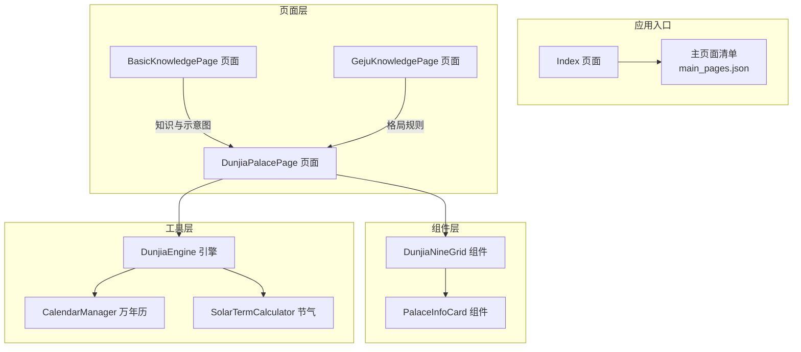
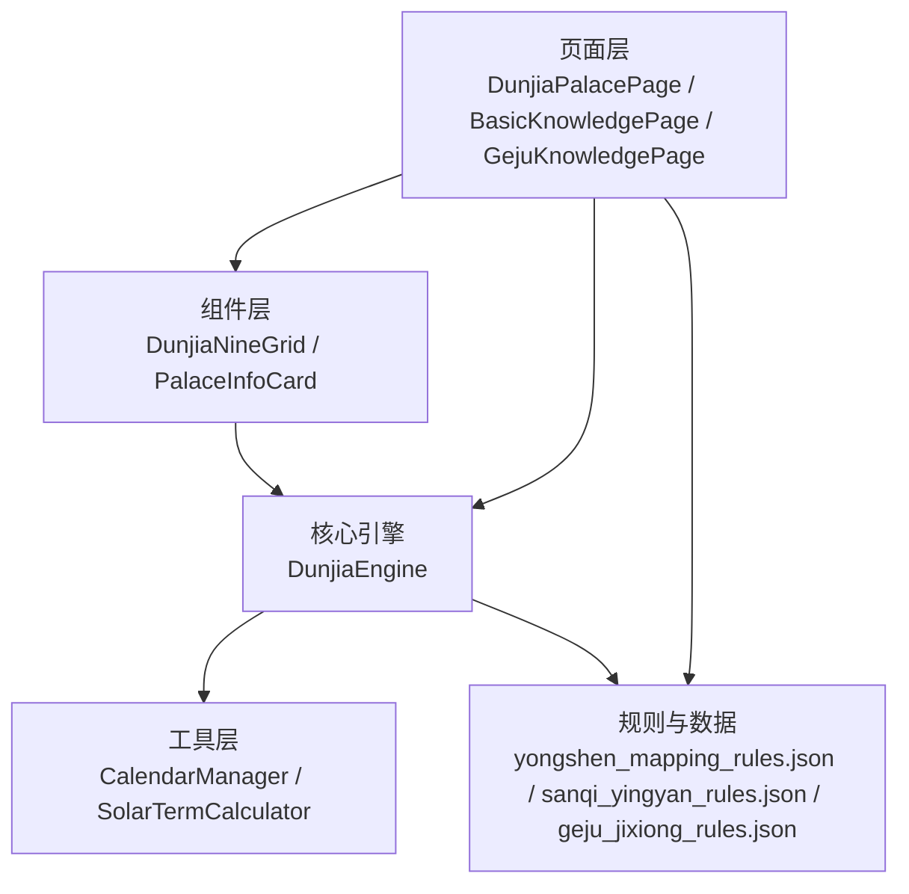
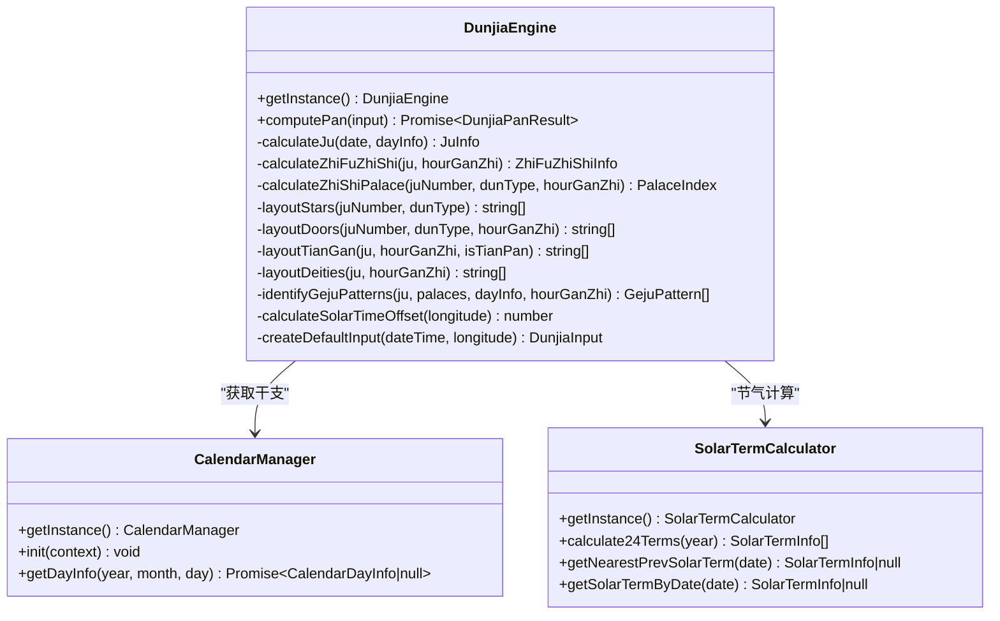
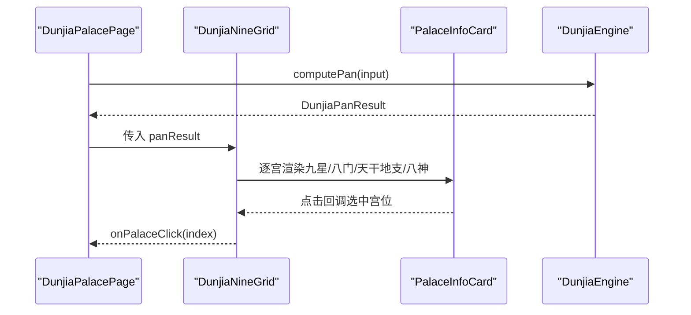
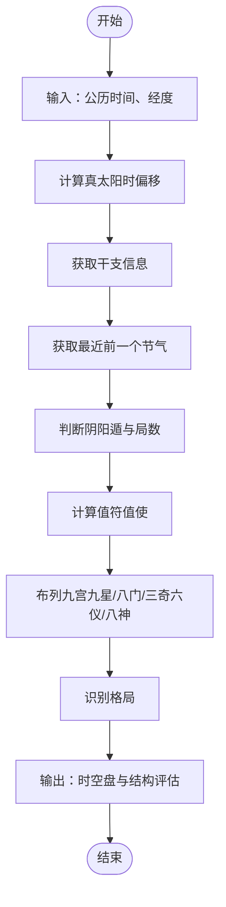
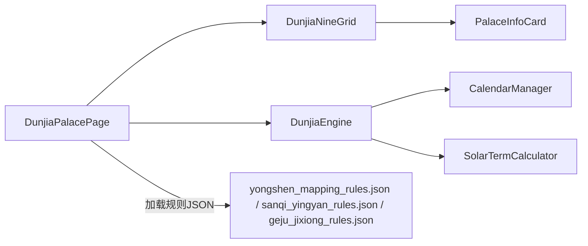

# 项目概述

<cite>
**本文档引用的文件**
- [Index.ets](file://entry/src/main/ets/pages/Index.ets)
- [DunjiaEngine.ets](file://entry/src/main/ets/utils/DunjiaEngine.ets)
- [DunjiaNineGrid.ets](file://entry/src/main/ets/components/DunjiaNineGrid.ets)
- [DunjiaPalacePage.ets](file://entry/src/main/ets/pages/DunjiaPalacePage.ets)
- [CalendarManager.ets](file://entry/src/main/ets/utils/CalendarManager.ets)
- [SolarTermCalculator.ets](file://entry/src/main/ets/utils/SolarTermCalculator.ets)
- [PalaceInfoCard.ets](file://entry/src/main/ets/components/PalaceInfoCard.ets)
- [BasicKnowledgePage.ets](file://entry/src/main/ets/pages/BasicKnowledgePage.ets)
- [GejuKnowledgePage.ets](file://entry/src/main/ets/pages/GejuKnowledgePage.ets)
- [build-profile.json5](file://build-profile.json5)
- [main_pages.json](file://entry/src/main/resources/base/profile/main_pages.json)
- [术数与真太阳时.md](file://entry/src/main/resources/rawfile/术数与真太阳时.md)
</cite>

## 目录
1. [简介](#简介)
2. [项目结构](#项目结构)
3. [核心组件](#核心组件)
4. [架构总览](#架构总览)
5. [详细组件分析](#详细组件分析)
6. [依赖关系分析](#依赖关系分析)
7. [性能考虑](#性能考虑)
8. [故障排查指南](#故障排查指南)
9. [结论](#结论)
10. [附录](#附录)

## 简介
本项目围绕《遁甲符应经》的正统排盘规则，构建一套基于ArkTS与HarmonyOS的奇门遁甲时空盘应用。项目以“真太阳时”为核心输入，结合节气、干支、九宫、三奇六仪、八门、九星、八神等要素，实现从时间/地点到时空盘面与格局识别的完整计算链路，并提供可视化九宫盘与知识库页面，帮助用户进行个人研习、策略布局与时机选择。

遁甲时空盘在奇门遁甲体系中处于“盘面”层级，是将时间、空间、星象、门路、神煞等要素整合为可读、可分析的“时空模型”。本项目严格遵循《遁甲符应经》的排盘规则，强调：
- 真太阳时校正（考虑经度差异）
- 节气与元数决定阴阳遁与局数
- 值符值使随时辰动态飞布
- 九宫内九星、八门、三奇六仪、八神的布列与识别

应用场景包括但不限于：
- 个人研习：理解九宫、三奇、八门、神煞等基本概念与排盘流程
- 战略布局：通过格局识别与用神指引，辅助决策与方位选择
- 时机选择：结合真太阳时与节气，把握吉凶时位

## 项目结构
项目采用HarmonyOS标准模块结构，入口页面通过主页面清单注册，核心逻辑集中在utils与components目录，页面负责状态管理与交互。

**图表来源**
- [Index.ets](file://entry/src/main/ets/pages/Index.ets#L1-L88)
- [DunjiaPalacePage.ets](file://entry/src/main/ets/pages/DunjiaPalacePage.ets#L1-L120)
- [DunjiaNineGrid.ets](file://entry/src/main/ets/components/DunjiaNineGrid.ets#L1-L179)
- [PalaceInfoCard.ets](file://entry/src/main/ets/components/PalaceInfoCard.ets#L1-L179)
- [DunjiaEngine.ets](file://entry/src/main/ets/utils/DunjiaEngine.ets#L1-L120)
- [CalendarManager.ets](file://entry/src/main/ets/utils/CalendarManager.ets#L1-L123)
- [SolarTermCalculator.ets](file://entry/src/main/ets/utils/SolarTermCalculator.ets#L1-L120)
- [main_pages.json](file://entry/src/main/resources/base/profile/main_pages.json#L1-L20)

**章节来源**
- [build-profile.json5](file://build-profile.json5#L1-L56)
- [main_pages.json](file://entry/src/main/resources/base/profile/main_pages.json#L1-L20)

## 核心组件
- DunjiaEngine（核心引擎）
  - 负责从输入参数计算完整的遁甲盘面与结构化分析结果，包括阴阳遁、局数、值符值使、九宫状态、规则命中与格局识别等。
  - 关键能力：节气计算、干支获取、值符值使计算、九宫布列（九星、八门、三奇六仪、八神）、真太阳时偏移计算、格局识别。
- DunjiaNineGrid（九宫格组件）
  - 展示九宫盘面、时间信息（阳历/农历/真太阳时）、局数与概览，支持宫位点击与选中态。
- PalaceInfoCard（宫位卡片组件）
  - 展示单宫的九星、八门、天干地支、八神、值符值使标识与格局徽章。
- CalendarManager（万年历）
  - 提供指定日期的干支、节气、节日等详细信息，并缓存年数据以提升性能。
- SolarTermCalculator（节气计算器）
  - 计算24节气精确时刻（±2分钟），支持跨年节气检索与最近前一个节气查询。
- DunjiaPalacePage（九宫盘页面）
  - 页面状态管理、组件组合、用神映射与三奇应验规则加载、时间调整与宫位详情展示。
- BasicKnowledgePage（基础知识页面）
  - 以图文并茂的方式讲解九星、八门、三奇、阴阳遁、排盘流程与神煞理论。
- GejuKnowledgePage（格局知识页面）
  - 分类展示大吉/强凶/战术/其他等格局，提供判定条件与效应说明。

**章节来源**
- [DunjiaEngine.ets](file://entry/src/main/ets/utils/DunjiaEngine.ets#L1-L200)
- [DunjiaNineGrid.ets](file://entry/src/main/ets/components/DunjiaNineGrid.ets#L1-L179)
- [PalaceInfoCard.ets](file://entry/src/main/ets/components/PalaceInfoCard.ets#L1-L179)
- [CalendarManager.ets](file://entry/src/main/ets/utils/CalendarManager.ets#L1-L123)
- [SolarTermCalculator.ets](file://entry/src/main/ets/utils/SolarTermCalculator.ets#L1-L120)
- [DunjiaPalacePage.ets](file://entry/src/main/ets/pages/DunjiaPalacePage.ets#L1-L120)
- [BasicKnowledgePage.ets](file://entry/src/main/ets/pages/BasicKnowledgePage.ets#L1-L120)
- [GejuKnowledgePage.ets](file://entry/src/main/ets/pages/GejuKnowledgePage.ets#L1-L120)

## 架构总览
系统采用“页面-组件-工具-引擎”的分层架构，页面负责交互与状态，组件负责渲染与复用，工具层提供日期、节气、干支等基础能力，引擎层完成核心排盘与规则识别。

**图表来源**
- [DunjiaPalacePage.ets](file://entry/src/main/ets/pages/DunjiaPalacePage.ets#L1-L120)
- [DunjiaNineGrid.ets](file://entry/src/main/ets/components/DunjiaNineGrid.ets#L1-L179)
- [PalaceInfoCard.ets](file://entry/src/main/ets/components/PalaceInfoCard.ets#L1-L179)
- [DunjiaEngine.ets](file://entry/src/main/ets/utils/DunjiaEngine.ets#L1-L120)
- [CalendarManager.ets](file://entry/src/main/ets/utils/CalendarManager.ets#L1-L123)
- [SolarTermCalculator.ets](file://entry/src/main/ets/utils/SolarTermCalculator.ets#L1-L120)

## 详细组件分析

### 核心引擎：DunjiaEngine
- 输入与输出
  - 输入：公历时间、地理经度、研习场景类型
  - 输出：阴阳遁类型、局数标签、值符值使宫位、九宫状态、规则命中、结构评估、当日干支、时辰干支、真太阳时偏移、格局识别结果
- 关键算法
  - 节气与元数：通过节气计算确定阴阳遁，结合干支地支判断上中下元
  - 值符值使：随时辰干支与局数飞布，阳遁顺飞、阴遁逆飞，跳过中宫
  - 九宫布列：九星固定、八门固定、三奇六仪按局数与遁法布列、八神随值符宫位动态定位
  - 格局识别：三奇得使、三遁、三奇合、伏吟、反吟、青龙返首、飞鸟跌穴等
- 技术要点
  - 真太阳时偏移：(经度 - 120) × 4分钟
  - 异常兜底：无法获取干支时返回空盘
  - 可扩展：规则命中与格局识别可从规则文件动态加载

**图表来源**
- [DunjiaEngine.ets](file://entry/src/main/ets/utils/DunjiaEngine.ets#L1-L200)
- [CalendarManager.ets](file://entry/src/main/ets/utils/CalendarManager.ets#L1-L123)
- [SolarTermCalculator.ets](file://entry/src/main/ets/utils/SolarTermCalculator.ets#L1-L120)

**章节来源**
- [DunjiaEngine.ets](file://entry/src/main/ets/utils/DunjiaEngine.ets#L1-L200)

### 九宫盘面：DunjiaNineGrid 与 PalaceInfoCard
- DunjiaNineGrid
  - 展示时间信息（阳历/农历/真太阳时）、局数、概览与九宫格
  - 九宫传统布局：上南下北，行序为巽-离-坤，中行震-中-兑，下行艮-坎-乾
- PalaceInfoCard
  - 展示宫位名称、地支、九星、八门、天干地支、八神
  - 值符/值使角标与选中态样式
  - 根据格局徽章颜色区分不同格局类型

**图表来源**
- [DunjiaPalacePage.ets](file://entry/src/main/ets/pages/DunjiaPalacePage.ets#L1-L120)
- [DunjiaNineGrid.ets](file://entry/src/main/ets/components/DunjiaNineGrid.ets#L1-L179)
- [PalaceInfoCard.ets](file://entry/src/main/ets/components/PalaceInfoCard.ets#L1-L179)
- [DunjiaEngine.ets](file://entry/src/main/ets/utils/DunjiaEngine.ets#L1-L200)

**章节来源**
- [DunjiaNineGrid.ets](file://entry/src/main/ets/components/DunjiaNineGrid.ets#L1-L179)
- [PalaceInfoCard.ets](file://entry/src/main/ets/components/PalaceInfoCard.ets#L1-L179)

### 真太阳时与节气
- 真太阳时
  - 依据经度计算偏移量，确保奇门遁甲等以“太阳真实位置”为核心的术数准确性
  - 项目文档明确指出“奇门遁甲必须使用真太阳时”，否则值符值使与盘面将全盘错误
- 节气计算
  - 通过节气精确时刻判断阴阳遁与局数，支持跨年检索与最近前一个节气查询

**图表来源**
- [DunjiaEngine.ets](file://entry/src/main/ets/utils/DunjiaEngine.ets#L1-L200)
- [SolarTermCalculator.ets](file://entry/src/main/ets/utils/SolarTermCalculator.ets#L1-L120)
- [术数与真太阳时.md](file://entry/src/main/resources/rawfile/术数与真太阳时.md#L1-L120)

**章节来源**
- [SolarTermCalculator.ets](file://entry/src/main/ets/utils/SolarTermCalculator.ets#L1-L120)
- [术数与真太阳时.md](file://entry/src/main/resources/rawfile/术数与真太阳时.md#L1-L120)

### 知识与规则体系
- BasicKnowledgePage
  - 以章节形式讲解九星、八门、三奇、阴阳遁、排盘流程与神煞理论，配有迷你九宫示意图
- GejuKnowledgePage
  - 分类展示大吉/强凶/战术/其他等格局，提供判定条件与效应说明，并支持从规则JSON动态加载
- DunjiaPalacePage
  - 加载用神映射规则与三奇应验规则，结合当前盘面筛选象意与提示

**章节来源**
- [BasicKnowledgePage.ets](file://entry/src/main/ets/pages/BasicKnowledgePage.ets#L1-L120)
- [GejuKnowledgePage.ets](file://entry/src/main/ets/pages/GejuKnowledgePage.ets#L1-L120)
- [DunjiaPalacePage.ets](file://entry/src/main/ets/pages/DunjiaPalacePage.ets#L1-L120)

## 依赖关系分析
- 页面依赖
  - DunjiaPalacePage 依赖 DunjiaEngine、DunjiaNineGrid、PalaceInfoCard、规则JSON
  - BasicKnowledgePage 与 GejuKnowledgePage 作为知识与规则展示页面，为排盘页面提供背景知识
- 组件依赖
  - DunjiaNineGrid 依赖 PalaceInfoCard 与 DunjiaEngine 的结果
- 工具依赖
  - DunjiaEngine 依赖 CalendarManager 与 SolarTermCalculator
- 数据依赖
  - 规则JSON（yongshen_mapping_rules.json、sanqi_yingyan_rules.json、geju_jixiong_rules.json）由页面异步加载

**图表来源**
- [DunjiaPalacePage.ets](file://entry/src/main/ets/pages/DunjiaPalacePage.ets#L1-L120)
- [DunjiaNineGrid.ets](file://entry/src/main/ets/components/DunjiaNineGrid.ets#L1-L179)
- [PalaceInfoCard.ets](file://entry/src/main/ets/components/PalaceInfoCard.ets#L1-L179)
- [DunjiaEngine.ets](file://entry/src/main/ets/utils/DunjiaEngine.ets#L1-L120)
- [CalendarManager.ets](file://entry/src/main/ets/utils/CalendarManager.ets#L1-L123)
- [SolarTermCalculator.ets](file://entry/src/main/ets/utils/SolarTermCalculator.ets#L1-L120)

**章节来源**
- [DunjiaPalacePage.ets](file://entry/src/main/ets/pages/DunjiaPalacePage.ets#L1-L120)

## 性能考虑
- 数据缓存
  - CalendarManager 对年数据进行缓存，减少重复IO
  - SolarTermCalculator 对节气结果进行缓存，避免重复计算
- 异步加载
  - 页面通过异步加载规则JSON，避免阻塞UI
- 组件渲染
  - 九宫格采用按需渲染与选中态样式，降低重绘成本
- 输入校正
  - 真太阳时偏移计算为纯数学运算，开销极低

[本节为通用性能建议，无需特定文件引用]

## 故障排查指南
- 无法获取干支信息
  - 现象：返回空盘或概览为空
  - 排查：确认 CalendarManager 初始化与资源路径正确
  - 参考：[DunjiaEngine.ets](file://entry/src/main/ets/utils/DunjiaEngine.ets#L613-L639)
- 节气计算异常
  - 现象：阴阳遁或局数错误
  - 排查：检查 SolarTermCalculator 的最近前一个节气与跨年逻辑
  - 参考：[SolarTermCalculator.ets](file://entry/src/main/ets/utils/SolarTermCalculator.ets#L143-L159)
- 真太阳时偏差过大
  - 现象：与北京时间偏差超过1小时
  - 排查：确认经度输入与偏移计算（(经度 - 120) × 4）
  - 参考：[术数与真太阳时.md](file://entry/src/main/resources/rawfile/术数与真太阳时.md#L500-L720)
- 格局识别缺失
  - 现象：未识别到预期格局
  - 排查：确认规则JSON加载成功与匹配条件
  - 参考：[GejuKnowledgePage.ets](file://entry/src/main/ets/pages/GejuKnowledgePage.ets#L299-L369)

**章节来源**
- [DunjiaEngine.ets](file://entry/src/main/ets/utils/DunjiaEngine.ets#L613-L639)
- [SolarTermCalculator.ets](file://entry/src/main/ets/utils/SolarTermCalculator.ets#L143-L159)
- [术数与真太阳时.md](file://entry/src/main/resources/rawfile/术数与真太阳时.md#L500-L720)
- [GejuKnowledgePage.ets](file://entry/src/main/ets/pages/GejuKnowledgePage.ets#L299-L369)

## 结论
本项目以《遁甲符应经》为准则，构建了从真太阳时、节气、干支到九宫盘面与格局识别的完整技术链路。通过ArkTS与HarmonyOS的现代化开发框架，实现了可读性强、可扩展的奇门遁甲时空盘应用。对于初学者，项目提供了丰富的知识页面与可视化盘面；对于专家用户，项目保留了规则可配置、引擎可扩展的空间，便于进一步深化应用。

[本节为总结性内容，无需特定文件引用]

## 附录
- 技术栈与平台
  - 开发语言：ArkTS
  - 运行平台：HarmonyOS
  - 构建配置：build-profile.json5
- 页面清单
  - 主页面清单：main_pages.json
- 规则与知识
  - 规则JSON：yongshen_mapping_rules.json、sanqi_yingyan_rules.json、geju_jixiong_rules.json
  - 知识文档：术数与真太阳时.md

**章节来源**
- [build-profile.json5](file://build-profile.json5#L1-L56)
- [main_pages.json](file://entry/src/main/resources/base/profile/main_pages.json#L1-L20)
- [术数与真太阳时.md](file://entry/src/main/resources/rawfile/术数与真太阳时.md#L1-L120)