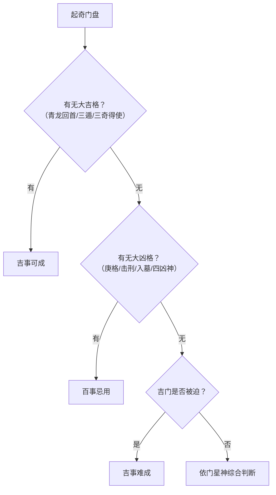

# 遁甲格局与吉凶规则_白话文.md

> 本文是对宋代官方典籍《遁甲符应经》中**奇门遁甲吉凶格局判断体系**的全面白话解读。原文高度凝练、术语密集，本文将其拆解为清晰逻辑结构，配合表格、分类说明与实例，帮助现代学习者快速掌握：哪些是大吉之格？哪些是大凶之局？如何识别“三奇得使”“天遁地遁”“门迫击刑”等关键概念？内容严格依据古法，兼顾实用性与准确性。

------

## 一、什么是“格局”？

在奇门遁甲中，“格局”指的是**特定天干、八门、九星、神煞在九宫中的组合形态**。
这些组合就像“化学反应”，会产生吉或凶的能量效应。
例如：“青龙回首”主大吉，“白虎猖狂”主大凶。

> ✅ 判断原则：  
>
> - 吉格 + 吉门（开、休、生） → 大吉  
> - 凶格 + 凶门（死、惊、伤等） → 大凶  
> - 吉格若遇“门迫”“入墓”等破坏 → 吉力减弱甚至转凶

------

## 二、三大吉格详解

### 2.1 三奇得使格（三奇有“使者”护航）

#### ▶ 什么是“三奇”？

- **乙** = 日奇（太阳之精）
- **丙** = 月奇（月亮之华）
- **丁** = 星奇（北斗星光）

#### ▶ 什么是“得使”？

每个“甲”旬都有一个专属“六仪”作为“甲”的替身（即“使”）。当三奇出现在**该旬甲所对应的六仪之上**，就叫“得使”。

| 甲旬       | 六仪（甲的替身） | 得使的三奇   | 格局名称             |
| ---------- | ---------------- | ------------ | -------------------- |
| 甲戌、甲午 | 己               | 乙奇落在己上 | 乙奇得使（日奇得使） |
| 甲子、甲申 | 戊               | 丙奇落在戊上 | 丙奇得使（月奇得使） |
| 甲辰、甲寅 | 丁               | 丁奇落在丁上 | 丁奇得使（星奇得使） |

> 💡 注意：这里的“落在”是指**天盘三奇加临地盘六仪**（如天盘乙 + 地盘己）。

#### ▶ 实例解析

- **阳遁三局，乙庚日丁亥时**：
  六乙（日奇）下临九宫，地盘是甲午（旬首），甲午对应六仪为**己** → 乙+己 → 乙奇得使 ✓  
- **阴遁五局，丙辛日己亥时**：
  丁奇下临四宫，地盘是甲辰 → 甲辰对应六仪为**丁** → 丁+丁 → 丁奇得使 ✓

#### ▶ 吉凶判断

> ✅ **凡用遁甲，若三奇得使，又合吉门（开、休、生）、吉星，百事皆吉！**

------

### 2.2 三遁格局（天地人三才庇佑）

“遁”即“隐蔽、庇护”。三遁代表获得天、地、人三界能量加持。

| 格局     | 构成条件                               | 能量来源             | 吉凶                     |
| -------- | -------------------------------------- | -------------------- | ------------------------ |
| **天遁** | 生门 + 六丙（月奇） + 六丁（星奇）同宫 | 天帝之光（日月星光） | 大吉，利求官、进见、文书 |
| **地遁** | 开门 + 六乙（日奇） + 六己（地户）同宫 | 地母之精（大地能量） | 大吉，利藏匿、筑城、安宅 |
| **人遁** | 休门 + 六丁（星奇） + 太阴神同宫       | 人间智慧（谋略贵人） | 大吉，利谈判、策划、求贤 |

> 📌 关键细节：
>
> - “合”指**在同一宫位**
> - “太阴”是八神之一，需排盘时确认其位置

#### ▶ 实例

- **阳四局，乙庚日酉时**：
  生门、丙奇、丁奇齐聚一宫 → 天遁 ✓  
- **阳一局，丙辛日日出时**：
  开门、乙奇、己土同在二宫 → 地遁 ✓  
- **阳七局，乙庚日夜间**：
  休门、丁奇与太阴同在六宫 → 人遁 ✓

> ✅ **结论：凡得三遁之时，出门办事，百事皆吉！**

------

### 2.3 其他重要吉格

| 格局           | 构成                              | 含义                     | 应用                           |
| -------------- | --------------------------------- | ------------------------ | ------------------------------ |
| **青龙回首**   | 天盘六戊（甲子戊） + 地盘丙奇     | 青龙回头顾盼，主贵人相助 | 百事大吉，尤其利出行、签约     |
| **飞鸟跌穴**   | 天盘丙奇 + 地盘六戊（甲子戊）     | 飞鸟归巢，安稳得利       | 利营造、嫁娶、求财             |
| **三奇之灵**   | 三奇（乙/丙/丁） + 开/休/生三吉门 | 奇门最理想组合           | 所求皆遂                       |
| **三奇游六仪** | 三奇游走于六甲（六仪）之间        | 玉女守门，歌舞升平       | 利宴会、娱乐、社交（有罪可免） |

> 💡 注：“六仪”即甲子戊、甲戌己、甲申庚、甲午辛、甲辰壬、甲寅癸。

------

## 三、主要凶格详解

### 3.1 天乙格（庚金克战之象）

| 格局           | 构成                         | 后果                 |
| -------------- | ---------------------------- | -------------------- |
| **天乙伏宫格** | 六庚（天干庚）加临直符所在宫 | 主客皆不利，易遭伏击 |
| **天乙飞宫格** | 直符加临六庚所在宫           | 同上，内外受敌       |
| **天乙伏干格** | 六庚加今日日干（如庚+甲）    | 主客交战，两败俱伤   |
| **飞干格**     | 今日日干加临六庚             | 同上，主动出击反被伤 |

> ⚠️ **庚为阻隔、战斗、凶险**，凡遇庚+干/符，多主冲突、阻碍、伤亡。

------

### 3.2 时干相关凶格（庚金作乱）

| 格局       | 构成                                   | 含义         |
| ---------- | -------------------------------------- | ------------ |
| **岁干格** | 六庚 + 当年天干（如2025乙巳年，庚+乙） | 年运受阻     |
| **月干格** | 六庚 + 当月天干                        | 月内不顺     |
| **日干格** | 六庚 + 当日天干                        | 当日凶险     |
| **时干格** | 六庚 + 当时时干                        | 此时不宜行动 |

> ❌ **凡遇“庚+干”，皆凶，不可举事！**

------

### 3.3 大格与刑格（极端凶象）

| 格局     | 构成        | 后果                         |
| -------- | ----------- | ---------------------------- |
| **大格** | 六庚 + 六癸 | 行动中断，财物丢失难寻       |
| **刑格** | 六庚 + 六己 | 车马损坏，中途折返，士兵逃亡 |

> 🚫 **此二格，百事忌用！**

------

### 3.4 六仪击刑（六甲自刑）

“击刑” = 自相刑伤。六甲在特定地支方位会“自刑”。

| 旬首（六仪） | 击刑方位（地支） | 对应宫位   | 刑式       |
| ------------ | ---------------- | ---------- | ---------- |
| 甲子（戊）   | 卯               | 三宫（震） | 子卯刑     |
| 甲戌（己）   | 未               | 二宫（坤） | 戌未刑     |
| 甲申（庚）   | 寅               | 八宫（艮） | 寅巳申三刑 |
| 甲辰（壬）   | 辰               | 四宫（巽） | 辰辰自刑   |
| 甲午（辛）   | 午               | 九宫（离） | 午午自刑   |
| 甲寅（癸）   | 巳               | 四宫（巽） | 寅巳刑     |

> 📌 口诀：“**子卯刑，丑戌未，寅巳申三刑，辰午酉亥自刑**”
> （注：奇门中主要用前四种）

#### ▶ 实例

- 阳遁一局，甲己日庚午时：
  甲子旬，值符落三宫（卯位）→ 六仪击刑 ✓ → **大凶，不可用**

------

### 3.5 三奇入墓（能量被埋没）

“墓” = 能量沉寂、失效。

| 三奇       | 入墓时间 | 入墓宫位         | 原因         |
| ---------- | -------- | ---------------- | ------------ |
| 乙奇（木） | 乙未时   | 二宫（坤，未位） | 木墓在未     |
| 丙奇（火） | 丙戌时   | 六宫（乾，戌位） | 火墓在戌     |
| 丁奇（火） | —        | 六宫（乾）       | 丁属火，同丙 |

> ⚠️ **三奇入墓，即使本为吉奇，也无力发挥作用！**

------

## 四、特殊凶格：四凶神格

| 格局         | 构成        | 含义                     | 吉凶         |
| ------------ | ----------- | ------------------------ | ------------ |
| **青龙逃走** | 六乙 + 六辛 | 青龙被白虎所制，贵人逃遁 | 百事凶       |
| **白虎猖狂** | 六辛 + 六乙 | 白虎反制青龙，小人得势   | 百事凶       |
| **朱雀投江** | 六丁 + 六癸 | 文书落入水中，计划失败   | 忌文书、诉讼 |
| **腾蛇夭矫** | 六癸 + 六丁 | 虚惊怪异，心神不宁       | 百事不利     |

> 💡 记忆口诀：
> “**乙辛龙逃，辛乙虎狂；丁癸雀投，癸丁蛇矫**”

------

## 五、其他重要概念

### 5.1 时勃（丙为乱神）

- **定义**：天盘六丙加临年、月、日、时干
- **含义**：纲纪紊乱，计划失控
- **吉凶**：❌ 凶，百事忌用

> 📌 类似“庚”的破坏力，但更偏向“内部混乱”。

------

### 5.2 伏吟与反吟（动静失衡）

| 类型     | 定义                         | 吉凶           | 宜忌                 |
| -------- | ---------------------------- | -------------- | -------------------- |
| **伏吟** | 星/门/宫重复（如坎宫见坎星） | ❌ 不宜行动     | ✅ 宜收藏、守旧、治病 |
| **反吟** | 星/门对冲（如坎↔离，震↔兑）  | ❌ 主反复、变动 | ✅ 宜散财、放粮、解散 |

> 📌 最典型：**子时加子宫 = 伏吟；子时加午宫 = 反吟**

------

### 5.3 门迫（吉门受制，凶门更凶）

“门迫” = 八门五行被所在宫位五行克制。

#### ▶ 吉门被迫（吉事不成）

| 吉门       | 五行 | 被克宫位（宫克门） | 结果                |
| ---------- | ---- | ------------------ | ------------------- |
| 开门（金） | 金   | 三宫、四宫（木）   | 金被木克 → 开门无力 |
| 休门（水） | 水   | 九宫（火）         | 水被火克 → 休门失效 |
| 生门（土） | 土   | 一宫（水）         | 土被水克 → 生财受阻 |

#### ▶ 凶门被迫（凶上加凶）

| 凶门             | 五行 | 被克宫位         | 结果                    |
| ---------------- | ---- | ---------------- | ----------------------- |
| 伤门、杜门（木） | 木   | 二宫、八宫（土） | 木克土反被耗 → 凶性加剧 |
| 死门（土）       | 土   | 一宫（水）       | 土被水冲 → 死气更重     |
| 惊门（金）       | 金   | 三宫、四宫（木） | 金被木耗 → 惊恐难解     |

> ✅ **判断口诀**：
> “**宫克门为迫，门克宫为制**”
> 迫则受损，制则可用（如开门克巽木，反主破障）。

------

## 六、总结：吉凶判断流程图（简化版）

------

## 七、附录：快速查表

### 吉格速查表

| 名称     | 关键组合   | 吉应           |
| -------- | ---------- | -------------- |
| 青龙回首 | 戊+丙      | 贵人助，出行吉 |
| 飞鸟跌穴 | 丙+戊      | 安稳得利       |
| 天遁     | 生+丙+丁   | 求官进见       |
| 地遁     | 开+乙+己   | 藏匿安宅       |
| 人遁     | 休+丁+太阴 | 谋略成功       |

### 凶格速查表

| 名称     | 关键组合   | 凶应     |
| -------- | ---------- | -------- |
| 白虎猖狂 | 辛+乙      | 小人当道 |
| 朱雀投江 | 丁+癸      | 文书失败 |
| 大格     | 庚+癸      | 行动中断 |
| 击刑     | 甲子+卯等  | 自伤自败 |
| 门迫     | 开门在震巽 | 吉事不成 |

------

> 📚 本文档专注**格局识别与吉凶判断**，需配合《遁甲排盘规则体系_白话文.md》使用，方能完整应用奇门遁甲。